vu vơ vài chall for của DH cho năm mới
# Bài 1 hacked
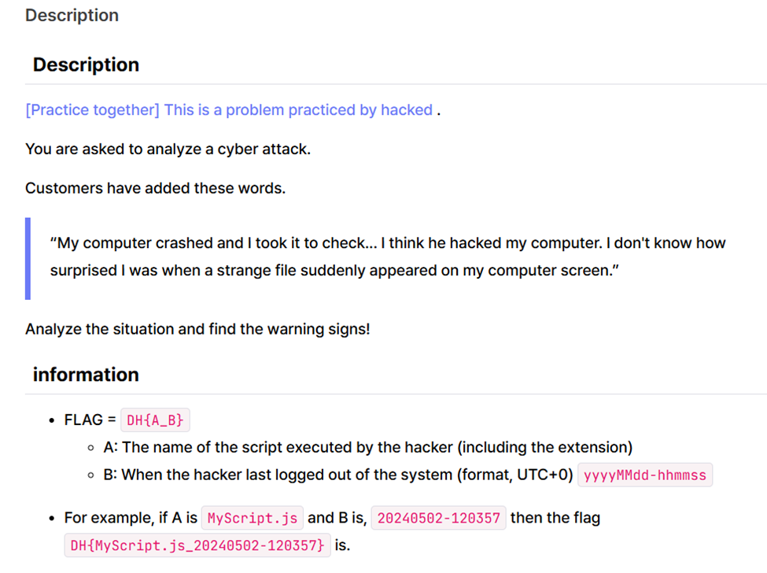

Phân tích đề: máy tôi bị crash và tôi mang nó đi kiểm tra… Tôi nghĩ là anh ta đã hack vào máy tính của tôi rồi. Tôi ko biết tôi đã bất ngờ thế nào khi thấy những cái file lạ này trong máy của tôi:
->có vẻ như khả năng hacker đã chạy một đoạn mã gì để cài đặt chương trình lên máy của anh bạn này rồi nên ta sẽ mở log của Microsoft-Windows-PowerShell%4Operational để kiểm tra xem đã có đoạn mã gì chưa
Vì log khá ngắn nên ta có thể mò tay cũng được và ta nên check 2 event id đó là event id 4100 (event check xem lệnh có chạy lỗi hay không) và 4104 (event kiểm tra xem có lệnh nào được thực thi không)
Ta vô tình thấy được ở event 4100
 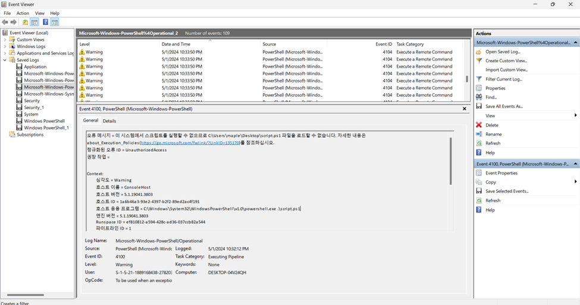

Nguyên văn đây:
오류 메시지 = 이 시스템에서 스크립트를 실행할 수 없으므로 C:\Users\maple\Desktop\script.ps1 파일을 로드할 수 없습니다. 자세한 내용은 about_Execution_Policies(https://go.microsoft.com/fwlink/?LinkID=135170)를 참조하십시오.
정규화된 오류 ID = UnauthorizedAccess
권장 작업 = 

Context:
        심각도 = Warning
        호스트 이름 = ConsoleHost
        호스트 버전 = 5.1.19041.3803
        호스트 ID = 1a6b46a3-93e2-4397-b2f2-89ed2ac4f191
        호스트 응용 프로그램 = C:\Windows\System32\WindowsPowerShell\v1.0\powershell.exe .\script.ps1
        엔진 버전 = 5.1.19041.3803
        Runspace ID = ef810812-a594-428c-ad36-037ccb82a544
        파이프라인 ID = 1
        명령 이름 = 
        명령 유형 = 
        스크립트 이름 = 
        명령 경로 = 
        시퀀스 번호 = 15
        사용자 = DESKTOP-04V24QH\maple
        연결된 사용자 = 
        셸 ID = Microsoft.PowerShell

User Data:

Gg dịch để hiểu nghĩa nhá, đại khái là có một lệnh bị window chặn hmmmmmm nó trả về một đường dẫn tới “script.ps1” khả năng đây là script đã chạy -> có phần A
Phần B là thời gian hacker đăng xuất khỏi vậy thì ta cần tìm được tài khoản của hacker đã -> qua log security và check logon event id 4624 thì ta có một tài khoản khá lạ 
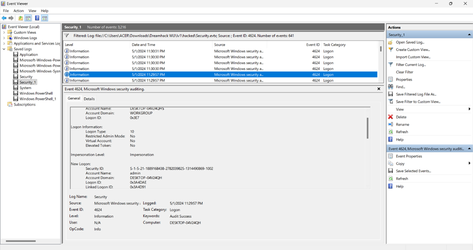

Hmmm đây là máy của maple vậy mà sao lại có một tài khoản tên admin nhỉ đã thế logon type còn có id là 10? Đây là id của việc kết nối từ xa? Máy của anh ta mà kết nối từ xa là sao-> khả năng đây là backdoor rồi từ đó ta sẽ check logoff của tài khoản này event id 4634 
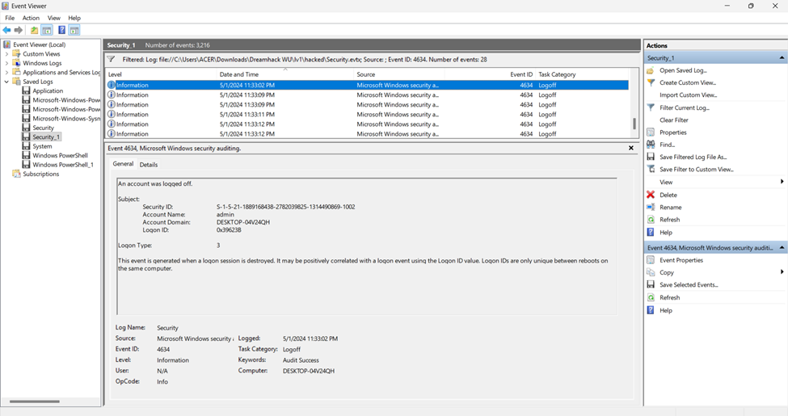
 
Có vẻ như đây là khoản thời gian cuối rồi -> ta có được thời gian aka part B 
Lưu ý nho nhỏ là event viewer của win lấy theo múi giờ của máy hiện đang ở vn ta chuyển qua utc+0 theo đúng cấu trúc là sẽ ra flag nhé
Flag: DH{script.ps1_20240501-163302}
# Bài 2 MZGZ
Ta được cho một chuỗi rất dài

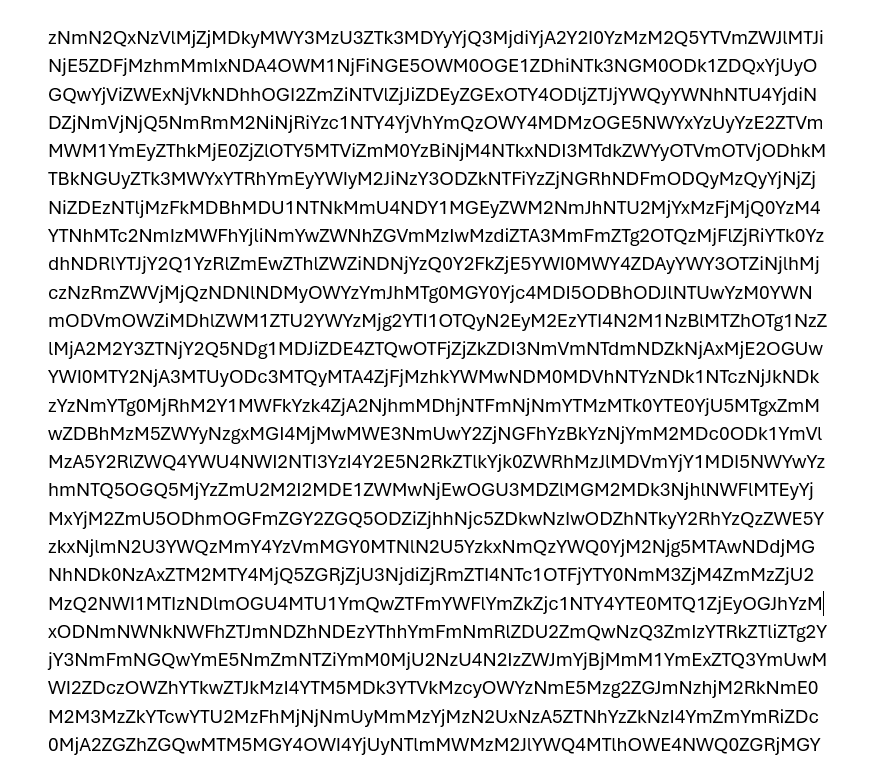

Nhìn vào dễ dàng nhận ra đây sẽ là dạng base64

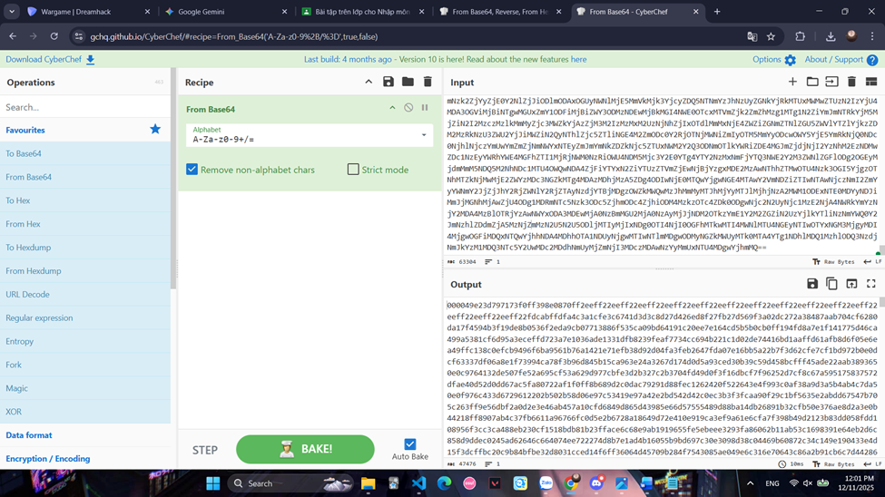

Decode ra ta sẽ thấy một chuỗi giống mã hex nên ta thử gắn hex vào 

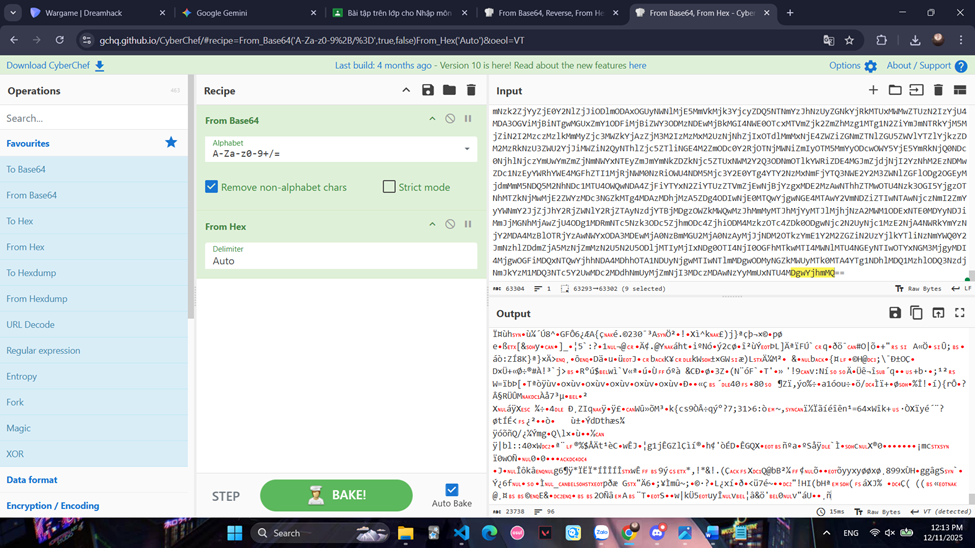

Ta thấy rằng rõ ràng dù đây là 1 mã hex nhưng ta lại không decode ra được vì vậy hướng giải quyết tiếp theo là quay ngược lại mã hex được base 64 giải để xem header và đuôi

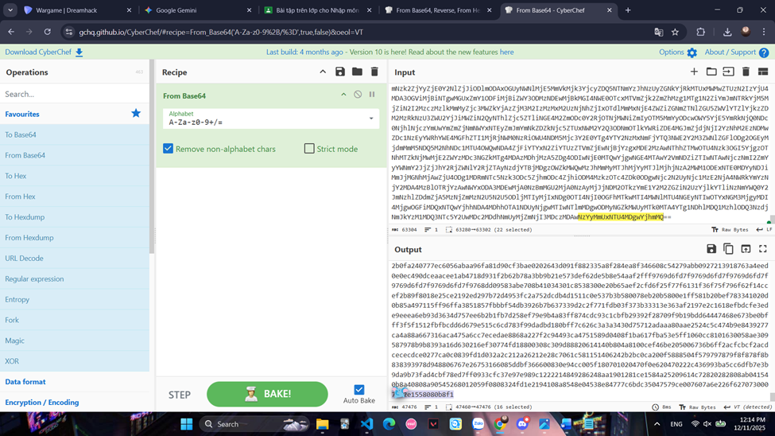

Ta thấy được phần đuôi trong này là 1 chuỗi kí tự 8b1f và bất ngờ chưa, nếu ta đổi ngược lại thành 1f 8b thì đây sẽ thành 1 tệp file GZ giống dựa vào hint đề bài đưa nữa MZGZ -> đây là kỹ thuật reverse đảo ngược byte từ đó hướng giải quyết sẽ là giải mã base 64-> reverse lại -> dịch mã hex-> giải nén file 

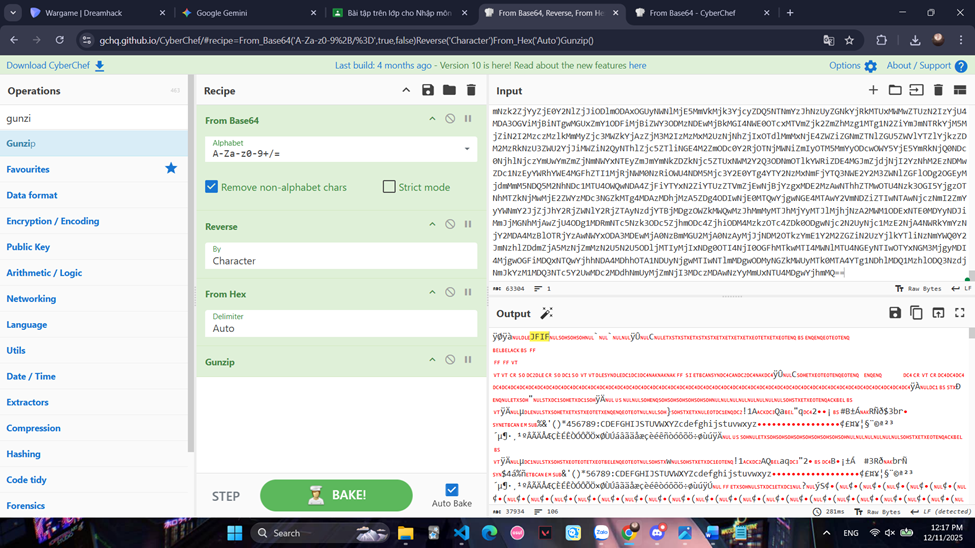

Ta thấy đây là một chuỗi JFIF -> đây là một file jpg-> lưu file về với đuôi .jpg
Đây là kết quả ta có được

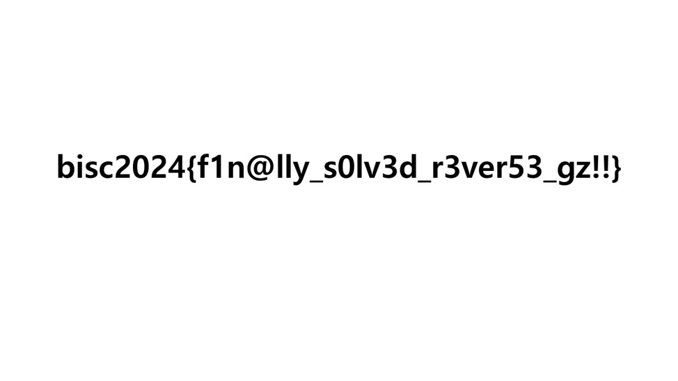

# Bài 3 Snowing
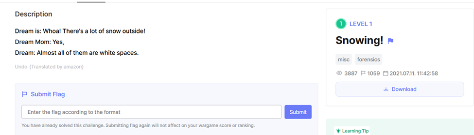

Ta nhìn vào đề có thể thấy cuộc hội thoại của Dream và Dream Mom, tải file về ta thấy có 2 file

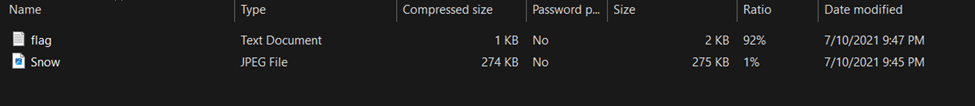

Mở file đầu lên ta có thể thấy nó là một fake flag

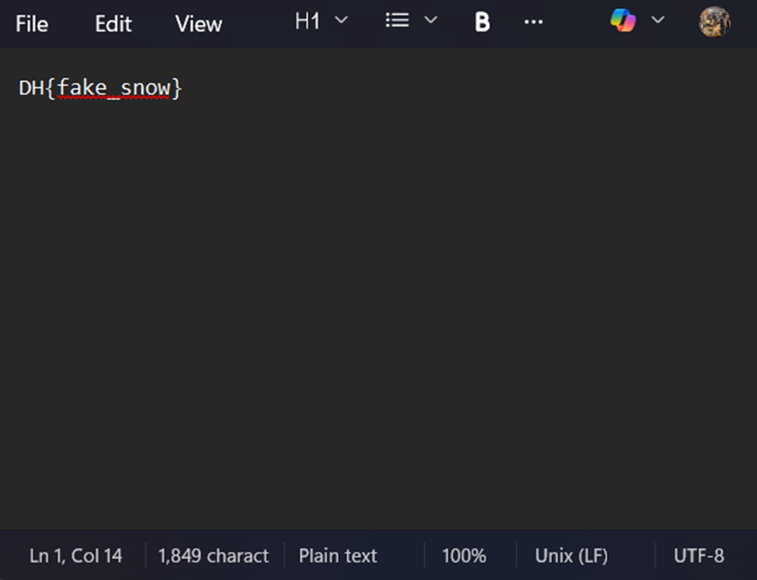

Tuy nhiên hãy để ý lại cuộc hội thoại của 2 người “White space” ý nghĩa là một khoảng trắng

Nó có nghĩa là gì thì hãy nhìn vào ảnh đây 
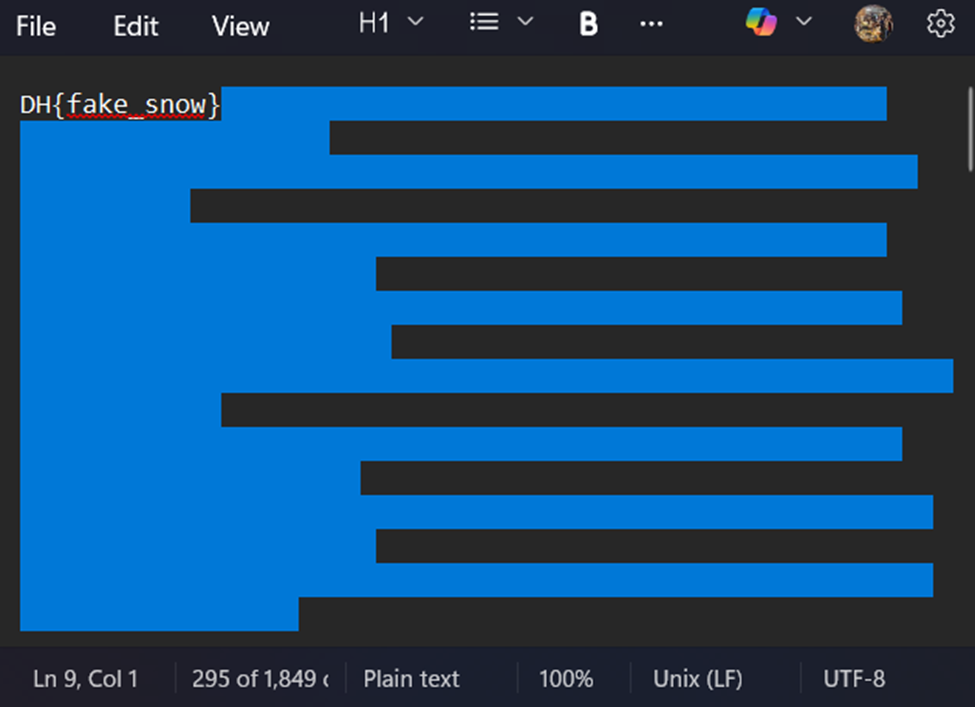

Bạn thấy ko có rất nhiều kí tự được ẩn đi thành các khoảng trắng ko thể nhìn thấy được, ta để ý đề bài  “snow” đây là ám chỉ tới một công cụ giải mã có tên là stegsnow để giải mã các khoảng trắng, ta chạy lệnh

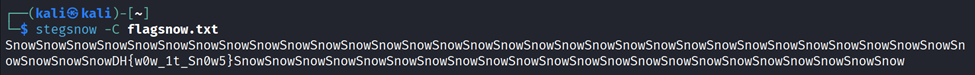

Sau khi giải mã xong ta có được flag 
DH{w0w_1t_Sn0w5}
Note: Tuy đơn giản nhưng bài này lại cho ta biết thêm 1 kỹ thuật giấu tin khác là giấu tin trên khoảng trắng, cũng khá thú vị đấy.

# Bài 4 Windows Search
Ta được cho một file Windows.edb đây là 1 loại cơ sở dữ liệu của Windows Search Indexer, 
Ta sẽ sử dụng tool esedbexport để trích xuất file ra sau đó mở file SystemIndex_PropertyStore.9 vì đây là file chứa nội dung text đã được index ra 
Mở file lên grep DH là có đáp án

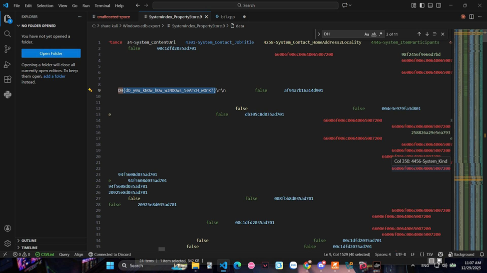

DH{dO_y0u_kNOw_hOw_wINDOws_5eArcH_wOrK?}

# Bài 5 Don_t Dos That!

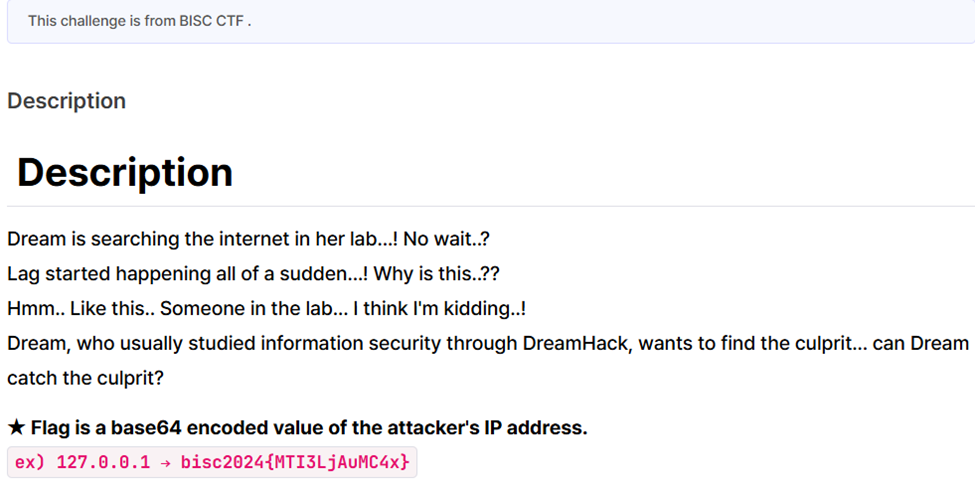

Đại loại là đang lướt web thì lag, có vẻ như trong lab có 1 ai đang chơi khăm mình
Gây lag khả năng cao là bị dos rồi, theo như tiêu đề cũng là thế đây là 1 kiểu tấn công như đưa nhiều truy cập rác vào làm máy xử lý ko kịp -> sập hoặc lag
Truy cập vào và tìm kiếm mình vô tình phát hiện ra đoạn này đây là phần endpoint trong mục thống kê của wireshark điểm đầu và cuối của các gói tin. Ở đây ta check những cái xuất hiện thì thấy tcp xuất hiện rất nhiều các địa chỉ gửi cùng 1 cái gì đó vào 1 địa chỉ ip duy nhất 192.168.0.11 -> khả năng cuộc tấn công này là dos nhắm vào tcp

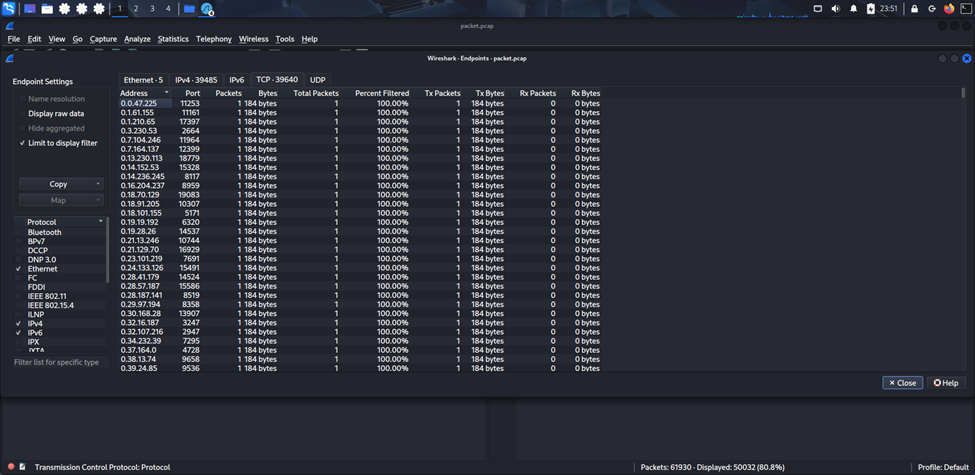

Check thêm phần conversation để càng khẳng định luận điểm 
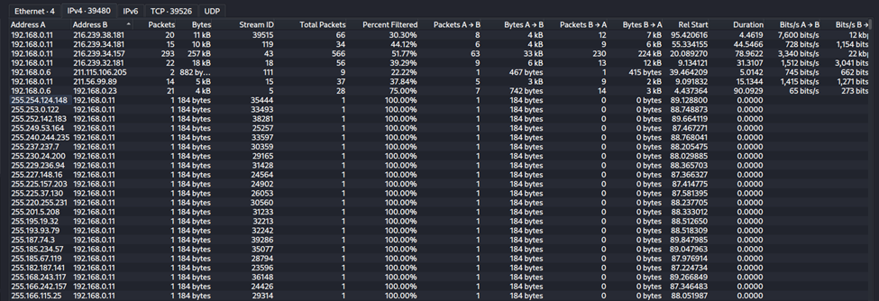
Bạn vẫn thấy rất nhiều gói tin từ A->B cùng 1 ip duy nhất và điều đặc biệt là B không phản hồi gì lại cho A đây chắc chắn là spam truy cập rác làm lag server rồi trong khi ban đầu vẫn rất bình thường phải không đặc biệt là đều có packets với bytes 184 đều tăm tắp
Ta check với lệnh frame.len == 184 để xem cái gói tin với 184 bytes kia là gì 
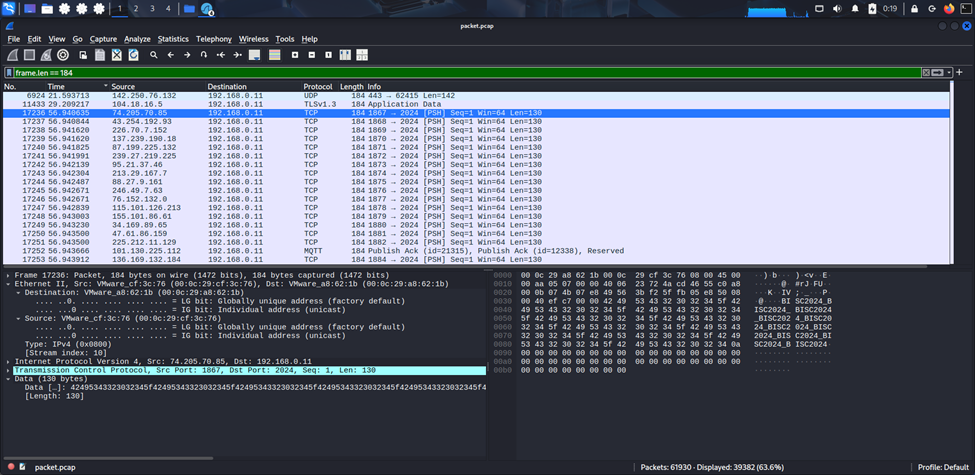
Với định dạng như này chắc chắn đây là cái ta cần tìm rồi
Để ý kỹ dòng này nhé
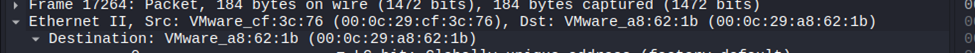
kẻ tấn công đã sử dụng máy ảo Vmware để tạo nhiều ip tấn công nhằm tránh để phát hiện nhưng lưới trời lồng lộng thưa mà khó thoát, tuy nhiều ip máy nhưng địa chỉ mac cái địa chỉ ứng với phần cứng thì không thay đổi được, đây là sơ hở của kẻ tấn công ta sẽ tìm kiếm dòng nào chứa địa chỉ này nhằm tìm ngược ra ip thật sự của kẻ tấn công .
ta sử dụng lệnh eth.src == 00:0c:29:cf:3c:76 && arp để truy tìm ra ip gốc tại sao lại là arp vì đây là giao thức để chuyển ip sang mac để các thiết bị giao tiếp chính xác
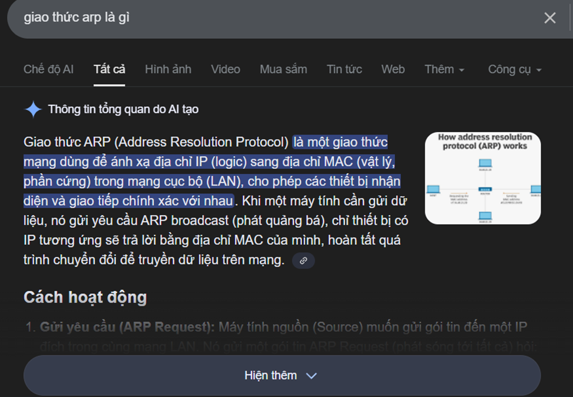
Về căn bản khi truy cập vào mạng thì ta sẽ được cấp 1 ip góc dựa trên địa chỉ mac để mạng có thể xác nhận được quy trình này không thể làm cách khác được vì mạng này đã cung cấp cho máy đó ip đó->ko thể fake->thực hiện tấn công spam gói tin các thứ làm lag server lúc này thì thoải mái ghi địa chỉ nào gửi cũng được vậy enen ta tìm được mac là có thể truy ngược được ip gốc.
Sau khi check ta thấy rằng
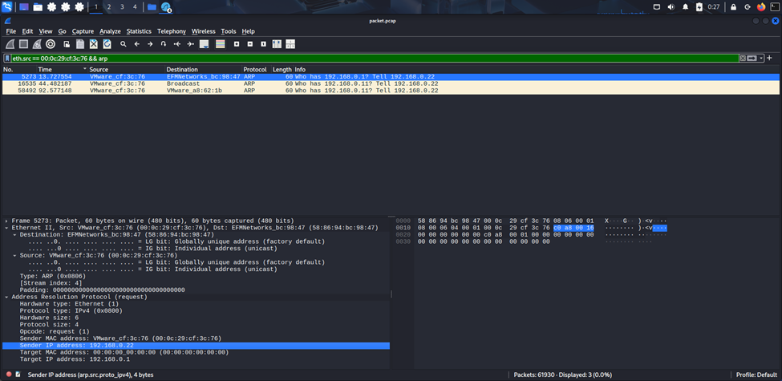
Ok có vẻ như đã có được ip rồi-> chuyển nó ra base64 là có flag thôi 
->flag: bisc2024{MTkyLjE2OC4wLjIy}

