# Bài 1:lolololologfile 
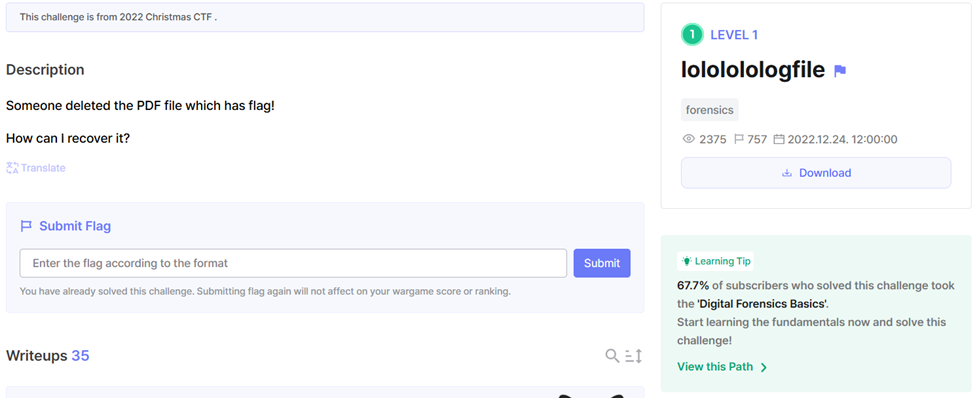
Đại loại là ai đó đã del cái file pdf có chứa flag rồi bây giờ nhiệm vụ của ta là phục hồi lại file đó nhằm tìm ra flag
Ta mở file bằng ftk image và thấy có 4 file đã bị xóa trong này có tên lần lượt là seg1, seg2, seg3, seg4 
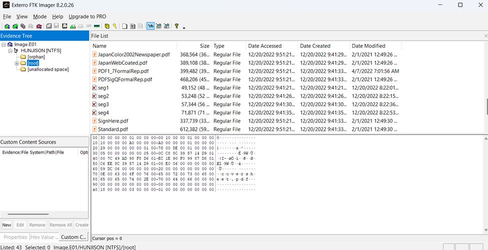
Seg cũng có thể hiểu là từ viết tắt của segment hay một phân đoạn nào đó nên rất có thể file pdf của ta đã bị cắt thành 4 phân đoạn này sau đó xóa đi. 
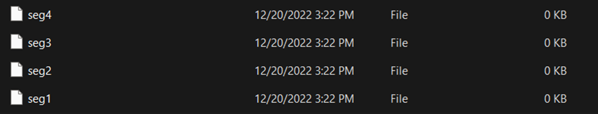
Ta thử trích xuất file này ra vì thấy nó có size nhưng kết quả trả ra là file rỗng 
Cũng dễ hiểu thôi nó bị xóa rồi mà, ta để ý tiêu đề nó là lolololologfile đây là một gợi ý về file log được đưa ra, theo ta được biết thì mặc dù đã bị xóa tuy nhiên vẫn có thể biết được dữ liệu nằm ở đâu vì khi tạo file nó sẽ cho ta một vùng nhớ để lưu dữ liệu vào, khi ta xóa file rồi thì dữ liệu ko hẳn biến mất mà nó vẫn tồn tại ô nhớ trống đó nhưng nó có thể dễ dàng bị thay thế bởi các dữ liệu khác ghi đè lên.
Ta sẽ tìm xem là địa chỉ của các file seg này nằm ở đâu 
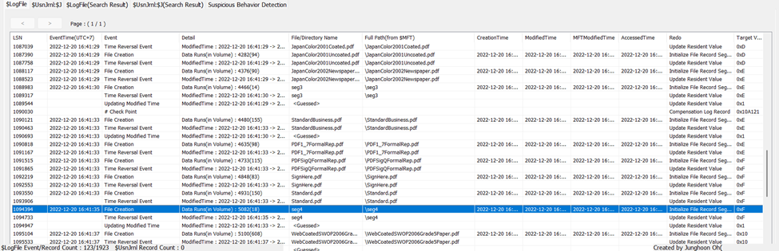
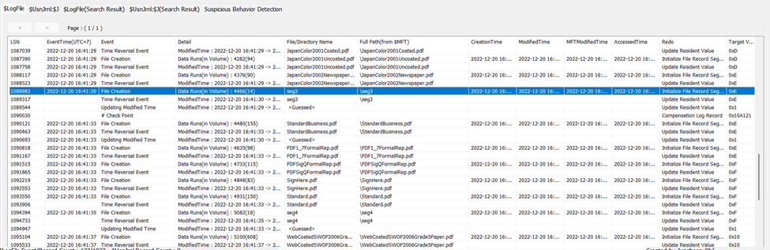
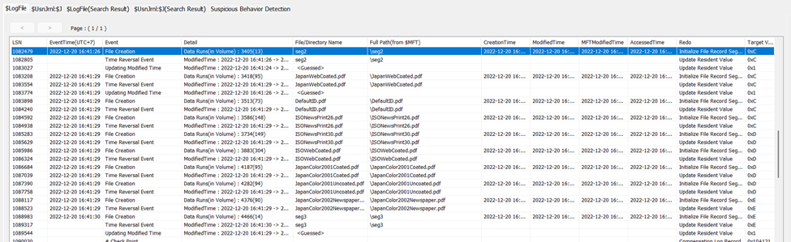
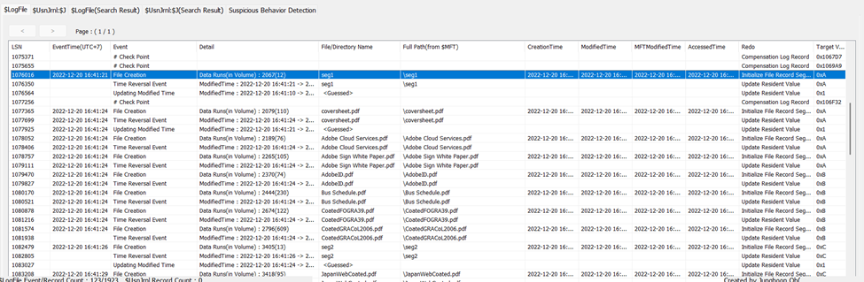
Vì nó bị xóa rồi nên các dữ liệu nó sẽ trôi nổi trên máy tính tất cả chúng đều sẽ được liệt vào unlocated space 
->ta vào trong và tìm xem những số địa chỉ ta có là file nào và export nó ra 
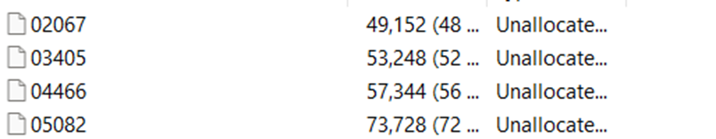
Có vẻ như đề cũng ko làm khó ta lắm nó được xếp ngay hang luôn
Sau đó như phân tích nó là 4 file pdf được cắt nhỏ từ 1 file ra nên việc còn lại là gộp cả 4 vào lại
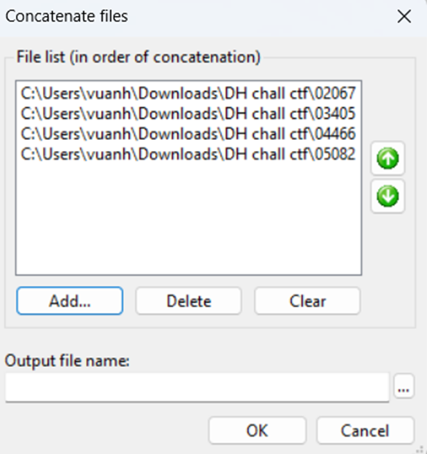
Nhớ đúng thứ tự nhé.
Sau đó là ta sẽ có flag thôi.
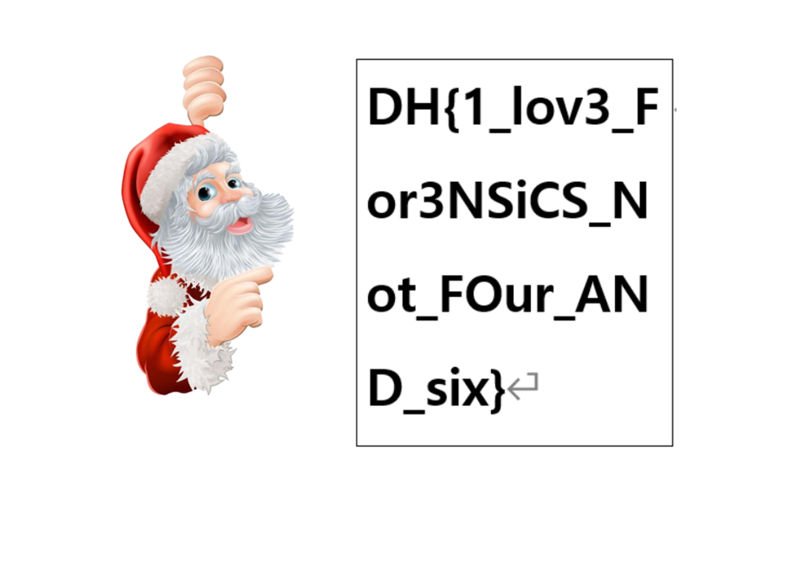
->flag: DH{1_lov3_For3NSiCS_Not_FOur_AND_six}
# Bài 2:FFFFAAAATTT 
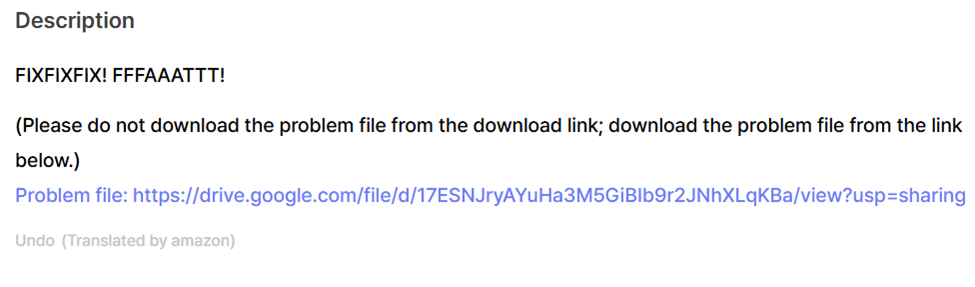
Với tiêu đề này khả năng là ta được đưa 1 file để fix rồi rất có khả năng ta sẽ không mở được file đó
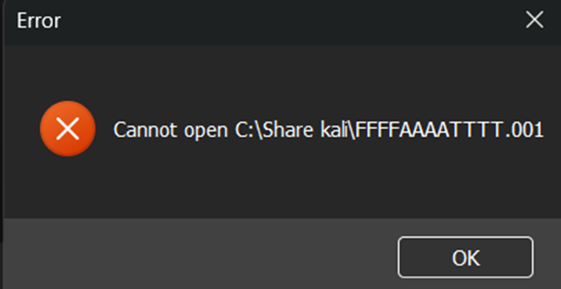
Bây giờ ta sẽ thử check xem file này là loại file gì 
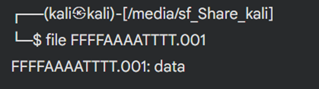
Đại khái thì máy cũng không nhận diện được nên chỉ trả về data, bây giờ ta sẽ lên hex edit nhằm check file đang bị vấn đề gì 
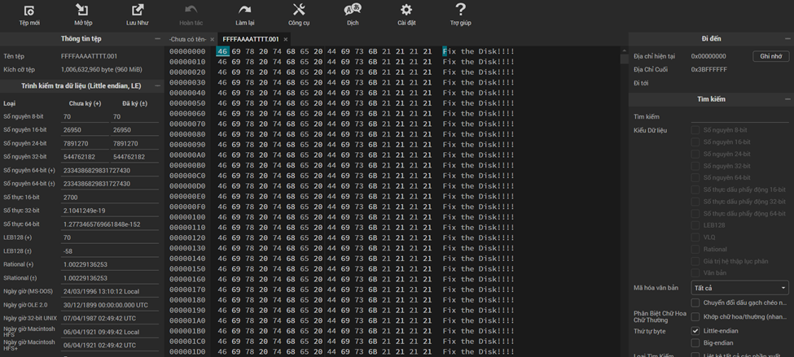
Có vẻ như phần đầu của nó đã bị hỏng nên ta không thể mở lên được
Sau khi lướt 1 xíu ta thấy được cái này
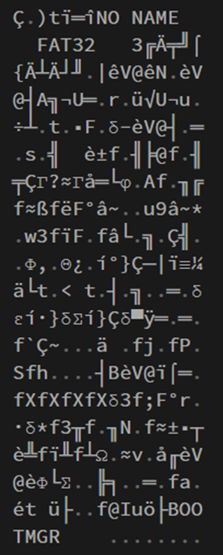
ở phần đầu đã bị ghi đè bằng các chữ fix the disk tuy nhiên ở section 6 ta lại đc nhận thông tin rằng đây là 1 loại tập tin FAT32 một loại tập tin thường dừng cho các usb, và đoán xem tập tin này có gì đặc biệt, nó có 1 cơ chế là Backup Boot Sector nghĩa là sẽ tự động lưu header vào section 6 chính vì vậy ta mới thấy được cái này.
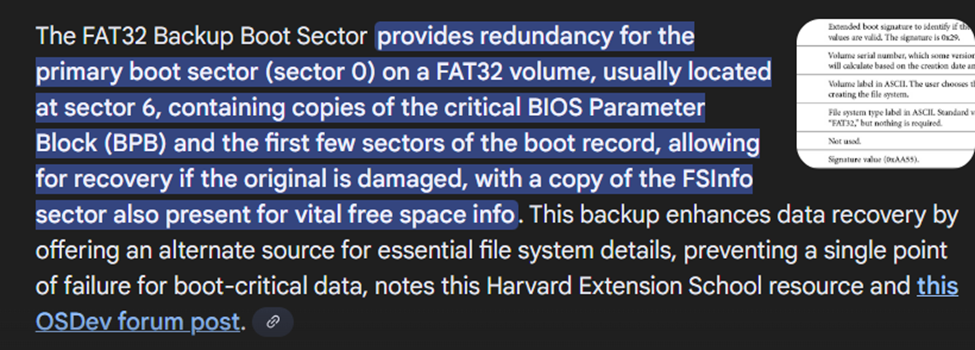
Việc tiếp theo cần làm đó chính là lôi cái này lên trên đầu, thay thế cái header fix the disk kia 
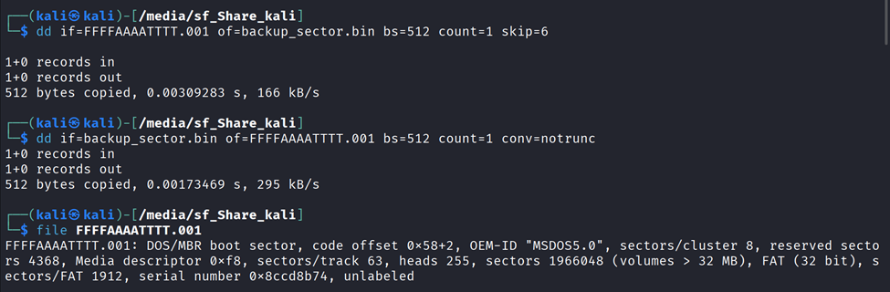
Ta sử dụng 2 lệnh để copy và thay thế, lệnh đầu là lưu 1 section khi bỏ qua 6 section đầu(0,1,2,3,4,5) từ đó section 6 sẽ trở thành đầu và được lưu vào 1 file, lệnh 2 là lấy file vừa copy thế vào header conv=notrunc nghĩa là phần sau giữ nguyên
sau đó check thì thấy máy đã có thể nhận diện tệp thành file FAT32 chuẩn.
Bước tiếp theo là ta tạo 1 thư mục và mount file đề cho ở trong đó
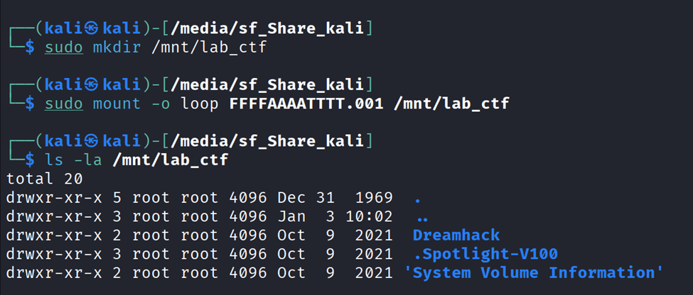
Do này chỉ là 1 file ảnh đĩa nên ta cần dùng lệnh 2 để mout từ đó mới có thể mở ra như khi đang cắm 1 usb thật sự
Ta đang giải bài ctf trên dreamhack nên thư mục dreamhack là đáng ngờ nhất, ta mở nó và list xem bên trong có gì
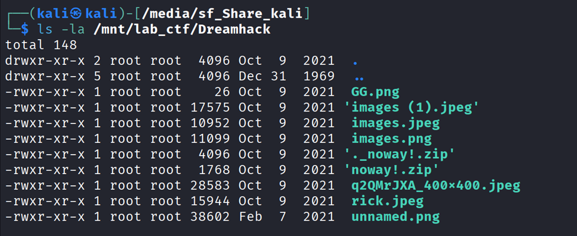
Ta thấy 1 file ảnh tên là GG hmmm, nó như kiểu good game, một câu kết trong các game online hay chơi nên đây chắc là hint mà đề bài gửi cho mình khi ta gần tìm ra rồi.
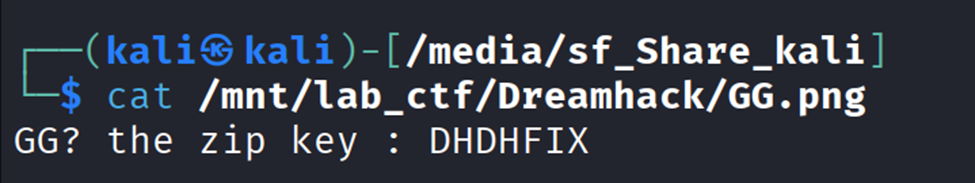
Mở ra thì thấy key của tệp zip và ngoài cái noway!.zip còn file nào nữa, chắc chắn flag bên trong rồi. 
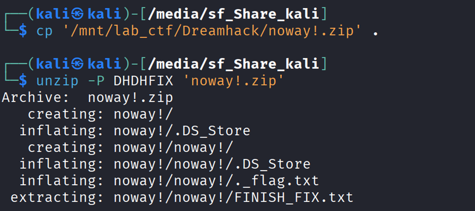
Ta copy file zip ra thư mục hiện có và giải nén nó với pass vừa tìm được, lệnh trả ra các file txt kia
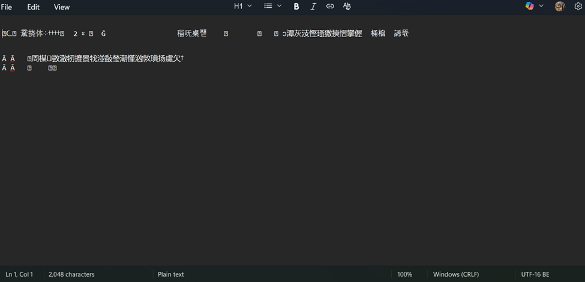
Check flag.txt thì nó là các kí tự rác không có tác dụng gì
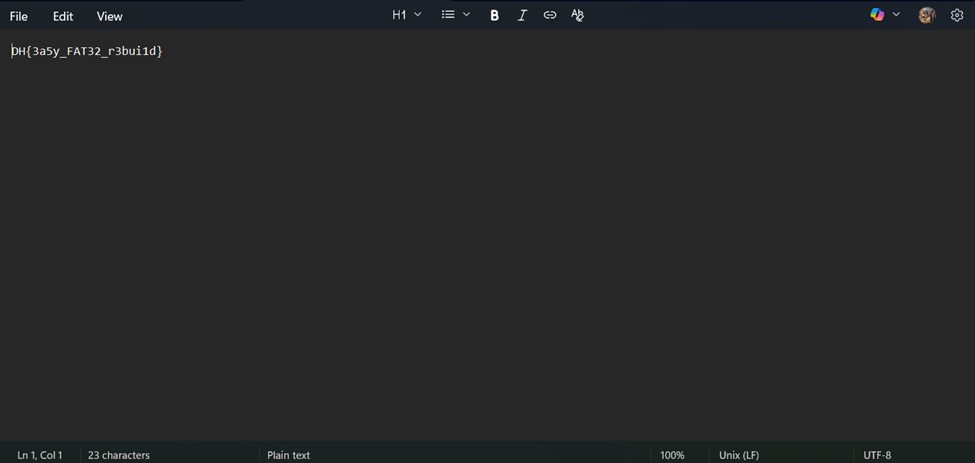
Check tệp còn lại thì flag đã xuất hiện
->flag ta có là: DH{3a5y_FAT32_r3bui1d}
# Bài 3:Corrupted Disk Image 
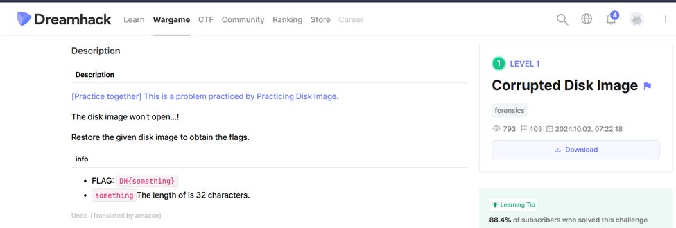
Đề bài
File ảnh đĩa này không mở được bây giờ ta cần khôi phục file này để lấy flag
Định dạng flag là DH{something} với something gồm 32 ký tự
Đầu tiên ta mở file ảnh đĩa lên 
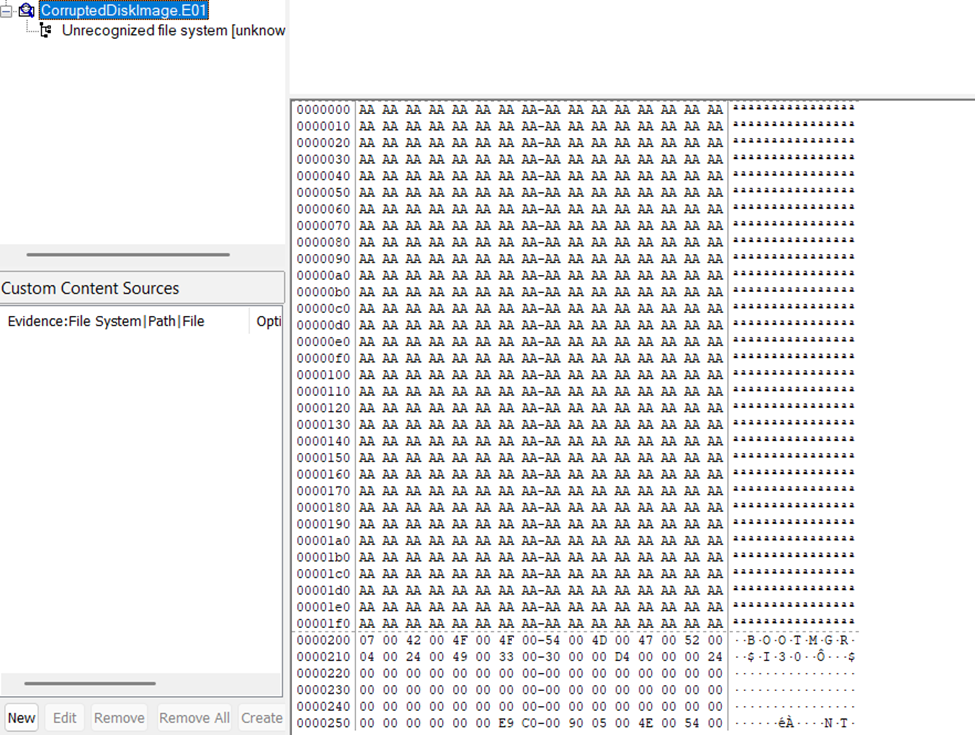
Có thể dễ dàng thấy rằng file này không thể mở lên được vì phần header đã bị ghi đè bởi các kí tự, ngoài ra ta thấy ở dưới là bootmgr đây là trình khởi động của file window vậy ta có thể suy ra được này là NTFS
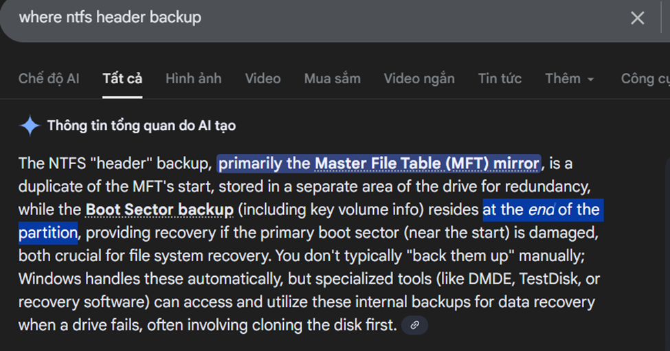
Có thể thấy nó được backup ở dưới cuối, ta sẽ sao chép và ghi đè lên các kí tự kia 
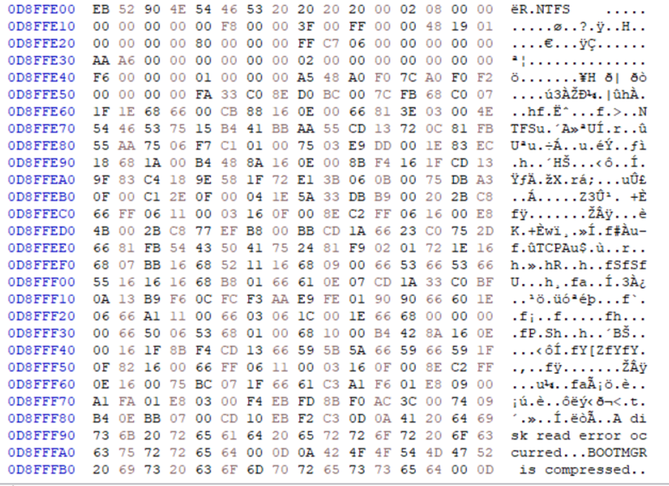
Đây là phần cuối chứa backup
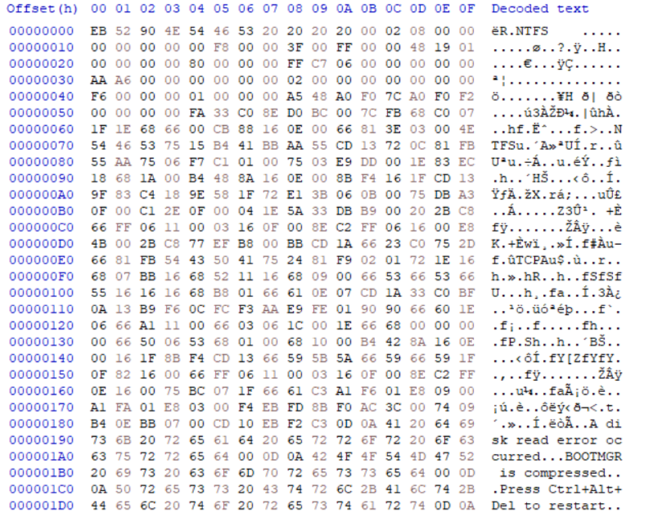
Ta ghi đè lên phần đầu sau đó xuất file và mở trên ftk image
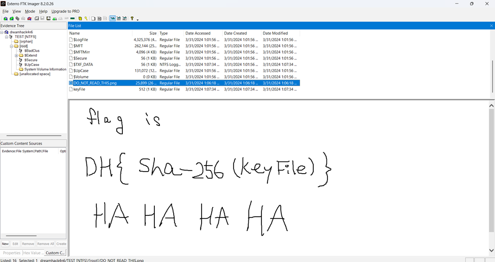
Sau khi mở lên thì ta thấy được flag cần tìm là mã keyfile chuyển thành SHA-256
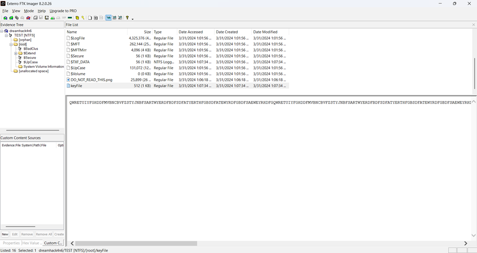
Đây là key của nó
Bây giờ ta chỉ cần chuyển thành hash SHA-256 là xong, ta sử dụng công cụ HashCalc để tính toán
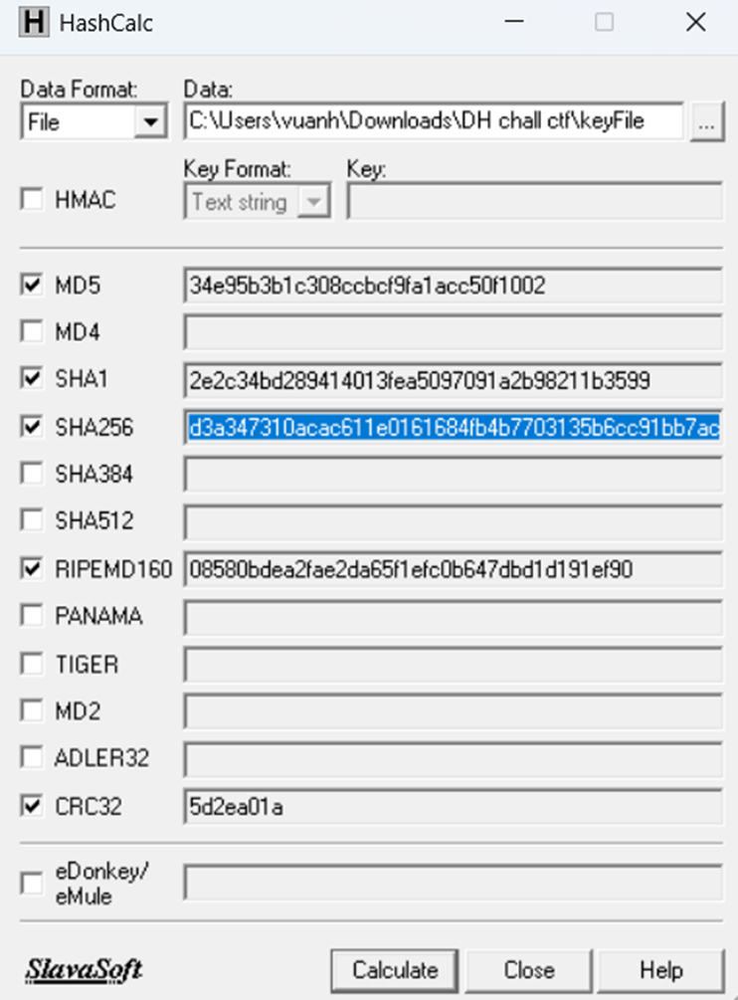
e71e2b1230fd090aebd3a347310acac611e0161684fb4b7703135b6cc91bb7ac 
đây là mã ta có được ghép lại là ra flag
DH{e71e2b1230fd090aebd3a347310acac611e0161684fb4b7703135b6cc91bb7ac}
Lưu ý:
1.	có thể do bản dịch tiếng anh bị lỗi(do dùng gg dịch chuyển từ tiếng hàn sang) ở đây ban đầu dịch là characters hay ký tự nhưng mã với SHA-256 nó sẽ trả ra 64 ký tự, có thể theo bản gốc nó là bytes vì 32 bytes->64 ký tự
2.	khi ta thử copy cái keyfile này lên trên cyberchef nó sẽ cho kết quả khác
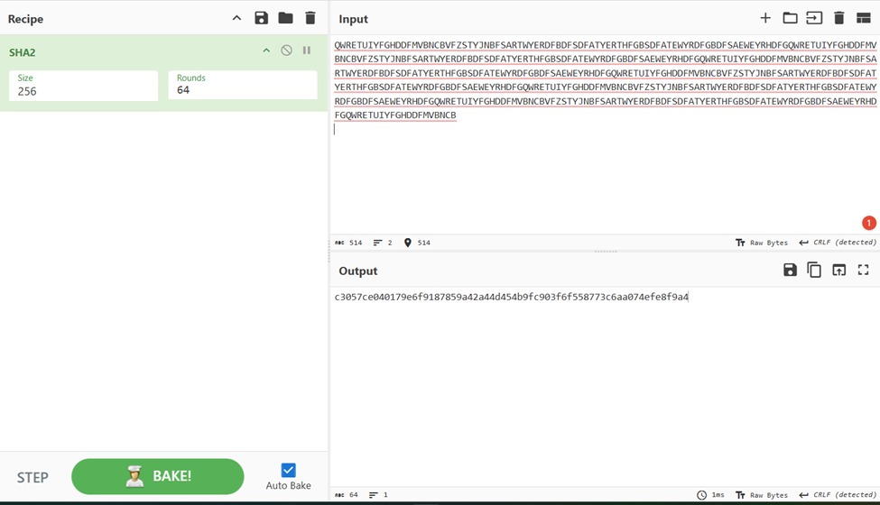
Nguyên nhân là vì trong file này khi ta copy paste có thể nó bị lỗi các kí tự trắng từ đó dẫn tới việc làm dư 1,2 kí tự hãy nhìn ở dưới đi nó là 514 ký tự trong khi file gốc ta chỉ có… 512, từ đó làm kết quả bị sai nói chung là ta nên xài hashcalc để chắc chắn đúng 100% 
# Bài 4:VBR
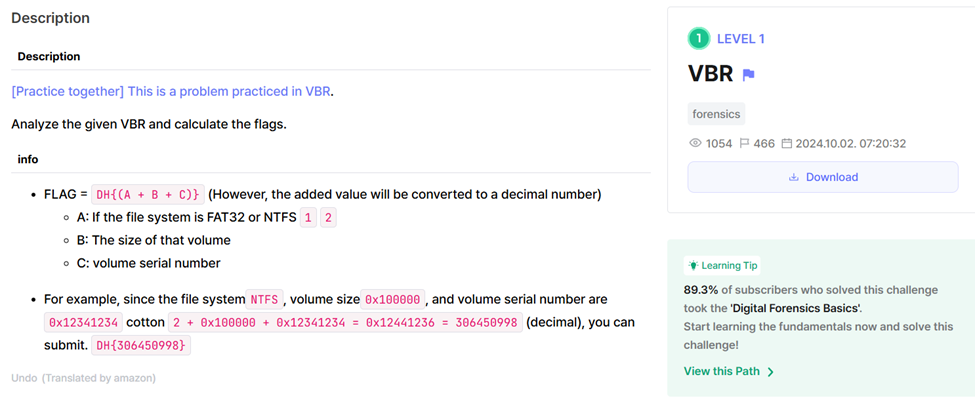
Đại loại là xác định vài cái thông số trên VBR sau đó đổi nó qua hệ demecial là xong
Mở file bằng ftk ta dễ dàng thấy ngay đó là 1 file FAT32
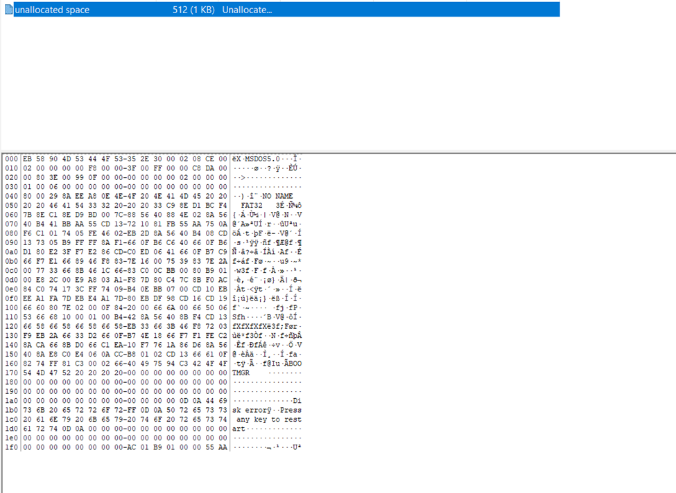
Vậy là ta đã có part A=1
Part B cần tìm khối lượng của cái này
Theo định nghĩa thì sẽ là total sectors nhân với bytes per sectors nó giống như bạn tính tổng số táo trong mấy chục thùng chứa táo ấy
Mình sử dụng trang này để tham khảo
https://wiki.osdev.org/FAT#FAT_32
bạn có thể thấy bytes per sectors nó nằm ở 0x0B và total sectors nằm ở 0x20
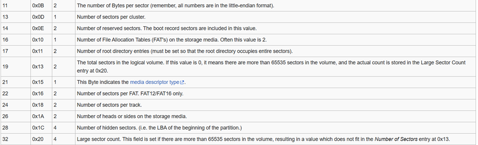
Ta sẽ mở file trên HxD cho dễ nhìn nhé.
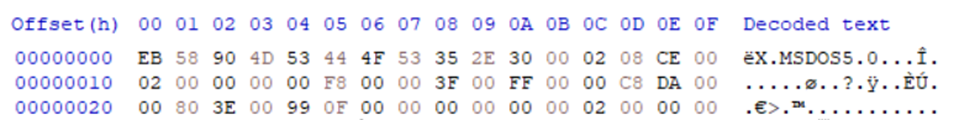
Copy đúng chỗ cần tìm ta sẽ có là 
bytes per sectors: 00 02
total sectors: 00 80 3E 00
ta đã có part B giờ ta cần chuyển qua hệ demacial
lên cyberchef và đổi thôi, mà nhớ ta cần đảo ngược lại mã hex để có thể tính được nhé 

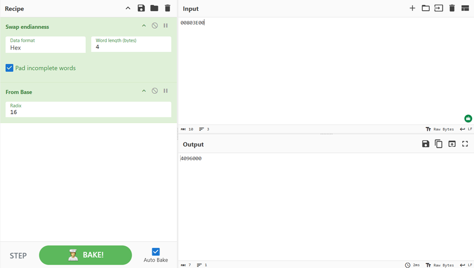
->có part B
Còn part C làm cũng tương tự thôi
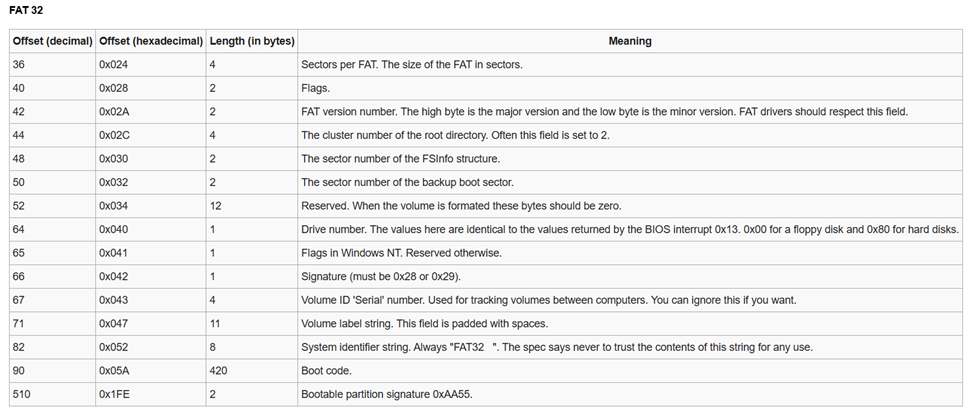
Ta thấy ở vị trí 0x043 là serial number
->copy nó rồi lên cyberchef thôi
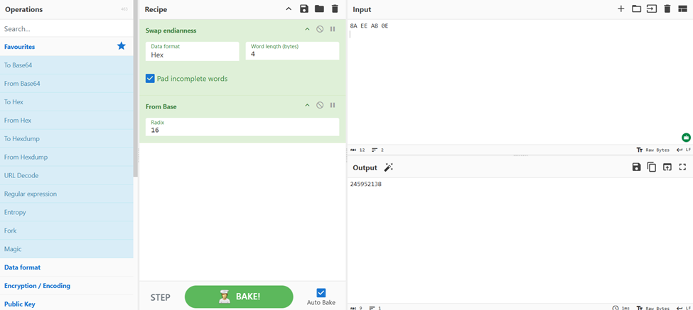
Giờ ta cộng tất cả số demical ta vừa tính được là xong
A+B+C= 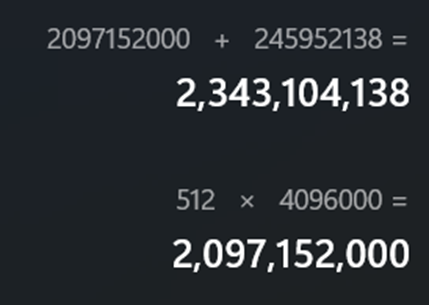
->flag: DH{2343104139}
# Bài 5: strange-program
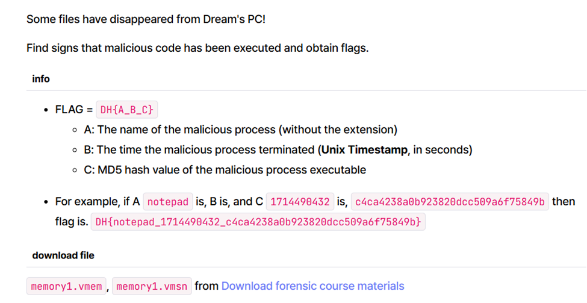
Đại loại là vài tập tin trong máy tính của Dream bị biến mất ta cần tìm ra mã độc và lấy flag. Flag có định dạng là DH{A_B_C} với A là tên của tiến trình độc hại, có thể là 1 phần mềm nào đó đang chạy, B là thời gian mà tiến trình đó kết thúc đổi qua Unix C là mã MD5 của tiến trình.
Ta được cung cấp 2 tệp là memory1.vmem và memory1.vmsn vì đây là memory nên ta sẽ nghĩ ngay đến dùng volatility3 để xét các tiến trình qua lệnh psscan.
ở đây sau một hồi lần mò ta tìm được một file exe khá là lạ thứ nhất là ở cái tên thứ 2 là ở thời gian nó chỉ bật lên 1 phát xong tắt luôn nên khả năng cao đây là mã độc ta đang tìm.
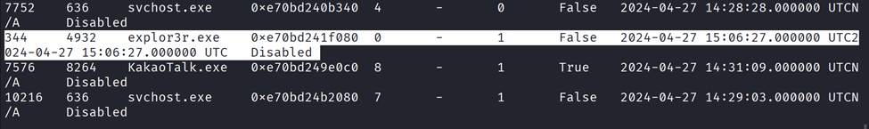
ngoài ra có một file exe khác cũng bật lên và tắt sau vài chục giây, cơ mà slack này mình tìm hiểu là một loại app nhắn tin gì đó có thật nên coi như cho qua và tập trung vào explor3r 
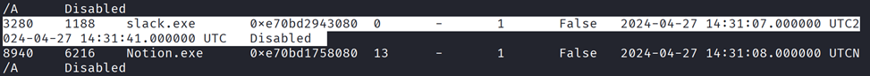
Với explor3r.exe thì ta sẽ có A là explor3r và B là 1714230387 đổi cái giờ kết thúc sang Unix
Việc còn lại chỉ là check md5 của tệp này thôi, ta sẽ tìm địa chỉ và dump nó ra
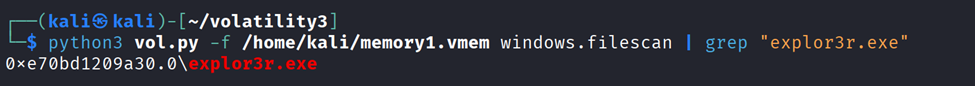
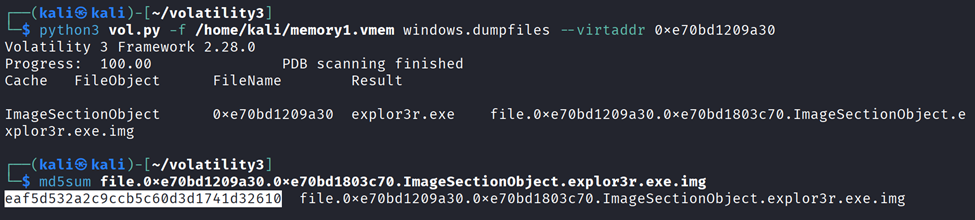
->flag:
DH{explor3r_1714230387_eaf5d532a2c9ccb5c60d3d1741d32610}

