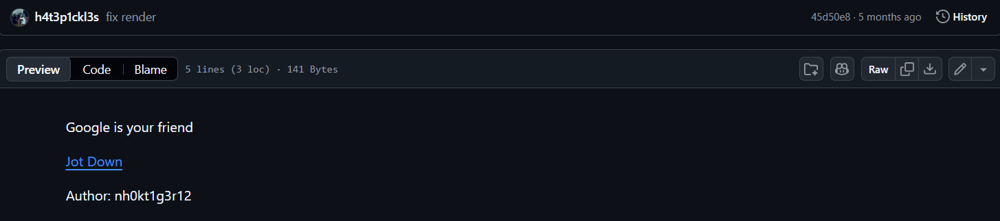
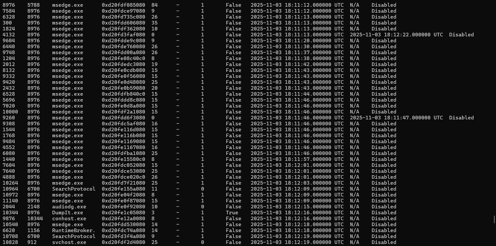
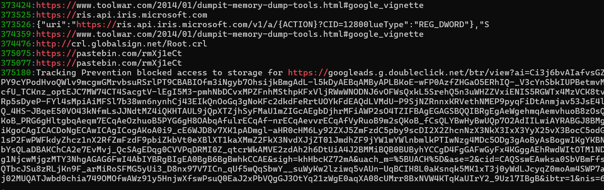
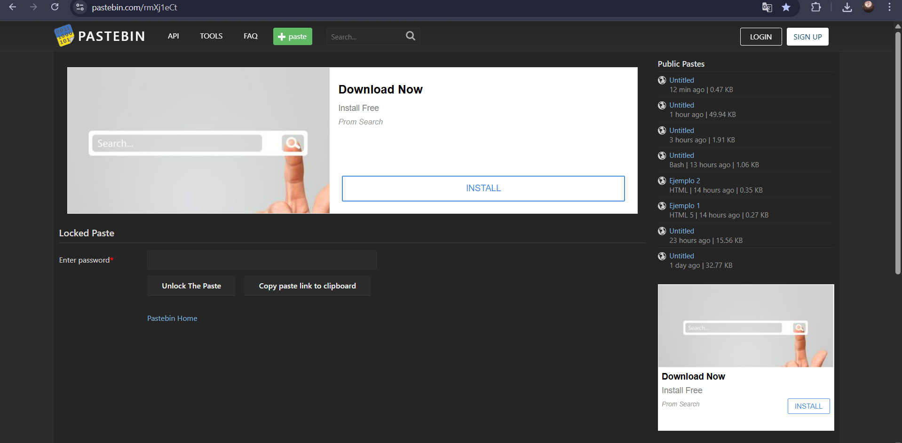
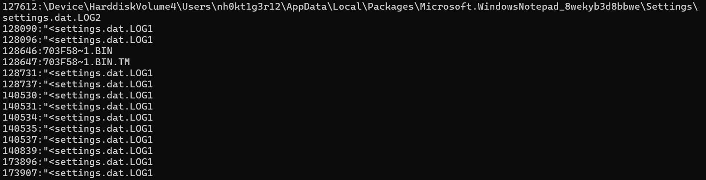
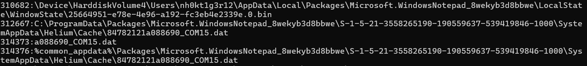
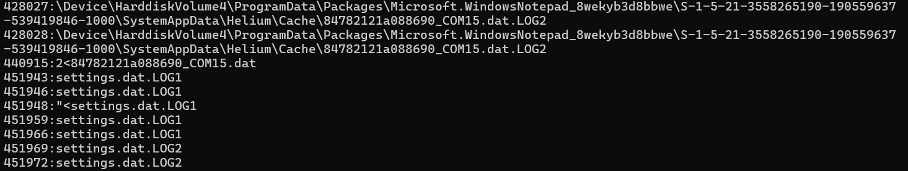
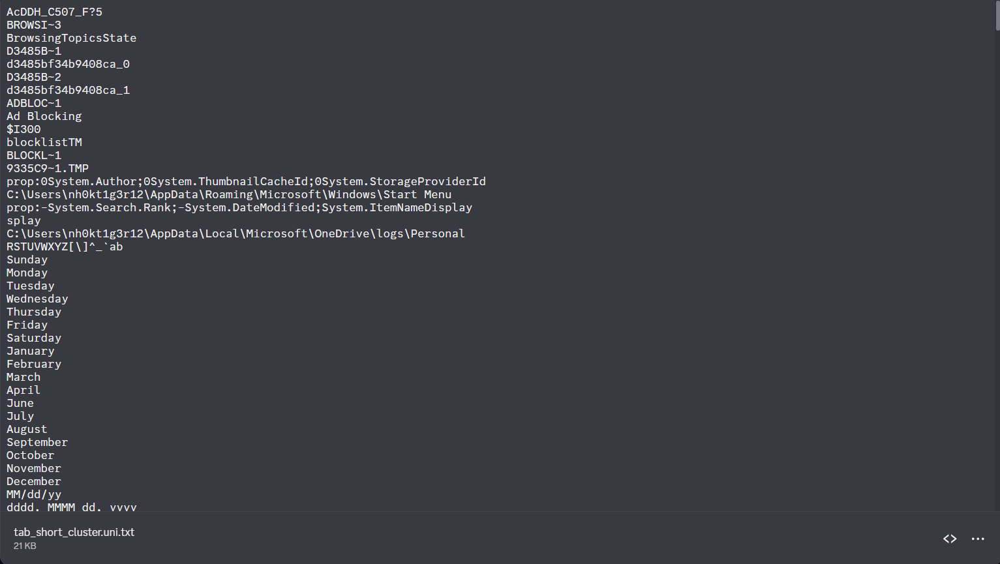
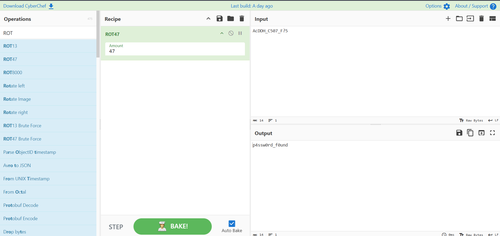
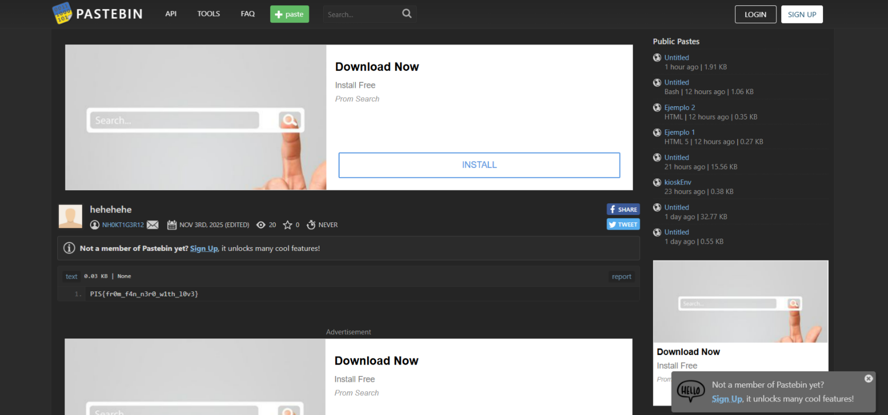

# Jot Down PtitHCMminictf


---
Đây là 1 challenge forensic rất hay của đợt minictf của Ptithcm vừa rồi tuy nhiên hồi đó mình chưa hoàn thành nổi challenge này và đã bị nó đánh bại, sau khoảng vài tháng cày bừa mình đã quay lại và phục thù được nó

đề bài:

cảm ơn anh nh0kt1g3r12 vì challenge rất hay và thú vị ạ

đây là 1 dạng memorydump vì vậy mà việc đầu tiên ta sẽ bắt đầu xem các tiến trình mà người dùng đã sử dụng nhằm check xem họ có lưu flag ở đâu không

ta sẽ dùng volitality3 với lệnh pslist để xem thì thấy user đã dùng microsoft edge sau đó dump mem bằng dumpit.exe ra ngoài tạo ra bài ctf này 



với đề bài là Google is your friend vì vậy mà rất có khả năng cái microsoft edge này là manh mối để xử lý bài này.

có rất nhiều tiến trình con của microsoft edge vì vậy mà mình sẽ dump những cái gần dumpit.exe nhất trước theo timeline
```
vol -f revenge.raw windows.memmap --pid 11140 --dump
vol -f revenge.raw windows.memmap --pid 10972 --dump
vol -f revenge.raw windows.memmap --pid 4888  --dump
vol -f revenge.raw windows.memmap --pid 9748  --dump
```

mình sẽ grep những cái liên quan có thể chứa flag ở google ví dụ như đường link bing,...
thực sự thì nó trả ra khá nhiều cơ mà mình lướt ở dưới lên 1 xíu thì ta thấy được có 1 link pastebin

điều khó khăn mình gặp ở đây là link này nó chứa pass nên không mở được vì vậy mà ta cần tìm được nơi chứa pass 

đoạn này mình mò khá nhiều cơ mà không có kết quả lắm mãi cho tới khi mình có được hint từ author, đó là để ý sự khác nhau giữa artifacts của win 10 và 11 thì mình mới có thể giải tiếp và hint này đúng nghĩa là đã đưa tới thẳng đáp án. 
Trong lúc tìm hiểu về hint thì mình thấy link này khá thú vị 
https://u0041.co/posts/articals/exploring-windows-artifacts-notepad-files/
đại khái thì trong này nói về notepad trên win 11 notepad trên win 11 lưu artifact tại 
`%LOCALAPPDATA%\Packages\Microsoft.WindowsNotepad_8wekyb3d8bbwe\LocalState`
bên trong đó thì ta có
```
TabState
WindowsState
```
 ở `TabState` là phần quan trọng nhất cho forensic vì nó chứa dữ liệu của từng tab, bao gồm path, content, metadata của tab đã lưu, và còn có thể chứa thêm dấu vết của tab chưa lưu.
ta grep theo các artifact của notepad để xem thử thì thấy
```
grep -niE '703F58~1|COM15\.dat|settings\.dat\.LOG|UserClasses\.dat\.LOG|25664951' revenge.uni.txt | head -200
```
trong đó "703F58~1" là tên rút gọn của file .bin trong máy ta có thể tìm thấy được thông qua windows.filescan
ta thấy kha khá hit




tiếp theo là ta sẽ grep để xem cái vùng của những byte offset và carve xung quanh nó
```
grep -aob '703F58~1.BIN' revenge.raw | head -20
grep -aob '703F58~1.BIN.TM' revenge.raw | head -20
grep -aob '703f5836-f2e4-43c0-8522-59e788aa06de.bin' revenge.raw | head -20
grep -aob '703f5836-f2e4-43c0-8522-59e788aa06de.bin.tmp' revenge.raw | head -20
grep -aob 'settings.dat.LOG1' revenge.raw | head -20
16577583:703F58~1.BIN
105394485:703F58~1.BIN
105395509:703F58~1.BIN
105396533:703F58~1.BIN
105397557:703F58~1.BIN
210829459:703F58~1.BIN
333955381:703F58~1.BIN
333956405:703F58~1.BIN
482608910:703F58~1.BIN
616049973:703F58~1.BIN
625229976:703F58~1.BIN
627985198:703F58~1.BIN
1441928671:703F58~1.BIN
1687734661:703F58~1.BIN
1702329987:703F58~1.BIN
2025329854:703F58~1.BIN
2025334878:703F58~1.BIN
2025336110:703F58~1.BIN
2189874638:703F58~1.BIN
2562212542:703F58~1.BIN
1224344251:703f5836-f2e4-43c0-8522-59e788aa06de.bin
1224345047:703f5836-f2e4-43c0-8522-59e788aa06de.bin
1719418983:703f5836-f2e4-43c0-8522-59e788aa06de.bin
1719419783:703f5836-f2e4-43c0-8522-59e788aa06de.bin
1719420103:703f5836-f2e4-43c0-8522-59e788aa06de.bin
1719420743:703f5836-f2e4-43c0-8522-59e788aa06de.bin
1719420903:703f5836-f2e4-43c0-8522-59e788aa06de.bin
1768709127:703f5836-f2e4-43c0-8522-59e788aa06de.bin
1768709447:703f5836-f2e4-43c0-8522-59e788aa06de.bin
1768709607:703f5836-f2e4-43c0-8522-59e788aa06de.bin
1768709767:703f5836-f2e4-43c0-8522-59e788aa06de.bin
1768709927:703f5836-f2e4-43c0-8522-59e788aa06de.bin
1768710087:703f5836-f2e4-43c0-8522-59e788aa06de.bin
3074550208:703f5836-f2e4-43c0-8522-59e788aa06de.bin
4345626880:703f5836-f2e4-43c0-8522-59e788aa06de.bin
4432625280:703f5836-f2e4-43c0-8522-59e788aa06de.bin
707418472:settings.dat.LOG1
```
ở đây ta chia ra 3 vùng, một vùng là setting, một vùng là long name và 1 vùng là short name, trong lúc mình giải thì mình check cả 3 vùng cơ mà ở đây mình ra kết quả rồi nên chỉ đưa ra phần chứa pass thôi đó là vùng short name
ta carve ra
```
python3 - <<'PY'
off = 105396533
window = 524288
start = max(0, off - window)

with open("revenge.raw", "rb") as f:
    f.seek(start)
    data = f.read(window * 2)

with open("tab_short_cluster.bin", "wb") as out:
    out.write(data)

print("tab_short_cluster.bin", off, start, len(data))
PY

strings -el tab_short_cluster.bin | tee tab_short_cluster.uni.txt | grep -niE '703F58~1.BIN|703F58~1.BIN.TM|settings.dat.LOG1|pastebin|rmXj1eCt|dumpit|toolwar|locked|unlock|password|pass'
sed -n '1,260p' tab_short_cluster.uni.txt
```
sau đó ta có một loạt text ntn 

cái đầu tiên ta thấy có đoạn AcDDH_C507_F?5 cái này là mã hóa ROT47 mình lên cyberchef và decode ra

vậy là ta đã có pass việc còn lại chỉ là mở khóa link và lấy flag thôi

flag:PIS{fr0m_f4n_n3r0_w1th_l0v3}


