# Bài 1: Operation Pensieve Breach - 1
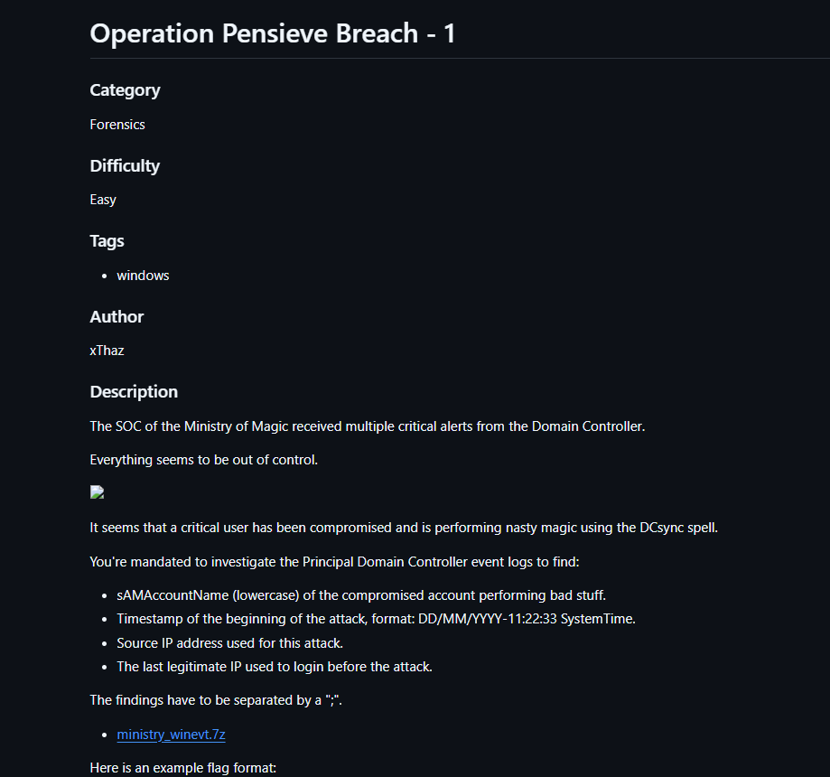
phân tích đề bài: 
Bộ phận SOC của bộ pháp thuật nhận được một loạt các cảnh báo từ Domain Controller và mọi thứ có vẻ như đang ngoài tầm kiểm soát, có vẻ như 1 tài khoản quan trọng trong này đã bị hack bằng DCsync.
dựa trên đề bài ta sẽ có được các manh mối sau
thứ 1: đó là kẻ tấn công đã sử dụng DCsync với mục đích là đánh cắp được thông tin đăng nhập ví dụ: như pass hay username.
thứ 2: là người dùng này là một người dùng có thẩm quyền cao vì vậy nên mới tạo nên sự hỗn loạn này
thứ 3: SOC của bộ pháp thuật? đây là tên gọi của một tổ chức trong loạt tiểu thuyết Harry Potter nổi tiếng hmmm có vẻ như đây là một hint mà ta sẽ sử dụng sau.

ta được yêu cầu điều tra Domain Controller để tìm được
Tên tài khoản bị hack:
Thời gian mà hacker bắt đầu thực hiện cuộc tấn công:
IP tấn công:
IP hợp lệ nhất trước khi bị tấn công:
link file: https://heroctf.fr-par-1.linodeobjects.com/ministry_winevt.7z
ví dụ của format cờ:
Hero{john.stark;DD/MM/YYYY-11:22:33;127.0.0.1;127.0.0.1}

Đầu tiên khi dow file và giải nén ra ta thấy khá nhiều log tuy nhiên ta chỉ để ý tới security.evtx thôi lí do là vì đây là tệp ghi lại các port liên quan tới đăng nhập đồng thời cũng là dấu hiệu của một cuộc tấn công DCSync.
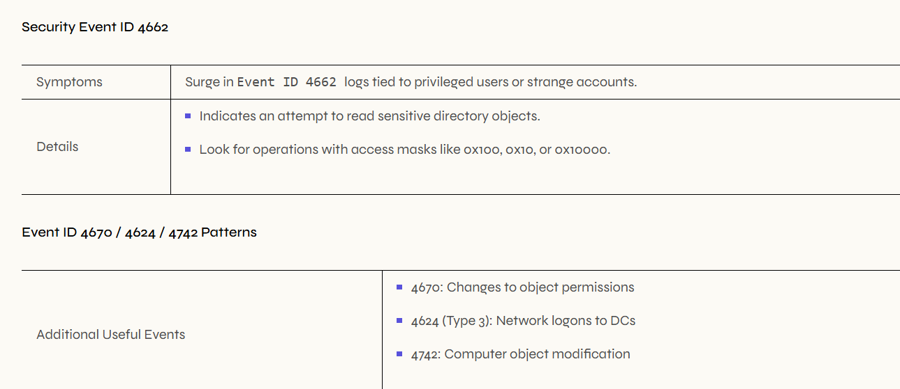

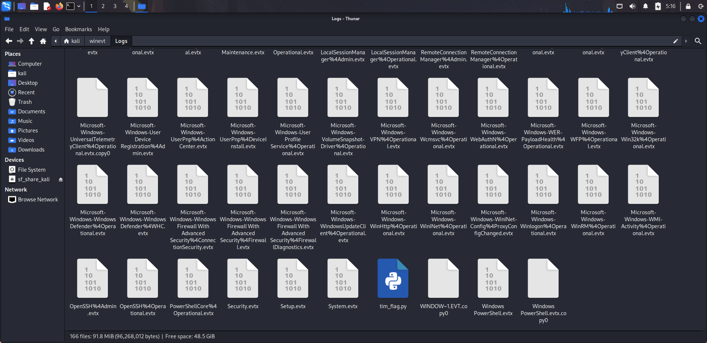

trích xuất security.evtx ra xml(ta có thể trích ra csv cũng được nhưng lúc giải mình dùng xml)
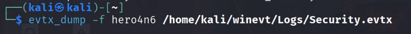

thực hiện grep chuỗi "1131f6ad-9c07-11d1-f79f-00c04fc2dcd2"
bởi vì đây là dấu hiệu của một cuộc tấn công DCSync
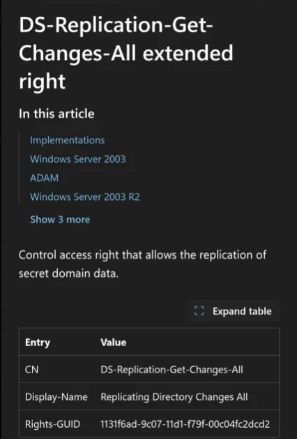
sau khi ta grep mã này thì ta nhận được 
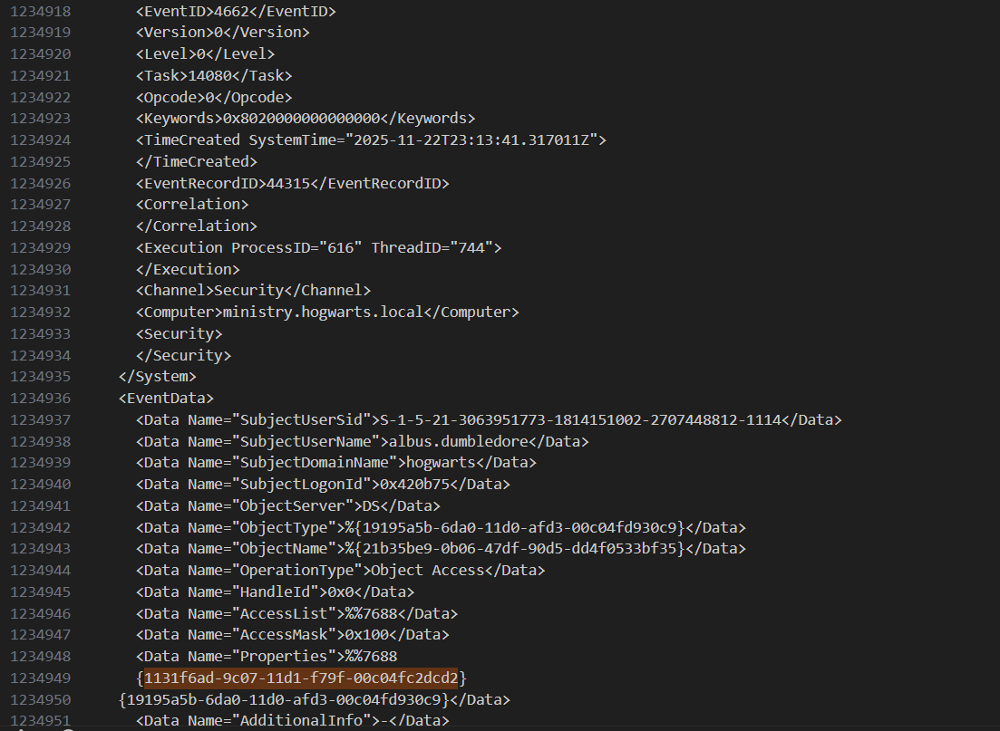
tài khoản albus.dumbledore đã thực hiện lệnh này ->ta có được tên tài khoản, càng khẳng định hơn vì trong bài đã có nói một tài khoản quan trọng đã bị hack và albus.dumbledore là tên một nhân vật vô cùng quan trọng trong Harry Potter nên hint chắc chắn là để xác định tên này
ngoài ra ta còn có một số thông tin khác như <TimeCreated SystemTime="2025-11-22T23:13:41.317011Z"> ->thời gian bắt đầu cuộc tấn công
tiếp theo mình search theo username để kiểm tra những đăng nhập bất thường trong này và để ý 1 điều "0x420b75" là logonid khi thực hiện tấn công để lại và tại đây
    
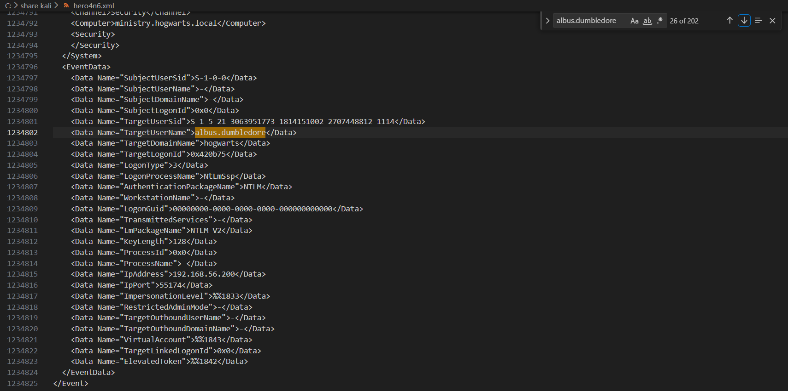
ta có thể thấy rằng ip 192.168.56.200 cũng tồn tại cái mã đó -> chắc chắn đây là ip của kẻ tấn công rồi. 
xâu chuỗi lại hiện ta đang có:
username:albus.dumbledore
Thời gian tấn công: 22/11/2025-23:13:41
IP của kẻ tấn công: 192.168.56.200
vậy ta còn thiếu IP truy cập lần cuối ta check xem thử trong log 192.168.56. thì có ip nào đúng không, ta coi từ trước có 3 ip ngoài của attacker và .1 là .101, .102 và .230 xuất hiện tuy nhiên chỉ có đuôi .230 là không có dấu $(tên máy trong cụm server) ->last legit là 192.168.56.230 đây là ip máy mà người dùng gốc sử dụng lần cuối trước khi bị hack
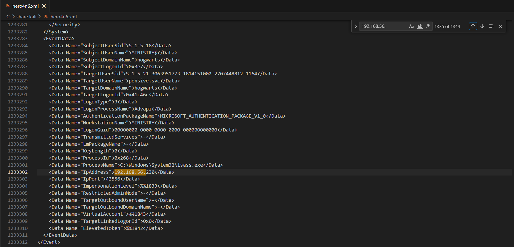
->flag hoàn chỉnh là: Hero{albus.dumbledore;22/11/2025-23:13:41;192.168.56.200;192.168.56.230}

# Bài 2: Operation Pensieve Breach - 2

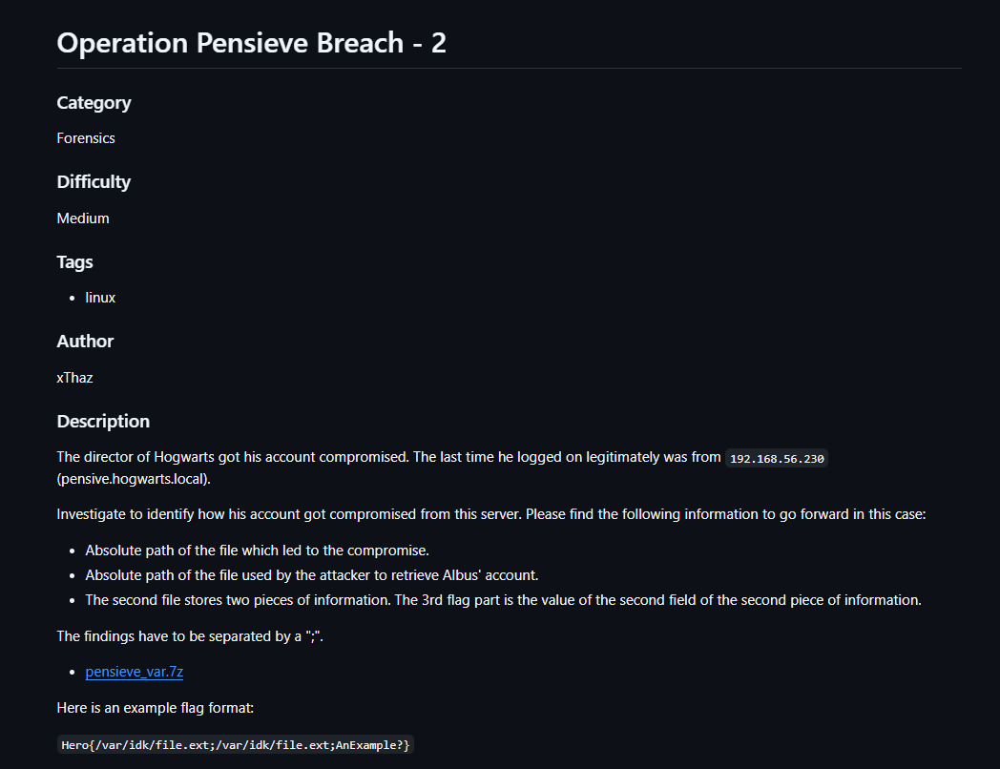
Phân tích đề bài:
đề bài yêu cầu ta xác định xem là tài khoản này bị xâm nhập như thế nào với yêu cầu flag là
1. Đường dẫn của file khiến tài khoản bị xâm nhập
2. Đường dẫn của file mà hacker đã sử dụng để lấy được tài khoản của Albus
3. Trong file mà hacker đã sử dụng sẽ có 2 thông tin và thông tin thứ 2 trong file chính là cái ta cần tìm
với ví dụ của cờ là:
    
Hero{/var/idk/file.ext;/var/idk/file.ext;AnExample?}

sau khi dowload xong ta đi vào thư mục var->log->apache2 để tìm kiếm các file access nhằm xem thử thông tin kết nối vào.
    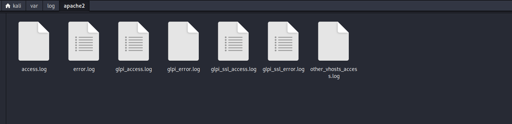
mình vào thư mục "glpi_ssl_access" và grep ip của kẻ tấn công đã có ở bài 1 là 192.168.56.200
    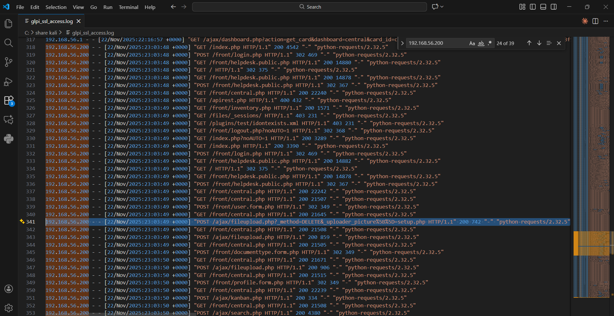
mình tìm thấy được một cái khá bất thường nguyên nhân là vì thứ nhất nó dài hơn hẳn so với các request trước của ip này thứ 2 là file này thực hiện một hành động khá kì lạ đó là file này upload lên một file đồng thời kêu hãy xóa file đó? nghe kì lạ nhỉ nên mình kiểm tra thử file setup.php trong đó để xem thử hacker muốn làm gì
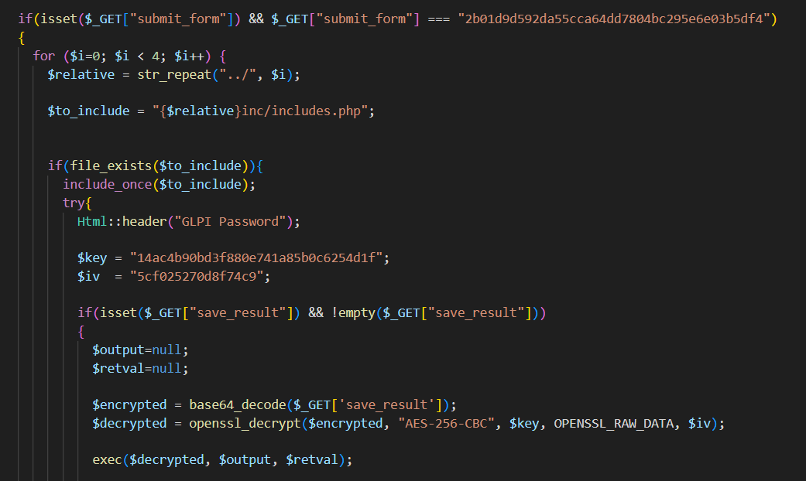
ta nhận ra ngay file này có tồn tại mặc dù đã có lệnh xóa? có vẻ như đây là một kỹ thuật khá hay ho được hacker sử dụng để có thể qua được việc uploadfile lên hệ thống một cách trái phép. Sau một hồi tìm hiểu thì ta nhận ra logic của câu lệnh này là hacker post 1 cái file setup.php lên và kêu là xóa cái file tương tự như này đi, cơ mà hệ thống sau khi rà soát lại thì lại không thấy file này và vì không thấy nên nó không xóa thành ra cái setup.php hacker vừa gửi lên vẫn ở nguyên đấy từ đó hacker đã thành công lách luật và upload 1 payload lên hệ thống để sử dụng.
Sau khi truy cập vào file thì ta thấy đây là một chuỗi giải mã một loại mã hóa nào vì vậy rất có khả năng hacker đã dùng cái này để thực thi một lệnh nào đó và bây giờ ta cần tìm kiếm xem cái mã mà hacker đã dùng là gì.
có một cái này khá thú vị trong file setup.php có một dòng là if(isset($_GET["submit_form"]) && $_GET["submit_form"] === "2b01d9d592da55cca64dd7804bc295e6e03b5df4") đại khái dòng này có thể đoán là nếu file có submit_form  với dãy số đó thì sẽ thực hiện giải mã từ đó ta có thể tìm được cái mà hacker giấu để thực hiện mã ngoài ra còn có thêm           
$encrypted = base64_decode($_GET['save_result']);
$decrypted = openssl_decrypt($encrypted, "AES-256-CBC", $key, OPENSSL_RAW_DATA, $iv);
này sẽ là khi trùng cái mã đó thì ta sẽ decode base64 trên save_result vậy thì khá sáng tỏ được cái key này dùng cho việc gì rồi
ta kiểm tra lại thì phát hiện ra 
    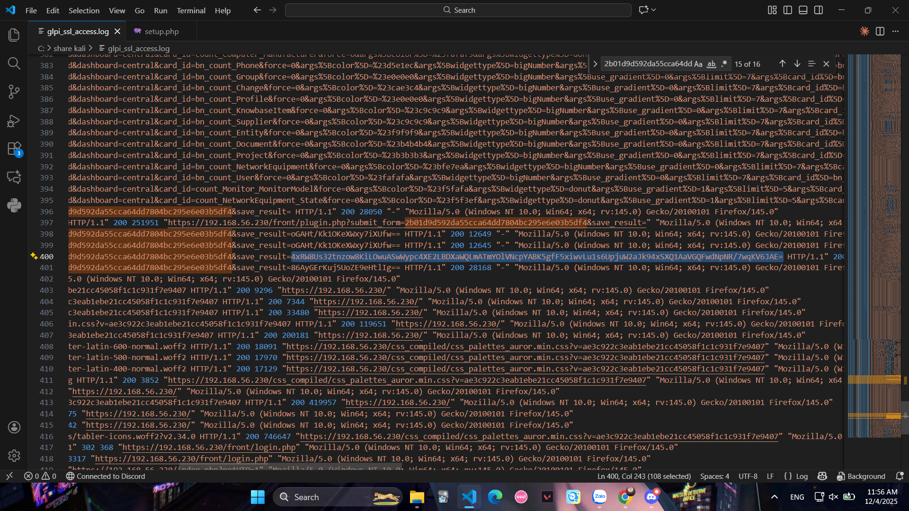
dòng base64 này dài hơn hẳn mấy cái còn lại nên khả năng cao đây là cái đã thực hiện rồi ta decode ra
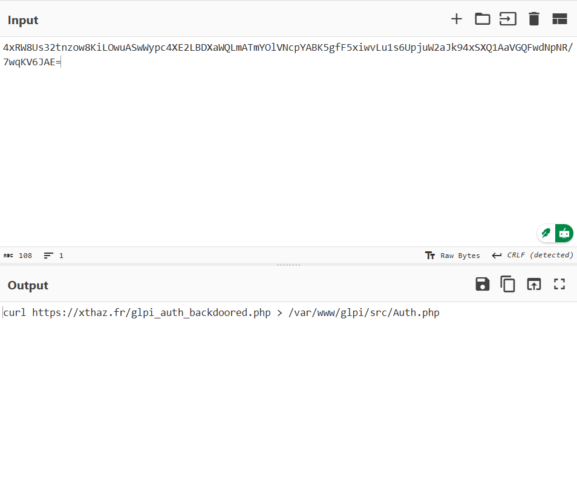
ta kiểm tra file này thì thấy
    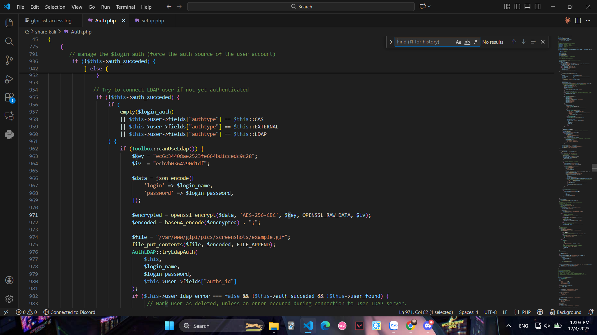
lại là decode một mã khác nhưng mà lần này tinh vi hơn vì nó được giấu trong một file ảnh là example.gif với đường dẫn là 
    /var/www/glpi/pics/screenshots/example.gif
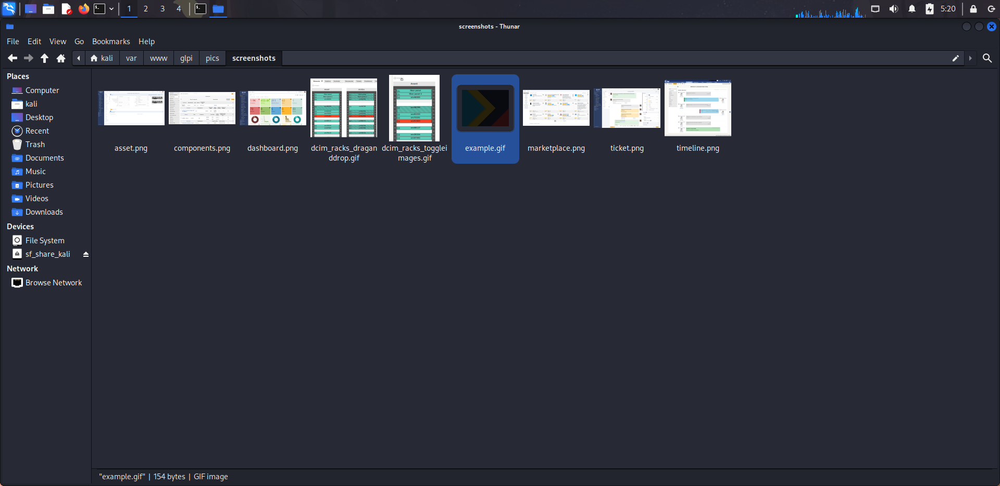
    strings ra thì ta có được 2 một chuỗi sau đó tiến hành giải mã trên cyberchef
    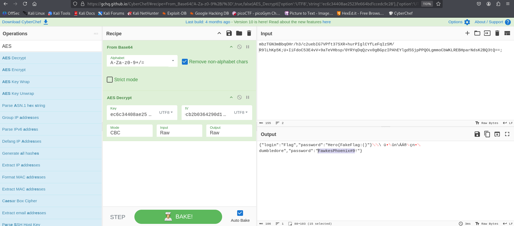
ta thu được password và username 
liên kết với những gì đề cho thì ta thấy rằng 
    Đường dẫn của file khiến tài khoản bị xâm nhập->khá chắc kèo nó là đoạn cái đường dẫn tới auth.php vì trong này có đoạn mã lưu mật khẩu vào 1 file khác->đây là p1
    tiếp theo là đường dẫn của file để hacker lấy mật khẩu-> chắc chắn là example.gif
    part 2 của thông tin trong example.gif là pass của tài khoản đã được giải mã->p3
tổng kết lại ta có flag đầy đủ là Hero{/var/www/glpi/src/Auth.php;/var/www/glpi/pics/screenshots/example.gif;FawkesPhoenix#9!} 
